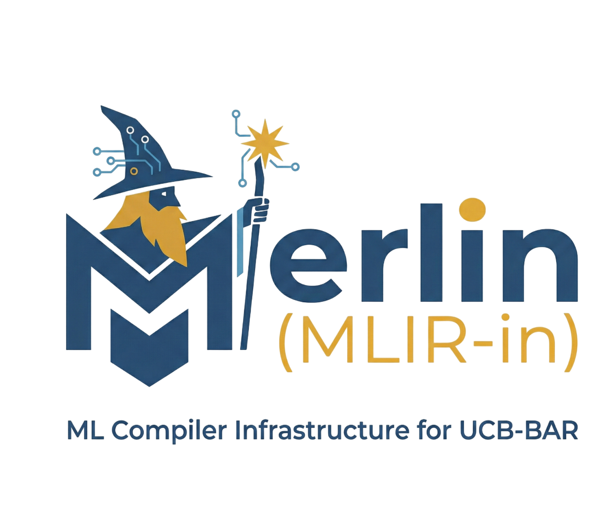

# Merlin Compiler Infrastructure

Merlin is an MLIR/IREE-based compiler stack that lowers ML models to host CPU
and custom RISC-V targets (SpacemiT, Saturn OPU, Gemmini, NPU). Ideally this
is where the *Compiler Magic* happens, so you don't have to.

> **Early Development Warning** — ***Merlin*** is under active development. Expect bugs,
> incomplete features, and APIs that may change. Bugfixes are welcome; please
> discuss significant changes in the
> [issue tracker](https://github.com/ucb-bar/merlin/issues) before
> starting work.

<p align="center">
  
</p>

- [**Documentation site**](https://ucb-bar.github.io/merlin/) — start here for guides, architecture, and reference
- [docs/getting_started.md](docs/getting_started.md) — fastest path from a fresh clone to a compiled model
- [docs/user_paths.md](docs/user_paths.md) — workflow-first map of the repo
- [CONTRIBUTING.md](CONTRIBUTING.md) — contributor guide

## Choose your path

Most first-time users do not need to understand the whole repository.

- **Compile or run models** → `tools/`, `models/`, `docs/getting_started.md`, then `build/` outputs
- **Bring up new hardware** → add `target_specs/`, `models/*.yaml`, `build_tools/hardware/`, [`docs/architecture/target_generator.md`](docs/architecture/target_generator.md)
- **Modify compiler/runtime** → eventually work in `compiler/`, `runtime/`, `third_party/iree_bar`

`third_party/`, `projects/`, deeper `benchmarks/`, and `docs/dev_blog/` are not
required for first contact.

## Quick start

Two ways to use Merlin: install prebuilt release artifacts, or build from source.

### Option A — Prebuilt binaries (recommended)

Release tarballs land on the [GitHub Releases](https://github.com/ucb-bar/merlin/releases) page:
`merlin-host-linux-x86_64`, `merlin-host-macos`, `merlin-runtime-spacemit`,
`merlin-runtime-saturnopu`. Install them into the expected `build/...` layout:

```bash
./merlin setup prebuilt --help
```

### Option B — Build from source

```bash
git checkout dev/main
conda env create -f env_linux.yml      # macOS: env_macOS.yml
conda activate merlin-dev
uv sync
pre-commit install

./merlin setup submodules --submodules-profile core --submodule-sync
./merlin build --profile vanilla
./merlin compile models/dronet/dronet.mlir --target spacemit_x60
```

Outputs land under `build/host-vanilla-release/install/bin/` (host tools) and
`build/compiled_models/dronet/spacemit_x60_RVV_dronet/dronet.vmfb`.

For build profiles, packaging, and target-specific flows see
[docs/how_to/use_build_py.md](docs/how_to/use_build_py.md). For more detail on
each step see [docs/getting_started.md](docs/getting_started.md).

## How to invoke the CLI

The docs use `./merlin` for brevity, but all three of these forms are
equivalent and fully supported. Pick whichever fits your workflow:

```bash
# 1. Wrapper — auto-activates the conda env if needed
./merlin <subcommand> [args...]

# 2. Direct, with conda env already active
conda activate merlin-dev
uv run tools/merlin.py <subcommand> [args...]

# 3. Direct, without activating the env first
conda run -n merlin-dev uv run tools/merlin.py <subcommand> [args...]
```

`./merlin` is a 30-line bash script that just delegates to form (3) — no
caching, no binary, nothing to keep up to date. See `merlin` at the repo root.

## Repository at a glance

| Path | What's there |
|---|---|
| `tools/` | The `./merlin` CLI entry point and developer helpers |
| `models/` | Models to compile and per-target YAML views |
| `docs/` | Getting started, how-to, architecture, reference |
| `compiler/` | MLIR dialects, passes, and compiler plugins |
| `runtime/` | HAL drivers and runtime-side target work |
| `target_specs/` | Canonical TargetGen capability specs |
| `build_tools/` | Toolchains, packaging, hardware recipes, patches |
| `samples/` | C/C++ runtime examples |
| `benchmarks/` | Benchmark and profiling workflows |
| `third_party/` | Submodules, including `iree_bar` and LLVM |
| `build/`, `dist/` | Generated outputs (gitignored) |

For placement conventions when adding code, see
[docs/repository_guide.md](docs/repository_guide.md).

## Formatting and CI

```bash
conda activate merlin-dev
pre-commit run --all-files
./merlin ci lint
```
