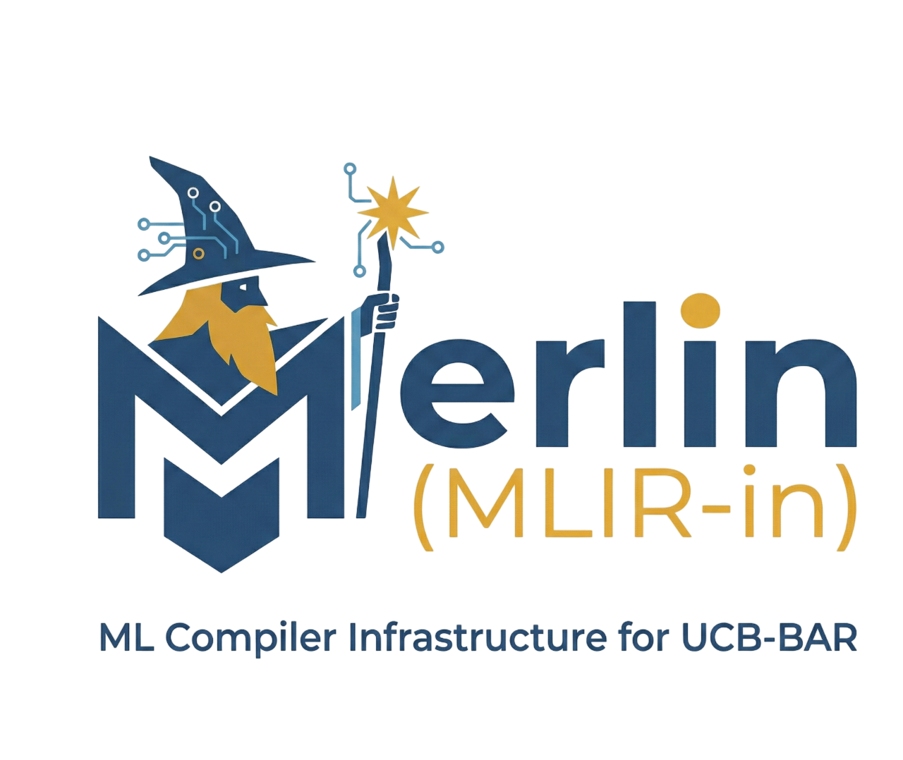

<p align="center">
  
</p>

<h1 align="center">merlin</h1>

<p align="center">
  A compiler-centered framework for studying <b>which hardware/software abstractions are worth
  exposing to the compiler</b> — from kernel mining and design-space exploration to target
  generation and whole-model bring-up on real RISC-V silicon.
</p>

> **Early development.** merlin is under active development; expect rough edges and APIs that may
> change. Bugfixes and PRs are welcome — please discuss significant changes in the
> [issue tracker](https://github.com/ucb-bar/merlin/issues) before starting work.

merlin has working end-to-end pipelines: kernel-mining → compiler improvement (RVV), design-space
exploration + DSE guidance, target generation, the Gemmini capsule/perf benchmarks (RTL-certified),
whole-model bring-up on real substrates (SpacemiT K1, spike, FireSim, Zephyr), and cross-framework
baselines. Start at the docs hub **[`docs/`](docs/README.md)**.

## Quick start

merlin uses [uv](https://docs.astral.sh/uv/):

```bash
uv sync --all-extras            # create .venv; install merlin (editable) + xDSL + dev deps
uv run pytest merlin/tests      # run the test suite
```

(Without uv: `pip install -e '.[dev,xdsl]'`.)

The CLI surface is a set of console scripts (full reference: [`docs/reference/cli.md`](docs/reference/cli.md)):

```text
merlin-targetgen        ISA/docs/RTL -> target contract -> dialect plan / scaffold
merlin-rvv-mine         mine expert kernels -> general compiler policies (RVV)
merlin-rvv-autotune     autotune RVV codegen packages
merlin-dse              design-space exploration
merlin-dse-guidance     rank DSE axes by measured target-gap closure
merlin-design-pressure  workload -> design-pressure report
merlin-compare          cross-config / cross-framework comparison
kernel-index | kernel-extract | kernel-audit | kernel-bench
```

## Choose your path

- **Compile / run models** → [`docs/guides/getting_started.md`](docs/guides/getting_started.md)
- **Bring up new hardware** → [`docs/guides/adding_a_target.md`](docs/guides/adding_a_target.md), [`docs/reference/architecture.md`](docs/reference/architecture.md)
- **Mine kernels / improve the compiler** → [`docs/guides/kernel_mining.md`](docs/guides/kernel_mining.md)
- **Design-space exploration** → [`docs/guides/dse.md`](docs/guides/dse.md)

## How it's organized

Three parallel workstreams coordinate through **shared schemas** (`merlin/schemas/`), not prose:

1. **TargetGen / dialect generation** — ISA/docs/RTL → target contract → dialect plan → scaffold
   (`merlin/python/merlin/targetgen/`, `merlin/targets/`).
2. **Kernel abstraction mining** — external kernels → kernel records → abstraction candidates →
   policy rules (`merlin/python/merlin/kernels/`, `merlin/python/merlin/rvvgen/`).
3. **Design-pressure & DSE** — workloads → design-pressure reports → candidate contracts → variant
   comparison (`merlin/python/merlin/design_pressure/`, `merlin/python/merlin/dse/`).

See [`docs/design/parallel_workstreams.md`](docs/design/parallel_workstreams.md).

**Two compiler planes.** xDSL (Python) is the default prototyping plane
(`merlin/python/merlin/xdsl_dialects/`); MLIR/C++ is the eventual stable plane
(see [`docs/design/compiler_plane.md`](docs/design/compiler_plane.md)). Core dialects —
`contract`, `schedule`, `interface`, `runtime` (see
[`docs/reference/core_dialects.md`](docs/reference/core_dialects.md)); DSE search spaces and
kernel-derived policies stay as schemas/YAML/JSON.

## Repository at a glance

| Path | What's there |
|---|---|
| `merlin/` | All project code (XLA-style internal tree): the `python/merlin/` package, `schemas/`, `tests/`, `targets/`, `experiments/` |
| `docs/` | Durable docs — `reference/` (code-derived), `guides/` (how-to), `design/` (rationale); start at [`docs/README.md`](docs/README.md) |
| `build_tools/` | Toolchains, scripts, structure/docs/artifact-layout gates, git hooks |
| `third_party/` | Submodules: LLVM + cross-framework baselines (TVM, ExecuTorch, Buddy, EXO, llama.cpp, and the IREE-based Merlin baseline) |
| `out/` | All generated output — `out/{runs,artifacts,build}` (gitignored except tracked scaffolding + curated reports) |

Every directory carries an `AGENT.md` describing its purpose and constraints — read it before
working there. Contributors: see [`CONTRIBUTING.md`](CONTRIBUTING.md).

## License

Apache-2.0 — see [`LICENSE`](LICENSE). Logos and artwork are separately licensed (LICENSE appendix).
