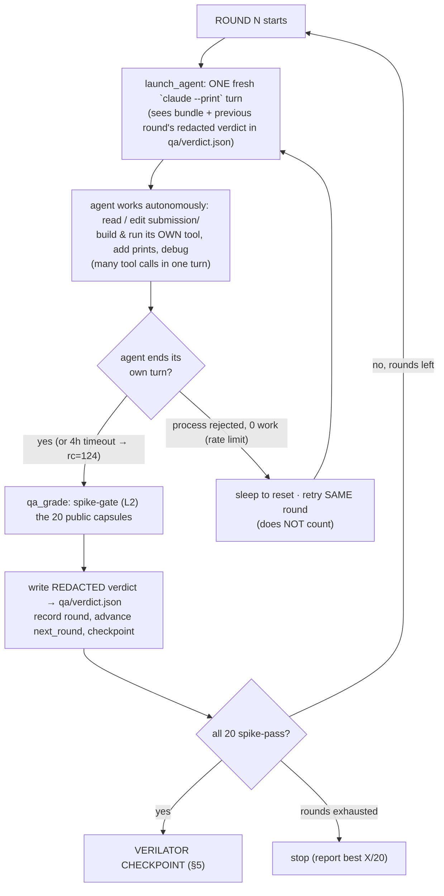
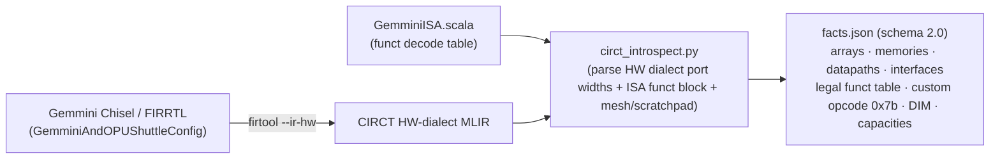
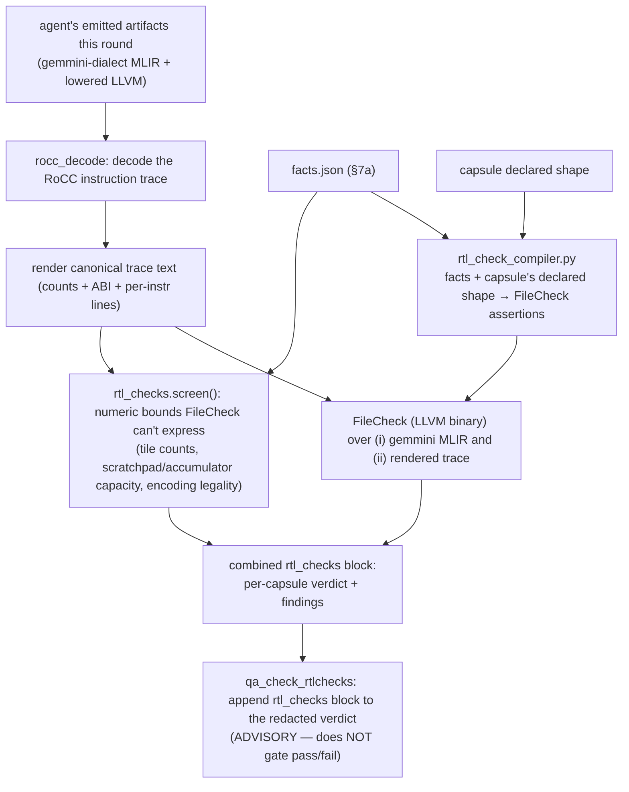

# Methodology — A/B/C agentic study: does RTL-grounded tooling help an agent author a hardware backend?

**One-line claim under test.** Holding the task, model, and grading fixed, we measure how much an agent's
ability to author a correct, complete Gemmini MLIR compiler backend improves as we add (B) Merlin's
authoring tools and (C) our new **CIRCT-compiled-from-RTL** feedback on top of those tools.

This document defines the experiment, the three arms, the shared infrastructure, what each arm is allowed
and denied, and — in detail — how the tooling works and interacts with the agent (especially the CIRCT
checks: how they are compiled from real hardware and fed back into the loop).

---

## 1. The task (identical for all three arms)

Each agent must author an **out-of-tree (OOT) MLIR compiler backend** for the Gemmini systolic-array
accelerator: an input dialect, a Gemmini *target* dialect, the lowering passes between them, and **4 CLI
entrypoints** that together turn a capsule's `capsule.interface.mlir` into a **command buffer** in Merlin's
frozen ABI.

```
capsule.interface.mlir ──[ agent's 4 entrypoints ]──▶ command buffer (frozen ABI)
   (the problem)            parse                         (the deliverable Merlin executes)
                            lower_interface_to_target
                            emit_command_buffer
                            lower_target_to_llvm
```

The agent iterates against a **redacted QA verdict** until its capsules pass (details §4). The **frozen
submission is graded only through those 4 CLI entrypoints — never imported** — and must be
**integrity-clean** (no `import merlin`, no oracle calls; see §6).

**Corpus.** 25 capsules: **20 public** (the agent sees their interfaces and iterates to pass them) +
**5 hidden** (held out; graded only in the final audit, to test generalization). Classes span the full op
surface: `config`, `matmul`, `k-accumulation`, `movement (mvin/mvout)`, `acc_scale`, `relu`, `padding`,
`conv2d (im2col)`, `mlp`, `attention`.

---

## 2. The three arms — what differs is *only* the authoring aid

```
                          ┌───────────────────────────── identical ─────────────────────────────┐
  ARM            authoring aid the agent is given        task   model   grading   corpus   sandbox
  ─────────────  ──────────────────────────────────────  ─────  ──────  ────────  ───────  ───────
  A  baseline    (none) spec + headers + contract only      ✓      ✓        ✓         ✓        ✓
  B  merlin      A + Merlin authoring tools (xDSL)          ✓      ✓        ✓         ✓        ✓
  C  merlin+CIRCT B + CIRCT-compiled RTL checks (feedback)  ✓      ✓        ✓         ✓        ✓
```

The arms are **nested**: `C ⊃ B ⊃ A`. Because each adds exactly one thing, the deltas are attributable:

- **(B − A)** = the value of Merlin's authoring tooling.
- **(C − B)** = the value of grounding feedback in the *actual RTL* via CIRCT — the contribution we test.

Model/flags: `claude-opus-4-8`, `--effort high`, up to **12 rounds**, 8 rate-limit waits, 4 h/round cap.

---

## 3. Shared infrastructure & inputs (the level playing field)

Everything below is identical across arms — this is what makes it an A/B/C rather than three different
experiments.

| Shared resource | What it is | Where |
|---|---|---|
| **Public Gemmini facts** | `gemmini.h`, `gemmini_params.h` — ISA encoding, `DIM`, dtypes | bundle (all arms) |
| **Bench contract** | frozen ABI v0.1: schemas, grammar, command-buffer ABI, integrity policy + public capsule inputs | `bench_contract/` |
| **Toolchain** | LLVM/MLIR 23 to build an OOT package | `third_party/llvm-install/` |
| **The runtime/ladder that EXECUTES + GRADES** | Merlin's `capsule_runner` binds the agent's 4 entrypoints and runs the emitted command buffer through the oracle ladder | operator-side (not the agent's to edit) |
| **Oracle ladder** | L0 numeric golden · L1 ref==sim · L2 spike (functional) · L3 verilator (cycle-accurate RTL) | operator-side |

**Key architectural point — shared compiler/runtime, own dialect+passes.** All three arms author *their
own* dialect and lowering passes, but they all target the **same command-buffer ABI** that Merlin's shared
runtime executes and grades. The submitted artifact is self-contained (cannot call Merlin at runtime); it
only has to emit a command buffer Merlin understands.

```
  ┌──────────────────────────── SHARED (operator-side, all arms) ───────────────────────────┐
  │  bench_contract (ABI, schemas, capsule inputs)   LLVM/MLIR 23   gemmini.h/params.h        │
  │                                                                                            │
  │  capsule_runner  ──▶  L0 golden ─ L1 ref==sim ─ L2 spike ─ L3 verilator   (oracle ladder) │
  └────────────────────────────────────────────────────────────────────────────────────────┘
                    ▲ binds the 4 entrypoints                 ▲ grades the emitted command buffer
                    │                                          │
        ┌───────────┴───────────┐   ┌───────────────────┐   ┌┴────────────────────────┐
        │ A: dialect+passes      │   │ B: dialect+passes  │   │ C: dialect+passes        │
        │    (from scratch)      │   │  + Merlin authoring│   │  + Merlin authoring      │
        │                        │   │    tools           │   │  + CIRCT RTL checks      │
        └────────────────────────┘   └───────────────────┘   └─────────────────────────┘
                AUTHORED PER ARM (this is the only thing that varies)
```

---

## 4. The round loop (identical control flow for all arms)

A **round** is one autonomous agent session followed by one grade.



**What ends a round** — two events: (a) the agent *voluntarily ends its turn* (no explicit "submit":
whatever is in `submission/` at turn-end is graded) or hits the 4 h cap; then (b) the spike grade runs.
A round **counts** (advances `next_round`) whenever the agent did real work — *including a timeout*. It
**does not count** only when rate-limit-rejected with zero work (it retries the same index). Feedback
arrives **between** rounds: the agent gets one autonomous attempt, then sees pass/fail next round.

**Per-round gate = L2 spike only.** Running cycle-accurate verilator (L3) on 20 capsules every round across
3 parallel arms is infeasible (CPU storm), and spike already gives the functional pass/fail signal. L3 is
the bounded checkpoint instead (§5).

### What feedback the agent receives (redacted verdict, all arms)
Per capsule: `status`, which `tier` failed, `failure_plane` (e.g. `command_buffer` vs `numeric_golden`),
`failure_category`, **`mismatch_count`**, `trace_violations`, and a human **`failure_detail`** hint (e.g.
*"conv2d must be lowered to a 2D im2col; a MATMUL operand likely has the wrong rank"*). **Golden values and
exact numbers are redacted** — it is a *why*, never the answer.

### Debug capability (all arms)
The agent has Bash/Read/Write/Edit and authors Python, so it **can** add `print()`s, build & run its own
`gemmini-opt`, dump its emitted command buffer / decoded trace / intermediate IR, and self-inspect its
*own* pipeline. It **cannot** run the oracle (spike/verilator/reference) or read goldens — so it can debug
*structure* freely but cannot self-verify *correctness vs golden*. That boundary is the intended limit.

---

## 5. The verilator checkpoint (cycle-accurate validation, 3 chances)

When an arm passes all 20 public capsules on spike, it is "ready"; the harness then validates on the real
RTL and gives the agent up to **3 verilator attempts** (a fix-round between each), all recorded.

```
  spike-converged (20/20 L2)
        │
        ▼
  ┌─ verilator attempt k (k = 1..3) ─────────────────────────────┐
  │  parallel L3 grade (max_workers) of all 20 on verilator RTL    │
  │  record n_passed/20 + per-capsule L3 status → verilator_checkpoints.json
  └───────────────────────────────────────────────────────────────┘
        │ all L3 pass? ── yes ──▶ done
        │ no, and k<3 ──▶ hand REDACTED L3 failures back → 1 fix round → attempt k+1
        │ k==3 ──────────▶ stop (record best)
```

Note: L3 runs strictly *after* L0/L1/L2 pass. A capsule failing earlier (e.g. conv at `command_buffer`)
never reaches verilator — so verilator access cannot fix pre-spike functional bugs; it certifies timing.

---

## 6. Allowed vs denied (the integrity model — identical grading guarantee)

| | baseline (A) | merlin (B) | merlin+CIRCT (C) |
|---|---|---|---|
| Public spec, `gemmini.h/params.h`, bench_contract, LLVM/MLIR | ✅ | ✅ | ✅ |
| Merlin **authoring** tools: `targetgen/synthesize/`, `targetgen/generate/`, `xdsl_dialects/`, `interface_emit.py` | ❌ | ✅ | ✅ |
| **CIRCT RTL-checks** feedback each round (§7) | ❌ | ❌ | ✅ |
| Merlin runtime `reference.py` / `simulator.py` / `reference_outputs` | ❌ denied (oracle = cheat) | ❌ | ❌ |
| `generate/runtime_adapter.py`, `xdsl_dialects/lowering/` | ❌ (callable oracle routes) | ❌ | ❌ |
| Hidden capsules + any goldens | ❌ | ❌ | ❌ |

**Enforcement:** denied paths are masked from the workspace; goldens are withheld; a **post-run transcript
audit** flags any out-of-bundle read or oracle-using code (defence-in-depth). The shipped package must pass
the integrity scan: graded only via its 4 CLI entrypoints, never imported.

---

## 7. The CIRCT tooling — how it works (arm C's contribution)

The CIRCT checks are **deterministic, RTL-grounded feedback** appended to arm C's redacted verdict every
round. They are produced in two phases: an **offline** extraction of hardware facts from the *real Gemmini
RTL* (run once, frozen), and a **per-round** screen of the agent's emitted artifacts against those facts.

### 7a. Offline: compile the RTL into machine-checkable facts (run once → `facts.json`)



`facts.json` is extracted **from the hardware itself** (CIRCT's HW dialect lowered by `firtool --ir-hw`
from the elaborated SoC, plus the ISA Chisel source) — *not* from documentation or hand-written rules.
That provenance is what makes the checks authoritative: they encode what the silicon actually accepts
(systolic array dims, scratchpad/accumulator capacities, the legal funct/opcode table, port widths).

### 7b. Per-round: screen the agent's artifacts against the facts



Concretely, `rtl_check_runner` per capsule: (1) renders the decoded RoCC trace to canonical text;
(2) compiles capsule-specific FileCheck assertions from the RTL facts (`rtl_check_compiler`); (3) runs the
**LLVM `FileCheck` binary** over the gemmini-dialect MLIR and the rendered trace; (4) additionally runs the
Python `rtl_checks.screen()` for numeric bounds FileCheck can't express. The result is a per-capsule
`{verdict, filecheck:{trace,dialect}, findings}` block.

### 7c. How it interacts with the agent
`qa_check_rtlchecks.run()` wraps the **unmodified** base QA gate, then appends the `rtl_checks` block +
a note to the verdict the agent reads next round. It is **advisory — it never gates pass/fail** (spike/
verilator still decide passing). What it changes is the *quality of feedback*: instead of only "capsule X
failed at plane Y," arm C also learns "your emitted trace violates a hardware-legal invariant Z" (illegal
funct/opcode, tile exceeding the systolic dims, scratchpad/accumulator over capacity, wrong ABI field) —
**grounded in the real RTL**, before the expensive oracle would ever catch it. A clean rtl_checks result
means the ISA structure is hardware-legal (not that numerics are correct).

> **Why this can help without cheating:** the facts come from public RTL/ISA (the same hardware the agent
> is targeting), the checks expose *structural/encoding* legality (not golden outputs), and they are
> advisory. It is the machine equivalent of a senior engineer saying "that instruction encoding isn't
> legal on this array" — guidance, not the answer.

### 7d. Related: the arc middle-tier (used in the perf study, same CIRCT lineage)
The same CIRCT toolchain underpins an **arcilator middle-tier** simulator: `firtool --ir-hw` → `arcilator`
JITs the isolated `@Gemmini` to a fast cycle-exact model (no SoC boot), bit-exact vs golden, ~10⁵× faster
than verilator. It is the RTL-faithful estimator used in the performance figures; it is *not* part of the
agentic loop (the loop's RTL grounding is the static checks above).

---

## 8. Merlin authoring tools (arm B & C) — what they are

The Merlin arms may use these **authoring aids** (to scaffold/plan, never to grade):

| Tool | Path | What it does for the agent |
|---|---|---|
| Plan synthesis | `targetgen/synthesize/` (`dialect_plan`, `target_contract`, …) | produce a *plan/spec* for a dialect, lowering, runtime adapter — scaffolding intent, not the answer |
| Scaffold generators | `targetgen/generate/` (`mlir_scaffold`, `xdsl`, …) **∖ `runtime_adapter.py`** | emit empty/structural dialect + pass + tablegen scaffolds to fill in |
| xDSL dialect patterns | `xdsl_dialects/` **∖ `lowering/`** | reference IRDL op/type/verifier patterns for prototyping input + target dialects |
| Interface grammar | `targetgen/contract/interface_emit.py` | serialize/parse the `merlin_iface` grammar (clean; no oracle) |

The excluded sub-paths (`runtime_adapter.py`, `xdsl_dialects/lowering/`) are denied because they route to
the reference oracle — allowing them would let the agent self-grade against the true answer.

---

## 9. What we measure (two first-class dimensions)

1. **Authoring effort** — cost ($), tokens, tool-calls, rounds-to-converge, cumulative spend, and the
   activity trajectory through the transcript. *Does the aid make authoring cheaper / faster?*
2. **Dialect completeness / correctness** — each frozen dialect re-graded on the **full 25 capsules**
   (20 public + 5 hidden) on the RTL oracle (L2 spike + L3 verilator) via `full_suite_audit`: per-capsule
   pass/fail, failure plane, L3 cycles, per-class coverage. *Does the aid yield a more complete dialect?*

Plus a **tool-usage breakdown** (`transcript_tooling_audit.py`): how each agent spent its actions
(reading / writing code / running / thinking; merlin-tool calls; and — for provenance — that the agent
never invoked the oracle). The same audit doubles as the **isolation check** (zero out-of-bundle reads).

---

## 10. Provenance & reproducibility

- Arms are keyed by `environment.yaml::bundle_id`
  (`raw_baseline_public_v0` / `merlin_assisted_public_v0` / `merlin_assisted_rtlchecks_public_v0`).
- Every round writes a durable checkpoint (`qa_loop_state.yaml`: `next_round`, per-round pass counts,
  cumulative active/wait time) so a run survives quota windows and resumes exactly where it stopped.
- `facts.json` records its inputs' SHAs (`hw_sha`, `fir_sha`, `isa_sha`) and generator version, so the
  CIRCT facts are reproducible from the exact RTL.
- Aggregation → `agentic_results.json`; figures → `gen_agentic_plots.py` + `gen_agentic_trajectory.py`;
  arm definitions → `ARMS.md`; this document → `METHODOLOGY.md`.
