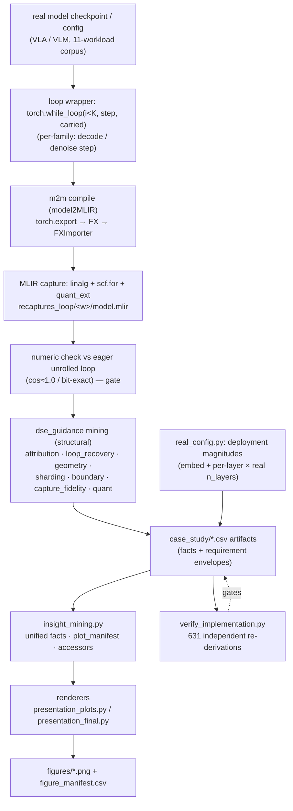
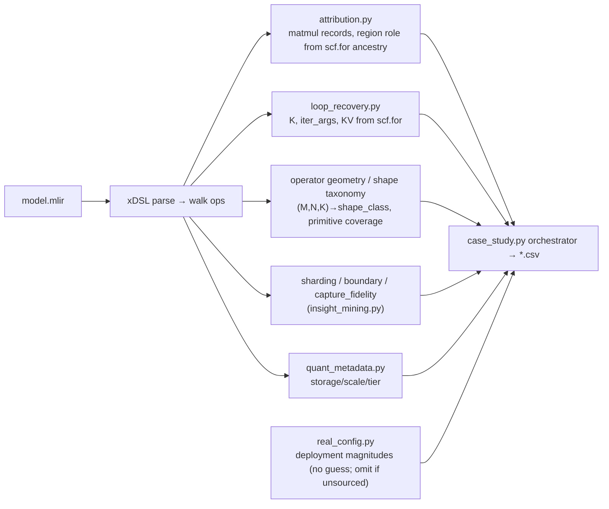

# Merlin `dse_guidance` — Methodology (for the talk & the paper)

This document explains, end to end, **how we go from a real model to the plots** in
`final_presentation_pass/figures/`, why we do it with a **compiler**, what exactly we **capture**, how the
mining **tooling** works and stays **generalizable**, where (and whether) we use an **LLM/agent** and how we
**verify** it, and a **per-plot data lineage** so any number on any slide can be defended in Q&A.

> One-line thesis: **Merlin recovers a *structural workload contract* from real model captures and turns it
> into accelerator-DSE search axes.** It is **not** a DSE optimizer and makes **no** speedup / cycle / area /
> energy / throughput / optimality / measured-performance claim. Timing & roofline views are **requirements /
> sensitivities**, never hardware results.

---

## 1. Why good workload analysis matters for DSE

Design-space exploration (DSE) for an accelerator chooses tiling primitives, on-chip capacity, dtype, the
loop/residency strategy, sharding, the HW/SW boundary, etc. **Every one of those choices is conditioned on the
workload's structure** — not on a single number like "FLOPs".

```
                 a DSE search needs, per workload:
   ┌───────────────────────────────────────────────────────────────────┐
   │  GEMM shapes (M,N,K)  →  which tiling primitive(s) to build         │
   │  loop count K + region roles  →  residency / double-buffering       │
   │  loop-carried state (KV, latent)  →  on-chip state sizing           │
   │  dtype + scale layout  →  datapath width, requant units             │
   │  shardable axes + comm  →  multi-PU partition + interconnect         │
   │  control rate / deadline →  required compute & bandwidth FLOORS      │
   └───────────────────────────────────────────────────────────────────┘
```

If the workload description is **wrong or coarse**, DSE optimizes the wrong thing: it builds a square
matrix-engine for a model that is 80% skinny GEMV, sizes SRAM for a forward pass when the real cost is a
K-step decode loop, or assumes weights stream when residency would remove a K× bandwidth requirement. **The
quality of the workload contract is the ceiling on the quality of the DSE.**

## 2. Why current tools are not good enough

| Common approach | What it gives | Why it's insufficient for DSE |
|---|---|---|
| `torchinfo` / FLOP counters | one scalar (FLOPs, #params) | no shapes, no loop, no roles, no residency — can't drive any axis |
| Framework profilers (torch profiler, nsys) | per-kernel time **on the GPU you ran it on** | measures the wrong hardware; you're designing a *different* chip |
| Hand-written workload specs | whatever the author remembered | not reproducible, not value-checked, drifts from the real graph |
| Raw ONNX/`torch.export` dump | a flat op list | the **multi-rate loop is unrolled/erased**; K, KV, region roles are gone |

The fatal gap for VLA/VLM accelerators specifically: the interesting cost is a **repeated decode/denoise
loop** (action chunking, diffusion steps). A flat trace **erases the loop** — so K, the loop-carried KV/latent,
and the once-vs-repeated region split simply aren't there to analyze.

**A fair caveat (this is not bias against existing work):** the mature DSE *engines* — Timeloop/Accelergy,
MAESTRO, Interstellar, CoSA, dMazeRunner — are good, and we do **not** replace them. Each one *consumes* a
workload spec (layer/loop-nest shapes, tensor sizes, reuse) and searches mappings or architectures over it.
Their chronic weak point is upstream of the search: **producing a faithful spec from a real model**, and
especially one whose true cost is a multi-rate decode/denoise loop that a flat export has already destroyed.
We are a **front-end** that produces that spec — not a competing mapper. §3A is an honest accounting of how
much of that spec you can already get *without* us, and exactly where the afternoon-of-PyTorch approach stops.

## 3. Why a compiler — why not just analyze the torch model?

Because the facts DSE needs are **only well-defined after lowering**, and a flat `torch.export` **destroys the
one structure that matters most (the loop)**. Using our own compiler (**model2MLIR / `m2m`**) buys four things
you cannot get from the eager torch model:

1. **Canonical, typed op graph.** `nn.Linear`, SDPA, fused blocks, Python control flow → a small set of
   canonical `linalg`/`scf` ops with explicit `(M,N,K)`, dtypes, and byte counts. Shape inference is the
   compiler's job, done once, consistently — not re-derived per-tool with ad-hoc hooks.
2. **Loop preservation (the keystone).** We lower `torch.while_loop → scf.for`; the decode/denoise loop
   **survives** as real IR with the trip count **K** as a constant and the carried KV/latent as `iter_args`.
   Plain `torch.export` unrolls or hides this — so the loop is recoverable **only** because we own the
   compile path.
3. **Structural region roles.** The `scf.for` boundary *is* the once-per-replan prefix vs the ×K repeated
   head. Roles come from the IR structure, **not** from fragile name/regex heuristics on Python modules.
4. **Value-independence + reuse of compiler infra.** MACs/bytes/shapes depend on shapes, not weight values,
   so random-init captures are valid; and dialects like `quant_ext` let us *name* low-bit unpack/scale ops
   when they exist. The same lowering also feeds real codegen, so the contract is grounded in something that
   actually compiles, not a sidecar guess.

> Short answer for the slide: **"a flat torch graph has already thrown away the loop, the roles, and the
> typed shapes we need; the compiler is what keeps them."**

---

## 3A. The honest baseline: what trivially-buildable PyTorch tooling already gives you

A fair yardstick is a small, well-made *"understand this model"* repo built only with PyTorch's own tooling.
**[`ucb-bar/Understanding-PI0`](https://github.com/ucb-bar/Understanding-PI0)** is exactly that: a few scripts
to understand the π0 VLA policy. It reports the parameter breakdown (≈ **3.5 B**: SigLIP vision 412 M, Gemma LM
2.5 B, flow-matching action expert 575 M), the full module tree, a single aggregate **4.35 TFLOP / inference
step** number, and ships `run_torch_profiler.py`, `run_torch_memory_snapshot.py`, and `run_quantization.py`.
That is genuinely useful and took roughly an afternoon. **We have to be honest about how much of "workload
analysis" that already covers — because it covers a lot.**

What an afternoon of `torch.fx` + a FLOP counter + `torch.profiler` actually gives you, with **no** custom
compiler:
- **Param & FLOP/MAC totals** — `fvcore` / `ptflops` / manual. (PI0's 4.35 T.)
- **Module tree / op inventory** — `print(model)`, `torchinfo`.
- **Per-op shapes `(M,N,K)` for one forward** — `torch.fx.symbolic_trace` + `ShapeProp` annotates every
  matmul's operand shapes. **This is the key concession: you do *not* need our compiler to get per-op GEMM
  shapes for a single pass.**
- **Real, *measured* per-kernel time & peak memory** — `torch.profiler`, memory snapshot. On the GPU you ran on.
- **Quantization storage deltas** — `torchao` / `bitsandbytes`.

So the brutally honest position is: **a large fraction of what any "workload analysis for DSE" tool emits is
reproducible in an afternoon, and the PI0 repo already does most of it.** If our pitch were "we count FLOPs and
list shapes," there would be no story, and we should not pretend otherwise.

### Where the afternoon stops — the only part that genuinely needs a compiler

Two things the PyTorch-only baseline **cannot** give you, and they are the entire reason this tooling exists:

1. **The multi-rate loop kept as *structure*, not erased.** PI0's headline is "4.35 TFLOP per **one** inference
   step." But the real cost of a VLA/VLM is a *prefill that runs once* followed by a *decode/denoise head that
   runs ×K* (action chunking, diffusion steps), carrying a KV cache or action latent across all K steps.
   `torch.export` / `torch.fx` **unroll or flatten** this — you get one step, or K identical copies, and in
   both cases **K, the loop-carried state, and the once-vs-repeated split are gone as first-class objects.** Our
   loop-preserving capture lowers `torch.while_loop → scf.for(0,K,1)` so that K is an IR constant, the carried
   KV/latent are `iter_args`, and the repeated region *is* the loop body — one verified, value-independent,
   cross-model object.
   > **Caveat, stated plainly:** K itself is often just a config constant a human could look up
   > (`num_inference_steps`, `max_new_tokens`). The non-trivial part is **not** "discovering K" — it is
   > *binding K structurally to the exact repeated region and its byte/MAC cost, automatically, the same way
   > across 10 model families, with no per-model glue and no dependence on weight values* — which a flat trace
   > fundamentally cannot represent.

2. **A disciplined translation of that structure into DSE *search axes*, with provenance.** Counting FLOPs is
   not a search space. The value-add is turning the recovered structure into the axes a DSE actually sweeps —
   primitive set, residency/capacity/dtype, sharding communication, real-time **requirement floors** — each
   tagged with an evidence tier (IR-recovered / derived / assumed), a **no-guess** rule (omit rather than
   fabricate), and an **independent re-derivation** (`verify_implementation.py`, 631 checks). This is **rigor**,
   not a capability PyTorch lacks — but it is the difference between a number on a slide and a number you can
   defend in a tape-out review.

### Value ledger (brutally honest)

| Capability | Afternoon in pure PyTorch? | What our tooling actually adds | Honest verdict |
|---|---|---|---|
| Param / FLOP / MAC totals | **Yes** (fvcore/ptflops) | nothing material | **No added value** — PyTorch is equal/better |
| Module tree / op inventory | **Yes** (torchinfo) | nothing material | **No added value** |
| Per-op `(M,N,K)` for one forward | **Yes** (fx `ShapeProp`) | same numbers, value-independent, uniform across models | **Marginal** — convenience/uniformity only |
| Measured latency / throughput / memory | **Yes** (`torch.profiler`) — and it's *real* | we deliberately **don't** measure | **PyTorch wins**; we must never claim this |
| Quantization storage deltas | **Yes** (`torchao`) | name unpack/scale ops *iff* the capture preserves them | **Marginal** |
| **K + loop-carried KV/latent + once-vs-×K split as structure** | **No** — export erases it | recovered from `scf.for` as one verified object | **Real, defensible value** |
| **Region-attributed bytes/MACs (prefill vs ×K head)** | Only by hand, per model | structural from the loop boundary, corpus-wide | **Real value at scale** |
| **DSE axes + requirement envelopes + evidence tiers + no-guess + re-derivation** | Possible, but nobody does it rigorously | the disciplined, re-derivable contract | **Real value as rigor** (not capability) |
| Roofline / sharding / boundary search-space framing | Possible by hand | systematized, caveated, target-agnostic | **Real value as framing** |

**Bottom line for the talk:** *strip away everything PyTorch already does well, and what is left — the only
thing that actually justifies a compiler — is (1) keeping the K-step loop and its carried state as recoverable
structure instead of an unrolled blur, and (2) translating that structure into a provenance-tracked DSE search
space we can independently re-derive. We claim exactly that, and nothing more.*

---

## 4. End-to-end flow (model → plots)



Key directories (committed):
- `recaptures_loop/<w>/model.mlir` — the **loop-preserving** capture (primary corpus).
- `recaptures/` (flat), `recaptures_levels/<w>/model_qdq.mlir` (int8 qdq), `recaptures_native/bitvla/` (packed
  int2) — capture-level variants used for the fidelity/low-bit story.
- `case_study/*.csv` — the mined facts. `case_study/final_presentation_pass/` — this pass.

### 4.1 What information is *born* at each stage (answers "which analysis happens where")

The compiler produces **only** the typed, loop-preserving IR plus provenance tags (Tier-A facts). **Every** DSE
interpretation happens *after* lowering, in the mining modules — never inside the compiler.

| Stage | Tool (file) | Information first created here | Tier |
|---|---|---|---|
| Loop wrapper | `*_whileloop_wrapper.py` | *what to trace*: which step repeats, what is carried (KV/latent), K as the cond bound | input (not a fact) |
| m2m compile | `model2MLIR` FXImporter (`import_fx.py`) | typed op graph; `(M,N,K)`, dtypes, byte counts; `prov.op`/`prov.family`/`prov.fqn` tags | A (IR) |
| `while_loop→scf.for` | `import_fx.py::_lower_while_loop` (≈L349–482) | **K** (loop bound), `iter_args` (carried KV/latent), repeated region = loop body | A (IR) |
| numeric gate | `dispatch_measure.py::measure` | cos vs eager golden (= 1.0 ⇒ capture faithful) | A (measured) |
| attribution | `attribution.py` | per-matmul MACs/bytes; region role (backbone_once / repeated_head) from scf.for ancestry | A (IR) |
| loop recovery | `loop_recovery.py` | K, loop-carried list, KV-cache bytes, residency eligibility (invariant vs carried) | A (IR) |
| operator geometry | `operator_geometry.py` | shape_class (gemv / wide_skinny / square), aspect ratios, primitive coverage | A (IR) |
| sharding | `sharding.py` | M/N/K shardable axes, comm bytes, reduction-required | B (derived) |
| capacity / dtype | `real_config.py` | deployment magnitudes (× real `n_layers`), KV sizing at bf16/int8 | A (config) |
| numeric contract | `quant_metadata.py` / `numerical_contract.py` | storage / scale / compute dtype, low-bit visibility | A (IR) where present |
| requirement envelopes | `case_study.py` | required GMAC/s, required GB/s **floors** (resident vs reload) | B (A + stated rate/H) |
| boundary | `boundary_placement.py` | candidate HW/SW placement per abstraction; necessity N/U/P/B | C (search space) |
| critic (agent) | `agent/critic.py` | proposed over-claims in the *prose*, citation-gated | interpretation only |
| verifier | `verify_implementation.py` | re-derives 631 facts independently; divergence fails the build | gate |

---

## 5. What exactly we capture (with tiny examples)

Each item below is a column/row in a `case_study/*.csv` and the input to one or more plots.

### 5.1 GEMM shape `(M, N, K)` + dtype + bytes  → *which primitive to build*
```
linalg.matmul ins(%a: tensor<1x2048xbf16>, %w: tensor<2048x8192xbf16>)   # M=1, K=2048, N=8192
  → MACs = M*N*K = 16.8M ; weight_bytes = N*K*2 ; shape_class = "gemv (M=1)"
```
Why: an `M=1` decode step is a **GEMV**, not a square GEMM — a square systolic array would run it at a tiny
utilization. (`operator_shape_table.csv`, `shape_summary_by_workload.csv`.)

### 5.2 The loop: `scf.for` trip count **K** + region split  → *residency / double-buffering*
```mlir
%out = scf.for %i = 0 to 7 step 1 iter_args(%kv = %kv0, %tok = %t0) -> (...) {   // K = 7  (Tier A)
   ...repeated decode head (runs ×K)...          // region role = repeated_head
   scf.yield %kv', %tok'
}                                                  // everything OUTSIDE = backbone_once (prefill)
```
Why: the prefill runs **once**; the head runs **×K**. That split decides what to keep resident and what to
overlap. (`loop_aware_contract.csv`, `attribution`.)

### 5.3 Loop-carried state (KV cache / diffusion latent)  → *on-chip state sizing*
```
iter_args = (counter, kv_cache[221184 B], token_buffer)      # openVLA, recovered from IR
```
Why: KV/latent is **live across the whole loop** — it must be sized and placed, and it's invisible in a flat
trace. (`loop_aware_contract.csv` `kv_cache_bytes_ir`, `n_loop_carried`.)

### 5.4 dtype / numeric contract + low-bit layout  → *datapath width, requant*
```
weight storage = i8 (per-channel scale)   |  bitvla: int2 packed in i8 + absmean scale + quant_ext.unpack_int2
```
Why: int8/int2 change the datapath and require requant/unpack units; only visible if the capture preserves the
quant ops. (`low_bit_visibility.csv`, `quant_metadata`.)

### 5.5 Shardable axes + communication  → *multi-PU partition + interconnect*
```
op split on M (rows) → broadcast weights ;  on N (cols) → partition weights ;  on K → partial-sum REDUCTION
per_extra_shard_bytes, reduction_required, comm_category   (per op, per axis)
```
Why: how much you can parallelize and what it costs to move data. (`sharding_table.csv`.)

### 5.6 Control rate / deadline  → *required compute & bandwidth FLOORS*
```
VLA 30 Hz, action chunk H actions  → replan budget = H/30 s
required_GMAC/s = MACs_per_replan / budget ; required_GB/s (resident vs reload)
```
Why: turns the structure into a **HW-independent requirement** a machine must meet. (`realtime_requirement.csv`,
`timing_requirement_envelope.csv`.)

### 5.7 HW/SW boundary candidates + abstraction necessity  → *what to build, where*
```
resident_weight_object : compiler? runtime/HAL? command-ISA? accel-ISA? microcode? fixed-datapath?
abstraction necessity per workload: N(ecessary) / U(seful) / P(ossible) / B(locked)
```
Why: DSE should search **which** abstractions matter and **where** they live. (`hw_sw_boundary_matrix.csv`,
`IM.abstraction_necessity`.)

---

## 5A. One workload end to end — the input snippets and the output they become

**(1) Input — the loop wrapper.** The only hand/agent-authored artifact in the path. It chooses *what to
trace*; it never produces a number. The human-specified rules (carry only evolving state; static shape-invariant
KV; `cond` returns `i < K`) live in `p21_loop_preserving/STATUS.md`:

```python
# tiny_llama_whileloop_wrapper.py — static-KV K-step decode (K = 7)
class StaticKVDecodeWrapper(nn.Module):
    def cond(self, i, cur_tok, out_toks, k_cache, v_cache):
        return i < K                                   # K=7 → becomes the scf.for upper bound
    def body(self, i, cur_tok, out_toks, k_cache, v_cache):
        ...                                            # one manual Llama decode step (RMSNorm→QKV→
                                                       #   RoPE→static-KV write→attn→MLP→lm_head→argmax)
        return i + 1, next_tok, out_toks, k_cache, v_cache    # the carried tuple (shape-invariant)
```

**(2) After m2m — the loop survives as IR** (the object a flat export cannot produce):

```mlir
%out = scf.for %i = %c0 to %c7 step %c1                         // K = 7, recovered (Tier A)
       iter_args(%tok = %t0, %o = %o0, %k = %k0, %v = %v0) -> (...) {
  ... repeated decode head (linalg.matmul / generic, runs ×7) ...   // region = repeated_head
  scf.yield %tok', %o', %k', %v'                                // carried KV = iter_args
}   // everything OUTSIDE scf.for = backbone_once (prefill, runs ×1)
```

`import_fx.py` logs `Lowered while_loop → scf.for(0,7,1); 4 iter_args, N additional`. The capture is then
**gated**: openVLA decode is **bit-exact** vs HF `generate(max_new_tokens=7)`; smolVLA cos **0.9999994**; pi0.5
cos **1.0** (max |Δ| 1.3e-6). A wrong wrapper fails this gate and never reaches the mining.

**(3) Output — the mined facts (real committed rows).** The IR becomes provenance-tracked CSV. Each cell carries
an `evidence_*` column; anything unsourced is **omitted, not guessed** (e.g. bitvla deployment config). From
`operator_shape_table.csv`:

```
workload,region_role,M,N,K,macs,rhs_weight_bytes,dtype,shape_class,evidence_shape
rdt,repeated_head,64,2048,256,33554432,2097152,f32,wide_skinny,recovered_from_ir
```

and the residency story in `data_movement_table.csv` (**bytes moved**, not bandwidth):

```
workload,region,invocations,weight_bytes,avoidable_weight_reload,resident_int8_B
rdt,repeated_head,5,393216000,1572864000,98304000
openvla,backbone_once,1,3145728,0,786432
```

`invocations` is K straight from the `scf.for` trip count; `avoidable_weight_reload = weight_bytes × (K−1)` is
the reload a resident strategy removes. That single number — the K× weight-traffic gap, attributed to the exact
repeated region — is the thing the PI0-style "4.35 TFLOP / one step" headline structurally cannot express.

---

## 6. How the mining tooling works (and stays generalizable)



**Generalizability is by construction, not by luck:**
- **Structural, not regex.** Roles/loops come from the `scf.for` IR boundary and `iter_args`, so a renamed
  module or a new architecture is handled the same way (no per-model string matching).
- **Target-agnostic.** Nothing assumes a chip: AI = MACs/byte and requirement floors are **workload**
  properties; the roofline ridge is a *parametric band* over possible machine balances, never a device.
- **Value-independent.** Shapes/bytes don't depend on weights, so random-init captures are valid; anything
  that *would* depend on values (accuracy) is taken only from a **measured** gate.
- **Evidence-tiered + no-guess.** Every fact carries a tier (A = IR/measured, B = recovered+recompute-checked,
  C = config/assumed); deployment magnitudes are composed from **real** config and a model is **omitted** if a
  field would require a guess (e.g. bitvla deployment config). Missing data is reported, never fabricated.
- **Independently re-derived.** `verify_implementation.py` recomputes 631 facts from the artifacts (not from
  the mining code) — a divergence fails the build.

---

## 7. Where we use an LLM / agent — and how we verify it (read this carefully)

We are **explicit** about every place a model-in-the-loop touches the pipeline, because a reviewer will ask.

**Two distinct kinds of AI use, never conflated:** (a) **dev-time authoring** — an AI assistant (Claude Code)
helped write code *and* the per-model loop wrappers during development, exactly as it helped write the rest of
the repo; this is gated by tests, numeric checks, and human review, and produces no runtime fact. (b) **one
runtime agent in the pipeline** — a devil's-advocate *critic* (`merlin/dse_guidance/agent/`) that reads the
emitted findings and proposes over-claims, disposed by a deterministic citation gate. **Neither kind ever
produces a number.**

| Stage | LLM/agent used? | What it does | How its output is verified (the part that matters) |
|---|---|---|---|
| **Loop-wrapper authoring** (write the per-model `torch.while_loop` step) | **Yes — dev-time** (an AI assistant wrote one wrapper per model; one was left unfinished when it "hit a limit", per `STATUS.md`) | produces *source code* for the capture step | **Not trusted as truth.** Each wrapper is gated by a **numeric check**: the captured loop must reproduce the eager unrolled loop to **cos ≈ 1.0 / bit-exact**. A wrong wrapper fails the gate and is rejected. The wrapper only chooses *what to trace*; the **compiler** produces the facts. |
| **Runtime critic** (`agent/critic.py` + `claude_cli.py`) | **Yes — the only agent *in* the pipeline** | reads `DSE_FINDINGS.md`, returns JSON `{claim, severity, cite, suggested_fix}` flagging over-claims / hidden caveats in the *interpretation* | **Citation gate** (`citation_gate()`): every critique must quote a verbatim ≥8-char substring of a committed artifact or it is mechanically **rejected**; it can flag prose only, never edit a number. |
| **m2m compilation** (torch→MLIR) | **No** | deterministic compiler passes | n/a — deterministic; same input → byte-identical MLIR. |
| **Mining → CSV facts** | **No** | deterministic Python over the IR | re-derived by `verify_implementation.py` (631 checks) + byte-stable regeneration. |
| **Deployment magnitudes** | **No** | arithmetic from real config objects | anchored to exact external values (openVLA = Llama-2-7B = 6.74 B; tiny_llama = 1.10 B). |
| **Plots / tables** | **No** | deterministic renderers over the CSVs | the wording-checker (`check_final_plots.py`) + visual review. |
| **This pass's classification / narrative docs** | **Authored with the agent** | prose: which plot is main/backup, slide text | every *claim* in the docs points to a CSV/figure; the **numbers** come from the deterministic artifacts, not the model; the checker enforces safe wording. |

**The principle:** an LLM/agent is allowed to **propose** (a wrapper, a narrative) but is **never the source of
a number**. Numbers come from the compiler + deterministic mining, and are independently re-derived by the
verifier. Anything an agent produced that *could* be wrong (the wrappers) passes a **numeric correctness gate**
before it is used. If a result depended on an unverified model output, that is called out as a limitation, not
presented as a fact.

**How the agents interact with the deterministic core (propose → dispose).** The pattern is identical in both
directions: *the model proposes, a deterministic check disposes, and the number always comes from the compiler.*
- **Runtime critic** runs *after* the facts exist. `claude_cli.py::run_agent` calls headless `claude -p … --output-format json`;
  the critic is handed the findings digest and returns its JSON list; `critic.py::citation_gate` drops any item
  whose `cite` is not a real substring of the committed artifacts. Accepted critiques surface as caveats to fix —
  they **cannot mutate a CSV**. (Design note in `agent/__init__.py`: *"the LLM proposes into a typed slot; the
  deterministic gate disposes … Agents NEVER produce numbers."*)
- **Loop wrappers** (dev-time) interact with the core only through the **numeric gate**: a wrapper that
  mis-traces the model yields a capture whose cos ≠ 1.0 and is rejected before any fact is mined.

This mirrors the same `targetgen/agent` runtime contract used elsewhere in the repo, so the discipline is
consistent rather than bolted on for this one study.

---

## 8. Per-plot data lineage (defend any number in Q&A)

For each curated plot: the **DSE question**, the **source artifact**, and **how the number is computed** from
the IR facts. Evidence tier and scale are in `figure_manifest.csv`.

- **`table_capture_summary`** — *"what does Merlin actually recover?"* — `loop_aware_contract.csv`. K, repeated
  ops, loop-carried count, KV bytes read **directly from `scf.for`** (trip count, body op count, `iter_args`).
  Tier A.
- **`capture_fidelity`** — *"which DSE axes does the capture enable vs block?"* — `IM.capture_fidelity`.
  Per feature × workload: `strong` (always present), `recovered` (re-parsed from IR, e.g. attention as
  `linalg.generic`), `measured` (host), `erased` (dequantized → low-bit gone), `not_claimed` (latency). The
  loop-preserving capture flips K/KV/loop-state from *erased* → *recovered*.
- **`capture_level_ablation`** — *"what does each capture level unlock?"* — `IM.capture_level_ablation`. Counts
  named ops per level: flat (none) → high_level (softmax+layernorm named) → quant_qdq (dequant named), summed
  over the corpus.
- **`primitive_set_frontier`** — *"is one tiling primitive enough?"* — `IM.primitive_set_frontier` over
  `primitive_coverage_matrix.csv`. Coverage = fraction of a workload's MACs a primitive tiles at **≤10% pad
  waste**; we plot mean vs worst-workload for the best 1/2/3 sets. Structural coverage only.
- **`operator_cumulative_mac`** — *"hot-op-dominated or diffuse?"* — `operator_shape_table.csv`. Sort op MACs
  desc, cumulative share vs top-k; 90% line marks concentration.
- **`decision_weight_residency`** — *"how does weight traffic scale with the loop?"* — `data_movement_table.csv`.
  reload = `weight_bytes × k`; resident = `weight_bytes` (flat); the dot is the model's **K** (`invocations`,
  from `scf.for`). **Bytes moved**, not bandwidth; captured-config scale.
- **`decision_capacity_dtype`** — *"when do repeated-head weights fit on-chip?"* — `dtype_capacity_table.csv`.
  Step curve: # repeated-head regions whose weights ≤ budget, per dtype (bf16/int8/int4).
- **`realtime_requirement`** — *"what must a machine provide for 30 Hz?"* — `realtime_requirement.csv`.
  budget = H/rate; `required_GB/s = weight_bytes / budget` (resident vs reload). A **requirement floor**.
- **`lever_ablation`** — *"how do system levers lower the requirement?"* — `arithmetic_intensity.csv` +
  `MODEL_ARCH`. reload-no-chunk → ÷H (chunking) → ÷K (residency). H, K from source/config. A requirement
  reduction, **not a speedup**.
- **`boundary_necessity_matrix`** — *"which abstractions should DSE search first?"* — `IM.abstraction_necessity`.
  N/U/P/B per workload; the side bar counts workloads needing each (N or U). "Blocked" = capture/evidence
  blocked.
- **`arithmetic_intensity_roofline`** — *"how does residency move intensity across machine regimes?"* —
  `arithmetic_intensity.csv`. x = **weight-stream** AI = MACs / repeated-head **weight** bytes; reload AI =
  1/dtype (the floor); resident AI = (prefix+rep·K)/((prefix+rep)·dtype); residency_gain = that ratio. y is a
  **normalized roofline bound under a hypothetical machine-balance band** — a modeling view, **not** measured
  performance and **not** full-memory AI.
- **`visible_linear_fraction`** — *"how much recovered work is GEMM vs attention?"* — `work_coverage_table.csv`.
  linear / (linear + recovered attention). Excludes erased/unmodeled work.
- **`sharding_scalability`** (backup) — *"what's the transfer cost of parallelism?"* — `sharding_table.csv`.
  extra comm bytes per unit output as shard count grows, by axis (M broadcast / N partition / K reduction).
- **`boundary_placement_simplified`** — *"where in the stack can each abstraction live?"* —
  `hw_sw_boundary_matrix.csv`. Categorical candidate placement (strong/possible/weak/blocked) per level — a
  search space, not a score.

---

## 9. Honesty discipline (the line we never cross)

- **No** speedup / cycles / area / energy / throughput / optimality / measured-performance — unless a value is
  an explicitly **measured** anchor (FireSim cycles, W8A8 accuracy), which is labeled as such and never turned
  into a product.
- **Requirement vs result:** timing/roofline are floors/sensitivities under a stated workload model.
- **Captured-config vs deployment-composition:** every magnitude says which it is; structural ratios come from
  captures, absolute deployment scale from real config composition.
- **Tiers + no-guess + missing-evidence reports** as in §6.
- **Reproducible:** `verify_implementation.py` (631 independent checks) + byte-stable regeneration +
  `check_final_plots.py` (wording/qualifier gate for this pass).

## 10. Glossary
- **m2m / model2MLIR** — our torch→MLIR compiler; owns the loop-preserving lowering.
- **Loop-preserving capture** — `torch.while_loop → scf.for`; keeps K + carried state in the IR.
- **K** — decode/denoise loop trip count (IR-recovered from `scf.for`); H — action-chunk horizon (source/config).
- **backbone_once / repeated_head** — prefix run once vs head run ×K, split by the `scf.for` boundary.
- **Weight-stream AI** — MACs per repeated-head **weight** byte (not full-memory arithmetic intensity).
- **Residency gain** — (prefix + repeated·K) / (prefix + repeated): how much keeping weights resident raises AI.
- **Evidence tier** — A IR/measured · B recovered+rechecked · C config/assumed.
