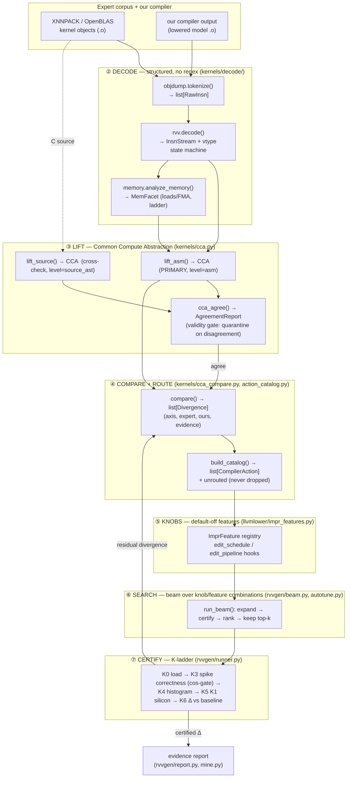
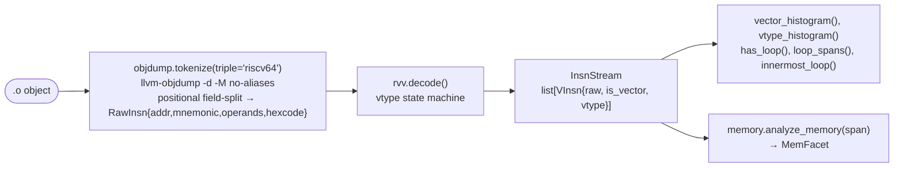
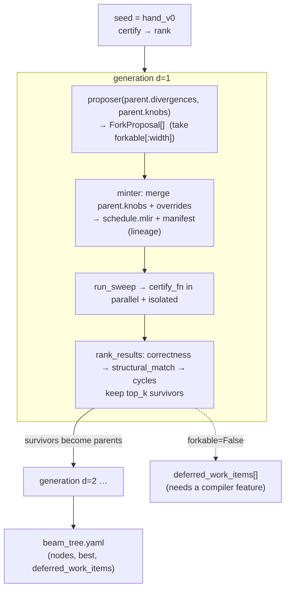
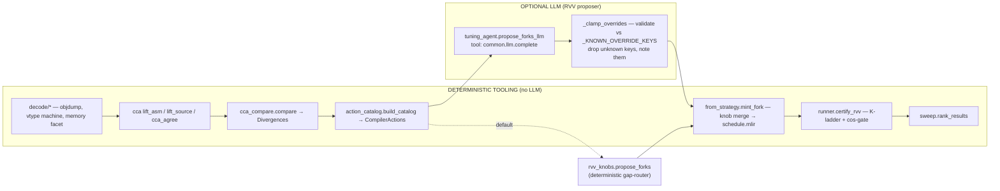

# Kernel-Mining → Compiler-Improvement: Methodology

*How we mine what expert kernels do, abstract it into target-agnostic structure, route it to
concrete compiler knobs, search the knob space with beam search, and certify every change against a
frozen baseline — with the split between deterministic tooling and LLM/agent stages made explicit.*

> Scope. This document is the **methodology and architecture** companion to the results writeups
> (`docs/rvv_kernel_mining_results.md`, `output/kernels/ceiling/RESULTS.md`). It describes *how the
> system works and how the artifacts interact*, not the measured numbers. RVV is the testbed; every
> abstraction is target-agnostic by construction (§9).

---

## 0. The one-paragraph version

We disassemble expert kernels (XNNPACK, OpenBLAS) and our own compiler's output to the **one
substrate every framework lowers to — assembly**. We lift both into a **Common Compute Abstraction
(CCA)**: target-agnostic facets (compute / vector / spatial / dataflow) reconstructed *structurally*
from the instruction stream, never by regex over text. We diff expert-CCA against ours-CCA to get
typed **Divergences**, route each divergence to a typed **CompilerAction** (FLAG / HEURISTIC / PASS /
KNOB) that names a concrete **seam** in our compiler, express that action as a **default-off feature**
(so the baseline stays byte-identical), and let a **beam search** explore combinations of those
features — certifying every candidate for *correctness first*, structural match to the expert
second, cycles last. The loop is deterministic end-to-end; an LLM is an *optional* proposer whose
suggestions are always clamped and validated before they can touch the compiler.

---

## 1. The mining loop (the whole process in one diagram)



The dashed back-edge — *certified result → residual divergence → re-compare* — is the iterative
heart. Each turn closes a measured gap and re-lifts the residual from fresh asm. (Turn 1 = vfmacc
fusion; turn 2 = `.vf` A-scalarization; turn 3 = packing/memory-traffic facet, which **refuted** the
human "packing" hypothesis by measuring ours-`.vf` already ties XNNPACK on loads/FMA.)

### Why asm is the substrate

XNNPACK lowers from C intrinsics, OpenBLAS from hand asm, ours from MLIR — three different front
ends. The **only** representation where all three are directly comparable is the emitted RISC-V
instruction stream. So the authoritative lift is `lift_asm`; source-level lifting (`lift_source`,
from the clang AST) exists purely as a **cross-check** that gates validity (§3.3), not as the
primary signal.

---

## 2. The measurement substrate (the honesty floor)

Every claim is pinned to a rung of a measurement ladder, and the rung is always reported:

| Rung | What it is | What it measures | `cycle_accurate` |
|---|---|---|---|
| **spike** | functional ISS | `minstret` instruction count (IPC=1 proxy, **no** memory hierarchy) | `false` |
| **K1 board** | real SpacemiT silicon (`root@…`, VLEN=256) | `rdtime` ticks → wall-ns; cycles *derived* (`ticks × 1600/24 MHz`) | `false` |
| **FireSim / VCS** | cycle-accurate RTL sim | true cycles | `true` (queue-gated, never escalated) |

Consequences we state openly: a loads/FMA improvement is invisible on spike (a load costs the same
as an FMA there) and only shows on the board / FireSim; the board's `cycles` is a derived estimate,
so `wall_ns` is the ground truth there. When a rung is unreachable the result is recorded as
`not_run`, never fabricated.

---

## 3. Mining & tooling, in detail

This is the part that must generalize. Everything here is a **deterministic tool** — no LLM in the
extraction path — so the same input always yields the same CCA, the same divergences, the same
actions.

### 3.1 Decode — structured disassembly, zero semantic regex

The old extractor (`kernels/features/rvv_intrinsics.py`) was **7 regex patterns over C source**
(`_E_LMUL = r"_e(\d+)m(f?\d+)\b"` guessing LMUL from a substring of an intrinsic name). It survives
only as a low-confidence source cross-check. The authoritative path is three structured decoders:



**`objdump.tokenize()`** disassembles with `llvm-objdump -d --triple=riscv64 -M no-aliases` and parses
each line *positionally* — split on `:` for the address, whitespace for `[hex, mnemonic, operands]`,
commas for operands. No regex guesses meaning; it just tokenizes.

```python
@dataclass
class RawInsn:
    addr: int            # byte address within section
    mnemonic: str        # "vfmacc.vf", "vsetivli", "addi"
    operands: list[str]  # comma-split, stripped
    hexcode: str = ""
    section: str = ""
```

**`rvv.decode()`** runs a **vtype state machine**. RVV encodes element width and grouping in explicit
`vsetvli`/`vsetivli` operands (`e32, m4, ta, ma`); the decoder reads those operand tokens directly,
tracks the *current* `VType`, and stamps every following vector instruction with its **effective**
vtype. This is what lets us say "this `vfmacc.vf` runs at SEW=32, LMUL=4" without ever pattern-matching
a string.

```python
@dataclass(frozen=True)
class VType:                       # parsed from explicit operands, never guessed
    sew: int | None;  lmul: float | None;  tail: str | None;  mask: str | None

@dataclass
class VInsn:
    raw: RawInsn;  is_vector: bool;  vtype: VType | None   # effective vtype at this insn
```

`InsnStream` then exposes the structural queries the lifter needs: histograms, loop-back-edge spans
(`loop_spans()` resolves branch targets robustly across `0x1dc` and `0x1dc <sym+…>` forms),
`innermost_loop()`, and span-scoped counts (`count_in(span, "vfmacc")`).

**`memory.analyze_memory()`** is the turn-3 facet — the CCA's compute/vector facets captured *what*
the FMA does but were blind to *how operands reach it*. Scoped to the K-reduction loop, it classifies
every load by mnemonic prefix (again, the ISA encodes addressing mode in the opcode):

```python
@dataclass
class MemFacet:
    fma_in_loop: int
    vec_unit_loads: int        # vle / vlNre   — packed-panel (the expert shape)
    vec_strided_loads: int     # vlse          — 2-D model-layout gather
    vec_indexed_loads: int     # vlux / vlox   — scatter/gather
    scalar_loads: int          # flw / fld     — the .vf A scalar
    broadcast_ladder_ops: int  # vslideup/vmv/vrgather — rebuilding A per K step (the .vv cost)
    loads_per_fma: float | None
    a_broadcast_per_fma: float | None
    unit_stride_only: bool
```

This single facet is what let us *measure* — not assert — that the `.vf` kernel ties XNNPACK at
**2.0 loads/FMA, unit-stride, 0 ladder ops**, and pin the only remaining lever (OpenBLAS's MR>1
A-reuse) as structurally inapplicable to small-M VLA matmuls.

### 3.2 Lift — the Common Compute Abstraction (CCA)

The CCA is the generalization layer. It is **per-op-region** and **target-agnostic**: a `backend`
tag plus four facets, only the relevant ones populated. RVV fills `compute` + `vector`; Gemmini would
fill `compute` + `spatial`; an NPU fills `dataflow`; a heterogeneous model is N regions each with its
own backend tag.

```python
@dataclass
class CCA:
    op: str
    backend: list[str]                 # ["rvv"] | ["gemmini"] | ["npu","rvv"] | ...
    compute:  ComputeFacet             # target-agnostic
    vector:   VectorFacet | None       # RVV/SIMD
    spatial:  SpatialFacet | None      # Gemmini/systolic
    dataflow: DataflowFacet | None     # NPU
    provenance: dict                   # {"level": "asm"|"source_ast"|"dse", "source", "confidence"}

@dataclass
class ComputeFacet:
    op; contraction_form           # "fused_fma" | "mul_add" | "outerproduct" | "dot" | "systolic"
    accumulator_dtype; widening; reduction_form
    register_block                 # (mr, nr); nr = ("vsetvlmax", lmul) — symbolic, VLEN-relative
    epilogue; accumulator_resident; nr_is_vsetvlmax
```

What makes the lift trustworthy is that every field is **structurally inferred**, not read off a name:

- **`contraction_form`** — `fused_fma` iff `vfmacc/vmacc` count > 0; `mul_add` iff separate
  `vfmul`+`vfadd`. (This is the turn-1 gap: our `outerproduct` lowering emitted `vfmul`+`vfadd`,
  the experts emitted `vfmacc`.)
- **`accumulator_resident`** — a **spill detector**: walk the FMA loop; if a whole-register store
  (`vs1r/vs2r/vs4r/vs8r`) + reload (`vl1re/…`) of the MAC destination appears *inside* the loop, the
  accumulator is round-tripping through memory → `False`; absent → `True`; no FMA loop → `None`.
- **`register_block` (MR, NR)** — MR = count of distinct accumulator vregs fed by the broadcast MAC
  chain in the K-loop; NR = `("vsetvlmax", lmul)` (symbolic lanes, LMUL-scaled relative to VLEN — not
  an absolute lane count, so it ports across VLENs).

### 3.3 Cross-level agreement — the validity gate (why mining doesn't overfit)

The same op is lifted from **two** levels: asm (primary) and the clang-AST source facts
(`clang_ast.extract()` → `SourceFacts`, which resolves SEW/LMUL from the *resolved C type*
`vfloat32m4_t`, not the intrinsic name). `cca_agree(asm_cca, source_cca)` compares them **per facet
field**:

```python
@dataclass
class AgreementReport:
    agree: bool
    disagreements: list[str]   # ["vector.lmul: asm=4 vs source_ast=2", ...]
    compared_fields: list[str]
```

A kernel whose asm- and source-lifted CCAs disagree on a populated field is **quarantined** — it
cannot promote a divergence into a compiler action. This is the built-in defence against reading a
decode artifact as a real algorithmic decision, and it is tested *both ways* (agreement on a curated
kernel; the gate *firing* on a deliberately mismatched pair).

### 3.4 A worked CCA artifact (the concrete example)

Here is the abstraction made concrete: the turn-1 GEMM K-loop, lifted from both expert and our
asm, the divergence between them, and the action it routes to. This is the kind of record that lands
in a `mining_rvv_v{V}_{ts}/` run.

**Expert — XNNPACK `1x4v` f32 GEMM micro-kernel** (lifted from its `.o`):

```yaml
op: matmul
backend: [rvv]
compute:
  contraction_form: fused_fma          # vfmacc.vf present
  accumulator_dtype: f32
  register_block: [1, ["vsetvlmax", 4]]   # MR=1, NR = LMUL-4 lanes
  accumulator_resident: true           # no spill store/reload inside K-loop
  nr_is_vsetvlmax: true
vector: {sew: 32, lmul: 4, vl_strategy: vsetvl_loop, tail: ta}
provenance: {level: asm, source: xnnpack/…/1x4v-rvv.o, confidence: high}
# memory facet (analyze_memory, K-loop one trip):
#   vec_unit_loads=1, scalar_loads=1, broadcast_ladder_ops=0, loads_per_fma=2.0, unit_stride_only=true
```

**Ours — baseline `outerproduct` lowering of the same matmul** (lifted from our `.o`):

```yaml
op: matmul
backend: [rvv]
compute:
  contraction_form: mul_add            # vfmul.vv + vfadd.vv — NO vfmacc
  accumulator_dtype: f32
  accumulator_resident: false          # vs4r spill + vl4re reload inside the K-loop
  register_block: [1, ["vsetvlmax", 4]]
vector: {sew: 32, lmul: 4, vl_strategy: vsetvl_loop, tail: ta}
provenance: {level: asm, source: ours/openvla_fp32/model.o, confidence: high}
```

**Divergences** (`compare()` — only differing, both-non-None fields):

```yaml
- axis: compute.contraction_form
  expert: fused_fma
  ours:   mul_add
  backend: rvv
  evidence: [xnnpack_rvv_gemm, openblas_rvv_gemm]
- axis: compute.accumulator_resident
  expert: true
  ours:   false
  backend: rvv
  evidence: [xnnpack_rvv_gemm]
```

**Actions** (`build_catalog()` — typed, each names a seam):

```yaml
- divergence_axis: compute.contraction_form
  action_class: PASS
  target_seam: "impr_features:fused_vfmacc_contraction"
  change: "form a real vector.contract / inject fastmath<contract> so asm carries vfmacc not vfmul+vfadd"
  forkable_now: true        # registered feature exists and is measured to work
  expected_effect: "vfmacc replaces vfmul+vfadd; MEASURED ~7.9x on the isolated kernel"
- divergence_axis: compute.accumulator_resident
  action_class: PASS
  target_seam: "impr_features:accumulator_resident_microkernel"
  change: "keep MAC chain in vreg group across K; eliminate per-tile spill/reload"
  forkable_now: true
  expected_effect: "removes vs4r/vl4re round-trip inside K-loop"
```

That YAML triplet — **lifted CCA → typed divergence → seam-named action** — is the unit of "what the
expert does that we don't, and exactly where in the compiler to change it." It is human-readable,
diffable, and reproducible from the `.o` files alone.

---

## 4. Utilizing what we capture — the compiler-knob layer

The action catalog answers *what to change*. The **knob layer** is *where and how* — and its hard
invariant is that **the baseline never moves**.

### 4.1 The four action classes and their seams

Every `CompilerAction.action_class` maps to exactly one compiler seam:

| Class | Seam | Mechanism |
|---|---|---|
| **KNOB** | `transform_schedule=` | additive edit to the transform-dialect schedule (e.g. tile/vector sizes, NR=vsetvlmax) |
| **PATTERN** | `schedule.mlir` (full replace) | a feature with `schedule_replace=True` swaps the whole schedule |
| **PASS** | MLIR pass list via `build_rvv_pipeline(features=)` | inserts/edits lowering passes |
| **HEURISTIC** | MLIR pass list | same seam as PASS, semantically a policy choice |
| **FLAG** | `cflags_override=` | C-compiler flag (e.g. `-ffp-contract=fast`) |
| **CODEGEN** | (marker, no edit) | a *ceiling reference* (hand-written driver) — names the work, emits nothing |

### 4.2 The default-off feature registry (`llvmlower/impr_features.py`)

Each PASS/HEURISTIC/PATTERN action is expressed as a named, **default-off** `ImprFeature`:

```python
@dataclass(frozen=True)
class ImprFeature:
    name: str
    action_class: str                  # PASS | HEURISTIC | PATTERN | CODEGEN
    description: str
    edit_pipeline: Callable[[list[str]], list[str]] | None = None   # mutate the MLIR pass list
    edit_schedule: Callable[[str], str] | None = None               # mutate the transform schedule
    schedule_replace: bool = False                                  # full-schedule replacement?
```

The registry today holds ~48 features — the mined headline families plus their MR/NR/KC tuning grids.
The ones that carry the story:

- `fused_vfmacc_contraction`, `fused_vfmacc_tiled` / `_scalable` — the turn-1 vfmacc PASS.
- `accumulator_resident_microkernel` (v1) → `…_v2` (PRE-bufferize subset hoist) →
  `accumulator_resident_microkernel_v3` (the `.vf` A-scalarization) — the turn-2 residency line.
- `accumulator_resident_wholemodel_vf` (v3 + whole-model tail clamps MR_mm=1 / NR_bmm=8) and
  `…_vf_mr4` (the turn-3 MR=4 A-reuse register block).
- `vectorized_transcendental_activation` — minimax-poly exp/erf/tanh + elementwise vectorize.
- `lmul_widen_n` (KNOB), `intrinsic_microkernel` (CODEGEN ceiling marker, no edit).

### 4.3 The byte-identical baseline guarantee

The composition functions are identity on the empty set, which is the whole safety story:

```python
def apply_pipeline(passes, features):
    if not features: return passes                 # identity → byte-identical pass string
    out = list(passes)
    for name in sorted(features):                  # deterministic order
        f = get(name)
        if f.edit_pipeline: out = f.edit_pipeline(out)
    return out

def apply_schedule(text, features):
    if not features: return text                   # identity → byte-identical schedule
    # at most ONE schedule_replace feature (else CompositionError); additive edits layer on top
```

Guarded by `test_impr_features.py::test_empty_features_pipeline_byte_identical` and
`…_schedule_byte_identical`. So `hand_v0` (the frozen baseline, `compiler_features: []`) emits the
exact shipping pipeline; a feature can only change asm *when a fork explicitly enables it*.

### 4.4 Threading and lineage

Features flow `RvvPackage.compiler_features → apply_rvv_package → build_app → lower_model →
lower_to_llvm_ir(features=) → {apply_schedule, build_rvv_pipeline(features=)}`. Every fork is a
versioned directory with a manifest whose `lineage` records `parent_run_id: hand_v0`, `version`,
`depth`, the `action` block (`{class, seam}`), and `source_evidence` (the mined policies that
justified it):

```
artifacts/targets/rvv/
  hand_v0/                       # immutable baseline; status=shipped; features=[]
  impr_auto_1_<ts>/              # fork; parent_run_id=hand_v0; features=[fused_vfmacc_contraction,…]
  rvv_tuned_v1_d1_<ts>/          # beam fork: v=generation, d=beam depth
artifacts/kernel-mining/rvv/
  mining_rvv_v{V}_{ts}/          # CCAs, agreement report, divergences, action catalog
```

Forks are **isolated**: they never edit `pipeline.py` defaults; they are reproducible from manifest +
source alone.

---

## 5. Beam search — why, and how beams combine

### 5.1 Why beam search

The knob space (tile × vector × contraction strategy × lowering patterns × dtype × feature subsets)
is combinatorial. Two extremes fail: greedy hill-climbing gets trapped (vfmacc alone is neutral until
paired with residency); exhaustive 2^N over features is intractable. Beam search is the middle —
**breadth-first but depth- and width-limited**, expanding only surviving branches, ranked toward the
expert oracle rather than a raw scalar. It is also the natural fit for the iterative loop: each
generation's residual divergences seed the next generation's proposals.

### 5.2 The search (`rvvgen/beam.py::run_beam`)

```python
def run_beam(seed_pkg, model_dir, curated_text, op_key, *, runs_root,
             width=3, depth=2, top_k=2, target="rvv", targets=("spike",),
             certify_fn=certify_rvv, proposer=propose_forks,
             loader=load_rvv_package, minter=mint_fork) -> dict: ...
```



**Search space** = knob overrides derived from the parent's S4 divergences: `op_match` (tile +
vector size lists), `contraction_strategy` (`outerproduct|dot|matmulintrinsics|parallelarith`),
`lowering_patterns`, `dtype_strategy`.

**Scoring is lexicographic — correctness dominates, cycles only break ties:**

```python
def key(n):
    correct = 1 if n["gate_ok"] else 0
    sm      = n["structural_match"] or 0.0     # 0.6*decision_match + 0.4*histogram_cosine
    cyc     = n["cycles"]
    return (correct, sm, -(cyc if cyc is not None else inf))
```

`structural_match = 0.6·(matched RVV decisions / 6) + 0.4·cosine(expert_histogram, ours_histogram)`
— so the beam climbs *toward the expert's fingerprint*, and an incorrect candidate can never
out-rank a correct one. A fork with no correctness gate gets `speedup = None` (fail-closed, §7).

### 5.3 How beams merge / combine

There are **two composition mechanisms**, deliberately:

1. **Implicit knob merge (`beam.py`).** Each fork deep-copies the parent's full knob dict and
   `knobs.update(overrides)`. So a child *inherits everything the parent had* plus one new lever. A
   winner two levels deep is literally `seed → (widen N) → (widen N + outerproduct)` — the beam
   discovers beneficial **knob combinations** by depth traversal, no explicit set algebra.

2. **Explicit greedy feature extension (`autotune.py::beam_search`).** This variant searches over
   **feature *sets*** ranked by *measured K1 wall-time*. A survivor with features `{A,B}` spawns
   candidates `{A,B,C}, {A,B,D}, …` — one feature added per step:

   ```python
   for d in range(1, depth):
       cands = {frozenset(p["features"]) | {f}
                for p in survivors for f in features if f not in p["features"]}
       rs = [evalc(c) for c in cands]
       allcorrect = sorted([r for r in survivors+rs if r["correct"]], key=lambda r: r["min_wall"])
       survivors = allcorrect[:width]
   ```

   This is exactly how the *neutral-alone, synergistic-together* pair was found: `vfmacc` only pays
   off once `accumulator_resident` is also in the set, and greedy extension surfaces the combination
   without enumerating all 2^N subsets.

Branches that can't be expressed as a knob today (forkable=False — e.g. a VL-polymorphic-tail PASS
that doesn't exist yet) are not discarded: they are logged to `beam_tree.yaml["deferred_work_items"]`
as the explicit "next compiler feature to build" list. No silent truncation.

---

## 6. Tooling vs. agents — who does what

The pipeline is **deterministic by default**. An LLM appears in exactly one *optional, sandboxed*
role (RVV) and one *separate* generative system (Gemmini targetgen). Everything else is tooling.



- **Decode → lift → compare → catalog → mint → certify → rank: 100% deterministic.** Same inputs ⇒
  same outputs. This is the auditable spine.
- **Proposer is pluggable.** The default `kernels/rvv_knobs.py::propose_forks` is a deterministic
  **gap-router**: a divergence key → a fixed list of levers (e.g. "lmul_class" → widen-N knob). The
  **optional** `rvvgen/tuning_agent.py::propose_forks_llm` renders a versioned prompt from the
  divergences + knobs, calls `common.llm.complete` (its only tool), parses JSON proposals — and then
  **every override is clamped against `_KNOWN_OVERRIDE_KEYS`; unknown keys are dropped and noted.**
  No LLM output reaches the compiler unvalidated. Both proposers emit the identical `ForkProposal`
  type, so the beam can't tell which produced a candidate.
- **Gemmini targetgen agent** (`merlin/python/merlin/targetgen/agent/`) is a *separate* system: it
  drives the Claude Code CLI headless to generate bare-metal Gemmini C kernels under a
  propose → visible-rung test → feedback → held-out-certification discipline. It is **not** part of
  the RVV beam; it shares only the gate philosophy (nothing is trusted until it certifies).

---

## 7. Certification — the K-ladder and the cos-gate

`runner.certify_rvv` runs every candidate through a fail-closed ladder; the beam consumes its
structured result:

| Rung | Check | Fails closed? |
|---|---|---|
| K0 | load + integrity | yes |
| K1 | non-perturbation (seed == canonical schedule) | yes |
| K2 | build via `apply_rvv_package` | yes |
| **K3** | **spike correctness — cosine(output, golden) ≥ 0.999** | **yes (the gate)** |
| K4 | instruction histogram (evidence, not a gate) | no |
| K5 | K1 silicon cycles (`rdtime`→cycles + `wall_ns`); `not_run` if board unreachable | no |
| K6 | Δ vs baseline — **speedup credited only if K3 passed** | yes |

```python
gate_ok = bool(rec["correctness"]["gate_ok"])
speedup = (baseline_cycles / m["cycles"]) if gate_ok else None   # incorrect ⇒ no number, ever
```

A candidate that is fast but wrong reports `speedup = None`. This is the structural reason the headline
numbers are defensible: nothing that fails the cosine gate can produce a speedup claim, and the rung
(`spike` vs `K1` vs `not_run`) is always attached.

---

## 8. End-to-end artifact interaction (how the pieces talk)

```mermaid
flowchart TD
    objs[".o files (expert + ours)"] -->|decode/*| stream["InsnStream + MemFacet"]
    stream -->|cca.lift_asm| cca["CCA records"]
    src["C source"] -->|clang_ast + lift_source| ccaS["CCA (source)"]
    cca & ccaS -->|cca_agree| gate{"agree?"}
    gate -->|no| quarantine["quarantined (no promotion)"]
    gate -->|yes| div["Divergences (cca_compare)"]
    div -->|action_catalog| actions["CompilerActions (typed, seam-named)"]
    actions -->|forkable| feat["impr_features (default-off)"]
    actions -->|not forkable| deferred["deferred work items"]
    feat -->|proposer → mint_fork| fork["impr_ fork pkg<br/>schedule.mlir + knobs.yaml + manifest(lineage)"]
    fork -->|apply_rvv_package → build_app → lower → pipeline(features=)| elf["zephyr.elf"]
    elf -->|certify_rvv K-ladder| result["certified result (gate_ok, cycles, wall_ns)"]
    result -->|rank_results / beam| best["survivors + beam_tree.yaml"]
    result -->|re-decode residual| stream
    best & actions & div -->|report.py / mine.py| report["evidence report (md)"]
```

Reading it as a sentence: **objects → InsnStream → CCA → (agreement gate) → Divergences → typed
Actions → default-off Features → minted Forks → built ELF → K-ladder certification → ranked
survivors**, with two back-edges (residual re-decode for the next turn; quarantine for kernels that
fail the validity gate) and one terminal sink (the evidence report). Every box is a real module named
in §3–§7.

---

## 9. Why this generalizes (and doesn't overfit to RVV)

Three design choices keep the methodology target-agnostic:

1. **Asm is the common substrate.** `objdump.tokenize()` is ISA-agnostic; `decode(obj, isa)`
   dispatches per ISA. RVV is the first instantiation; the Gemmini RoCC decoder
   (`targetgen/rocc_decode.py`) is the sibling precedent. A new target adds a decoder, not a rewrite.
2. **The CCA facets are split by execution model, not by ISA.** `compute` is universal; `vector`,
   `spatial`, `dataflow` are populated only where they apply, and a composite model (NPU+RVV) is just
   N regions with different `backend` tags. Nothing in the comparator or action catalog is
   RVV-specific except the *route table* (`_ROUTES["rvv"]`), which is data, not code.
3. **The beam is plugin-shaped.** `run_beam(loader, minter, proposer, certify_fn)` are all injectable
   (see `rvvgen/TARGET_PLUGIN.md`); a new target reuses the orchestration unchanged by supplying its
   own four callables. The cross-level agreement gate, the byte-identical-baseline invariant, and the
   fail-closed cos-gate are target-independent.

The validity gate (§3.3) is the specific anti-overfitting mechanism: a divergence can only become a
compiler action if it agrees across asm and source levels, so we never "optimize" toward a decode
artifact. And the iterative loop has twice corrected a *human* hypothesis with a *measured* refutation
(lane-width, then packing) — the system is built to overrule its operators when the asm disagrees.

---

## 10. Pointers (where each thing lives)

| Concern | Module |
|---|---|
| Tokenize / decode | `kernels/decode/{objdump,rvv,memory,clang_ast}.py` |
| CCA + lifters + agreement | `kernels/cca.py` |
| Comparator / divergences | `kernels/cca_compare.py` |
| Typed action catalog | `kernels/action_catalog.py` |
| Default-off feature registry | `llvmlower/impr_features.py` |
| Pipeline / schedule seams | `llvmlower/pipeline.py` (`build_rvv_pipeline(features=)`, `lower_to_llvm_ir`) |
| Fork minting + lineage | `rvvgen/fork.py`, `rvvgen/from_strategy.py` |
| Apply / threading | `rvvgen/apply.py`, `runtime/backends/zephyr_model.py::build_app` |
| Beam (knob merge) | `rvvgen/beam.py` |
| Beam (feature extension, K1-ranked) | `rvvgen/autotune.py` |
| Deterministic proposer (gap-router) | `kernels/rvv_knobs.py` |
| Optional LLM proposer | `rvvgen/tuning_agent.py` |
| K-ladder certification | `rvvgen/runner.py` |
| Ranking / sweep | `rvvgen/sweep.py` |
| Evidence report / driver | `rvvgen/report.py`, `rvvgen/mine.py` |
| Gemmini targetgen agent | `targetgen/agent/`, `targetgen/rocc_decode.py` |
| Tests | `tests/test_decode_rvv.py`, `test_cca.py`, `test_action_catalog.py`, `test_impr_features.py`, `test_rvv_beam.py`, `test_tuning_agent.py`, `test_rvv_runner.py` |
