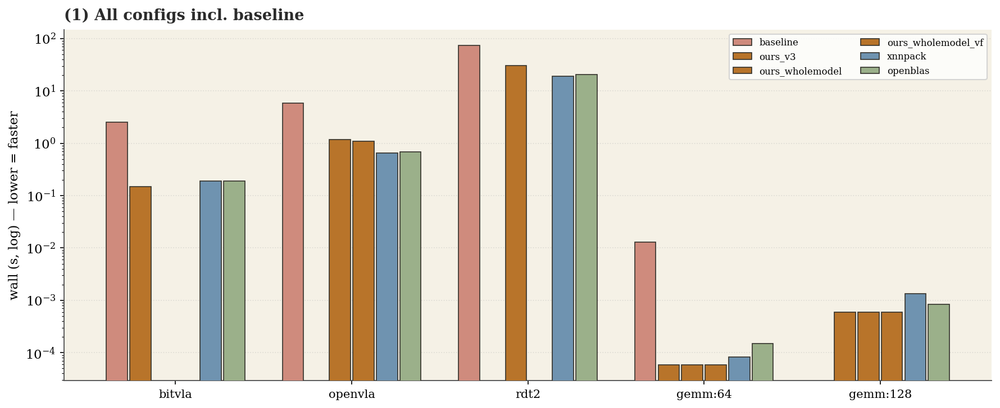

# merlin-compare — compare

target=`k1` · metric=`wall` · reps=5 · commit=`a459c1bb1330`

> v1 INGESTS already-measured host/board data (no new board run). Static CCA decode gives the RANKING of structural factors, not exact cycle fractions (no K1 perf counters).

## 1. Empirical (measured table)

| workload | baseline | ours_v3 | ours_wholemodel | ours_wholemodel_vf | xnnpack | openblas |
|---|---|---|---|---|---|---|
| bitvla | 2.5243s ±0.5% (cos 1.0000) | 0.1495s ±4.6% (cos 1.0000) | not_measured | not_measured | 0.1913s ±2.0% (cos 1.0000) | 0.1885s ±3.0% (cos 1.0000) |
| openvla | 5.8550s ±1.6% (cos 1.0000) | not_measured | 1.1857s ±3.8% (cos 1.0000) | 1.0889s ±2.3% (cos 1.0000) | 0.6565s ±2.7% (cos 1.0000) | 0.6864s ±1.8% (cos 1.0000) |
| rdt2 | 73.8266s ±0.4% (cos 1.0000) | not_measured | 30.7772s ±2.1% (cos 1.0000) | not_measured | 18.9800s ±0.2% (cos 1.0000) | 20.3163s ±0.8% (cos 1.0000) |
| gemm:64 | 0.0128s | 0.0001s | 0.0001s | 0.0001s | 0.0001s | 0.0001s |
| gemm:128 | not_measured | 0.0006s | 0.0006s | 0.0006s | 0.0013s | 0.0008s |

## 2. Structural (per-config CCA)

| config | contraction | acc_resident | nr_is_vsetvlmax | sew/lmul | vfmacc(.vf/.vv) |
|---|---|---|---|---|---|
| baseline | (no vector matmul decode — scalar/baseline) | | | | |
| ours_v3 | fused_fma | True | False | 32/4.0 | vf=4, vv=0 |
| ours_wholemodel | fused_fma | True | True | 32/4.0 | vf=0, vv=1 |
| ours_wholemodel_vf | fused_fma | True | False | 32/4.0 | vf=4, vv=0 |
| xnnpack | fused_fma | True | True | 32/4.0 | vf=1, vv=0 |
| openblas | fused_fma | True | False | 32/2.0 | vf=60, vv=0 |

## 3. Attribution (measured gap × structural divergence × routed action)

### bitvla: `ours_v3` vs `xnnpack` — ours BEATS expert

- measured: ours=0.1495s, expert=0.1913s, ratio(ours/expert)=0.78x
- structural divergences (expert vs ours):
    - `compute.register_block`: expert=(1, ('vsetvlmax', 4.0)) vs ours=(4, ('vsetvlmax', 4.0))
    - `compute.nr_is_vsetvlmax`: expert=True vs ours=False
    - `vector.vl_strategy`: expert='vsetvl_loop' vs ours='vsetivli_fixed'
- routed compiler actions:
    - [HEURISTIC] `schedule:NR=vsetvlmax (VL-adaptive output tile + N-tail clamp)` (forkable-now) — one kernel adapts NR to any VLEN; small-N contractions vectorize (N-tail) instead of hitting the masked-transfer_write fallback to scalar
    - [PASS] `pass:vl-polymorphic-tail (emit vsetvli loop)` (deferred) — one kernel handles any VLEN; smaller code; no fixed-width tail waste
- unrouted divergences (surfaced, not dropped): `compute.register_block`
- note: ours BEATS xnnpack: 0.78x its wall (1.28x faster).
- note: static CCA decode gives the RANKING of structural factors, not exact cycle fractions (no K1 perf counters).

### bitvla: `ours_v3` vs `openblas` — ours BEATS expert

- measured: ours=0.1495s, expert=0.1885s, ratio(ours/expert)=0.79x
- structural divergences (expert vs ours):
    - `compute.register_block`: expert=(16, ('vsetvlmax', 2.0)) vs ours=(4, ('vsetvlmax', 4.0))
    - `vector.lmul`: expert=2.0 vs ours=4.0
- unrouted divergences (surfaced, not dropped): `compute.register_block`, `vector.lmul`
- note: ours BEATS openblas: 0.79x its wall (1.26x faster).
- note: static CCA decode gives the RANKING of structural factors, not exact cycle fractions (no K1 perf counters).

### openvla: `ours_wholemodel` vs `xnnpack` — ours 55% of expert

- measured: ours=1.1857s, expert=0.6565s, ratio(ours/expert)=1.81x
- note: vfmacc form: expert emits .vf (broadcast A scalar; vf=1, vv=0); ours emits .vv (vf=0, vv=1) -> the per-K broadcast-ladder gap driver (kernel_breakdown.md).
- note: ours trails xnnpack: 55% of expert speed (ratio 1.81x of expert wall).
- note: static CCA decode gives the RANKING of structural factors, not exact cycle fractions (no K1 perf counters).

### openvla: `ours_wholemodel` vs `openblas` — ours 58% of expert

- measured: ours=1.1857s, expert=0.6864s, ratio(ours/expert)=1.73x
- structural divergences (expert vs ours):
    - `compute.register_block`: expert=(16, ('vsetvlmax', 2.0)) vs ours=(1, ('vsetvlmax', 4.0))
    - `compute.nr_is_vsetvlmax`: expert=False vs ours=True
    - `vector.lmul`: expert=2.0 vs ours=4.0
    - `vector.vl_strategy`: expert='vsetivli_fixed' vs ours='vsetvl_loop'
- unrouted divergences (surfaced, not dropped): `compute.register_block`, `compute.nr_is_vsetvlmax`, `vector.lmul`, `vector.vl_strategy`
- note: vfmacc form: expert emits .vf (broadcast A scalar; vf=60, vv=0); ours emits .vv (vf=0, vv=1) -> the per-K broadcast-ladder gap driver (kernel_breakdown.md).
- note: ours trails openblas: 58% of expert speed (ratio 1.73x of expert wall).
- note: static CCA decode gives the RANKING of structural factors, not exact cycle fractions (no K1 perf counters).

### openvla: `ours_wholemodel_vf` vs `xnnpack` — ours 60% of expert

- measured: ours=1.0889s, expert=0.6565s, ratio(ours/expert)=1.66x
- structural divergences (expert vs ours):
    - `compute.register_block`: expert=(1, ('vsetvlmax', 4.0)) vs ours=(5, ('vsetvlmax', 1.0))
    - `compute.accumulator_resident`: expert=True vs ours=False
    - `vector.lmul`: expert=4.0 vs ours=1.0
- routed compiler actions:
    - [PASS] `impr_features:accumulator_resident_microkernel` (deferred) — accumulator never touches memory across the reduction; removes the accumulator/result memref.copy traffic that is the measured ~15.7x scalable gap (compute kernel alone is already ~1.5x OpenBLAS)
    - [KNOB] `schedule:vector_sizes (widen N to raise LMUL)` (forkable-now) — larger vector groups -> fewer vset/loop iterations per output tile
- unrouted divergences (surfaced, not dropped): `compute.register_block`
- note: vfmacc form: expert emits .vf (broadcast A scalar; vf=1, vv=0); ours emits .vv (vf=0, vv=16) -> the per-K broadcast-ladder gap driver (kernel_breakdown.md).
- note: ours trails xnnpack: 60% of expert speed (ratio 1.66x of expert wall).
- note: static CCA decode gives the RANKING of structural factors, not exact cycle fractions (no K1 perf counters).

### openvla: `ours_wholemodel_vf` vs `openblas` — ours 63% of expert

- measured: ours=1.0889s, expert=0.6864s, ratio(ours/expert)=1.59x
- structural divergences (expert vs ours):
    - `compute.register_block`: expert=(16, ('vsetvlmax', 2.0)) vs ours=(5, ('vsetvlmax', 1.0))
    - `compute.accumulator_resident`: expert=True vs ours=False
    - `compute.nr_is_vsetvlmax`: expert=False vs ours=True
    - `vector.lmul`: expert=2.0 vs ours=1.0
    - `vector.vl_strategy`: expert='vsetivli_fixed' vs ours='vsetvl_loop'
- routed compiler actions:
    - [PASS] `impr_features:accumulator_resident_microkernel` (deferred) — accumulator never touches memory across the reduction; removes the accumulator/result memref.copy traffic that is the measured ~15.7x scalable gap (compute kernel alone is already ~1.5x OpenBLAS)
    - [KNOB] `schedule:vector_sizes (widen N to raise LMUL)` (forkable-now) — larger vector groups -> fewer vset/loop iterations per output tile
- unrouted divergences (surfaced, not dropped): `compute.register_block`, `compute.nr_is_vsetvlmax`, `vector.vl_strategy`
- note: vfmacc form: expert emits .vf (broadcast A scalar; vf=60, vv=0); ours emits .vv (vf=0, vv=16) -> the per-K broadcast-ladder gap driver (kernel_breakdown.md).
- note: ours trails openblas: 63% of expert speed (ratio 1.59x of expert wall).
- note: static CCA decode gives the RANKING of structural factors, not exact cycle fractions (no K1 perf counters).

### rdt2: `ours_wholemodel` vs `xnnpack` — ours 62% of expert

- measured: ours=30.7772s, expert=18.9800s, ratio(ours/expert)=1.62x
- note: vfmacc form: expert emits .vf (broadcast A scalar; vf=1, vv=0); ours emits .vv (vf=0, vv=1) -> the per-K broadcast-ladder gap driver (kernel_breakdown.md).
- note: ours trails xnnpack: 62% of expert speed (ratio 1.62x of expert wall).
- note: static CCA decode gives the RANKING of structural factors, not exact cycle fractions (no K1 perf counters).

### rdt2: `ours_wholemodel` vs `openblas` — ours 66% of expert

- measured: ours=30.7772s, expert=20.3163s, ratio(ours/expert)=1.51x
- structural divergences (expert vs ours):
    - `compute.register_block`: expert=(16, ('vsetvlmax', 2.0)) vs ours=(1, ('vsetvlmax', 4.0))
    - `compute.nr_is_vsetvlmax`: expert=False vs ours=True
    - `vector.lmul`: expert=2.0 vs ours=4.0
    - `vector.vl_strategy`: expert='vsetivli_fixed' vs ours='vsetvl_loop'
- unrouted divergences (surfaced, not dropped): `compute.register_block`, `compute.nr_is_vsetvlmax`, `vector.lmul`, `vector.vl_strategy`
- note: vfmacc form: expert emits .vf (broadcast A scalar; vf=60, vv=0); ours emits .vv (vf=0, vv=1) -> the per-K broadcast-ladder gap driver (kernel_breakdown.md).
- note: ours trails openblas: 66% of expert speed (ratio 1.51x of expert wall).
- note: static CCA decode gives the RANKING of structural factors, not exact cycle fractions (no K1 perf counters).

### gemm:64: `ours_v3` vs `xnnpack` — ours BEATS expert

- measured: ours=0.0001s, expert=0.0001s, ratio(ours/expert)=0.72x
- structural divergences (expert vs ours):
    - `compute.register_block`: expert=(1, ('vsetvlmax', 4.0)) vs ours=(4, ('vsetvlmax', 4.0))
    - `compute.nr_is_vsetvlmax`: expert=True vs ours=False
    - `vector.vl_strategy`: expert='vsetvl_loop' vs ours='vsetivli_fixed'
- routed compiler actions:
    - [HEURISTIC] `schedule:NR=vsetvlmax (VL-adaptive output tile + N-tail clamp)` (forkable-now) — one kernel adapts NR to any VLEN; small-N contractions vectorize (N-tail) instead of hitting the masked-transfer_write fallback to scalar
    - [PASS] `pass:vl-polymorphic-tail (emit vsetvli loop)` (deferred) — one kernel handles any VLEN; smaller code; no fixed-width tail waste
- unrouted divergences (surfaced, not dropped): `compute.register_block`
- note: ours BEATS xnnpack: 0.72x its wall (1.4x faster).
- note: static CCA decode gives the RANKING of structural factors, not exact cycle fractions (no K1 perf counters).

### gemm:64: `ours_v3` vs `openblas` — ours BEATS expert

- measured: ours=0.0001s, expert=0.0001s, ratio(ours/expert)=0.40x
- structural divergences (expert vs ours):
    - `compute.register_block`: expert=(16, ('vsetvlmax', 2.0)) vs ours=(4, ('vsetvlmax', 4.0))
    - `vector.lmul`: expert=2.0 vs ours=4.0
- unrouted divergences (surfaced, not dropped): `compute.register_block`, `vector.lmul`
- note: ours BEATS openblas: 0.40x its wall (2.53x faster).
- note: static CCA decode gives the RANKING of structural factors, not exact cycle fractions (no K1 perf counters).

### gemm:64: `ours_wholemodel` vs `xnnpack` — ours BEATS expert

- measured: ours=0.0001s, expert=0.0001s, ratio(ours/expert)=0.72x
- note: vfmacc form: expert emits .vf (broadcast A scalar; vf=1, vv=0); ours emits .vv (vf=0, vv=1) -> the per-K broadcast-ladder gap driver (kernel_breakdown.md).
- note: ours BEATS xnnpack: 0.72x its wall (1.4x faster).
- note: static CCA decode gives the RANKING of structural factors, not exact cycle fractions (no K1 perf counters).

### gemm:64: `ours_wholemodel` vs `openblas` — ours BEATS expert

- measured: ours=0.0001s, expert=0.0001s, ratio(ours/expert)=0.40x
- structural divergences (expert vs ours):
    - `compute.register_block`: expert=(16, ('vsetvlmax', 2.0)) vs ours=(1, ('vsetvlmax', 4.0))
    - `compute.nr_is_vsetvlmax`: expert=False vs ours=True
    - `vector.lmul`: expert=2.0 vs ours=4.0
    - `vector.vl_strategy`: expert='vsetivli_fixed' vs ours='vsetvl_loop'
- unrouted divergences (surfaced, not dropped): `compute.register_block`, `compute.nr_is_vsetvlmax`, `vector.lmul`, `vector.vl_strategy`
- note: vfmacc form: expert emits .vf (broadcast A scalar; vf=60, vv=0); ours emits .vv (vf=0, vv=1) -> the per-K broadcast-ladder gap driver (kernel_breakdown.md).
- note: ours BEATS openblas: 0.40x its wall (2.53x faster).
- note: static CCA decode gives the RANKING of structural factors, not exact cycle fractions (no K1 perf counters).

### gemm:64: `ours_wholemodel_vf` vs `xnnpack` — ours BEATS expert

- measured: ours=0.0001s, expert=0.0001s, ratio(ours/expert)=0.72x
- structural divergences (expert vs ours):
    - `compute.register_block`: expert=(1, ('vsetvlmax', 4.0)) vs ours=(4, ('vsetvlmax', 4.0))
    - `compute.nr_is_vsetvlmax`: expert=True vs ours=False
    - `vector.vl_strategy`: expert='vsetvl_loop' vs ours='vsetivli_fixed'
- routed compiler actions:
    - [HEURISTIC] `schedule:NR=vsetvlmax (VL-adaptive output tile + N-tail clamp)` (forkable-now) — one kernel adapts NR to any VLEN; small-N contractions vectorize (N-tail) instead of hitting the masked-transfer_write fallback to scalar
    - [PASS] `pass:vl-polymorphic-tail (emit vsetvli loop)` (deferred) — one kernel handles any VLEN; smaller code; no fixed-width tail waste
- unrouted divergences (surfaced, not dropped): `compute.register_block`
- note: ours BEATS xnnpack: 0.72x its wall (1.4x faster).
- note: static CCA decode gives the RANKING of structural factors, not exact cycle fractions (no K1 perf counters).

### gemm:64: `ours_wholemodel_vf` vs `openblas` — ours BEATS expert

- measured: ours=0.0001s, expert=0.0001s, ratio(ours/expert)=0.40x
- structural divergences (expert vs ours):
    - `compute.register_block`: expert=(16, ('vsetvlmax', 2.0)) vs ours=(4, ('vsetvlmax', 4.0))
    - `vector.lmul`: expert=2.0 vs ours=4.0
- unrouted divergences (surfaced, not dropped): `compute.register_block`, `vector.lmul`
- note: ours BEATS openblas: 0.40x its wall (2.53x faster).
- note: static CCA decode gives the RANKING of structural factors, not exact cycle fractions (no K1 perf counters).

### gemm:128: `ours_v3` vs `xnnpack` — ours BEATS expert

- measured: ours=0.0006s, expert=0.0013s, ratio(ours/expert)=0.44x
- structural divergences (expert vs ours):
    - `compute.register_block`: expert=(1, ('vsetvlmax', 4.0)) vs ours=(4, ('vsetvlmax', 4.0))
    - `compute.nr_is_vsetvlmax`: expert=True vs ours=False
    - `vector.vl_strategy`: expert='vsetvl_loop' vs ours='vsetivli_fixed'
- routed compiler actions:
    - [HEURISTIC] `schedule:NR=vsetvlmax (VL-adaptive output tile + N-tail clamp)` (forkable-now) — one kernel adapts NR to any VLEN; small-N contractions vectorize (N-tail) instead of hitting the masked-transfer_write fallback to scalar
    - [PASS] `pass:vl-polymorphic-tail (emit vsetvli loop)` (deferred) — one kernel handles any VLEN; smaller code; no fixed-width tail waste
- unrouted divergences (surfaced, not dropped): `compute.register_block`
- note: ours BEATS xnnpack: 0.44x its wall (2.26x faster).
- note: static CCA decode gives the RANKING of structural factors, not exact cycle fractions (no K1 perf counters).

### gemm:128: `ours_v3` vs `openblas` — ours BEATS expert

- measured: ours=0.0006s, expert=0.0008s, ratio(ours/expert)=0.71x
- structural divergences (expert vs ours):
    - `compute.register_block`: expert=(16, ('vsetvlmax', 2.0)) vs ours=(4, ('vsetvlmax', 4.0))
    - `vector.lmul`: expert=2.0 vs ours=4.0
- unrouted divergences (surfaced, not dropped): `compute.register_block`, `vector.lmul`
- note: ours BEATS openblas: 0.71x its wall (1.42x faster).
- note: static CCA decode gives the RANKING of structural factors, not exact cycle fractions (no K1 perf counters).

### gemm:128: `ours_wholemodel` vs `xnnpack` — ours BEATS expert

- measured: ours=0.0006s, expert=0.0013s, ratio(ours/expert)=0.44x
- note: vfmacc form: expert emits .vf (broadcast A scalar; vf=1, vv=0); ours emits .vv (vf=0, vv=1) -> the per-K broadcast-ladder gap driver (kernel_breakdown.md).
- note: ours BEATS xnnpack: 0.44x its wall (2.26x faster).
- note: static CCA decode gives the RANKING of structural factors, not exact cycle fractions (no K1 perf counters).

### gemm:128: `ours_wholemodel` vs `openblas` — ours BEATS expert

- measured: ours=0.0006s, expert=0.0008s, ratio(ours/expert)=0.71x
- structural divergences (expert vs ours):
    - `compute.register_block`: expert=(16, ('vsetvlmax', 2.0)) vs ours=(1, ('vsetvlmax', 4.0))
    - `compute.nr_is_vsetvlmax`: expert=False vs ours=True
    - `vector.lmul`: expert=2.0 vs ours=4.0
    - `vector.vl_strategy`: expert='vsetivli_fixed' vs ours='vsetvl_loop'
- unrouted divergences (surfaced, not dropped): `compute.register_block`, `compute.nr_is_vsetvlmax`, `vector.lmul`, `vector.vl_strategy`
- note: vfmacc form: expert emits .vf (broadcast A scalar; vf=60, vv=0); ours emits .vv (vf=0, vv=1) -> the per-K broadcast-ladder gap driver (kernel_breakdown.md).
- note: ours BEATS openblas: 0.71x its wall (1.42x faster).
- note: static CCA decode gives the RANKING of structural factors, not exact cycle fractions (no K1 perf counters).

### gemm:128: `ours_wholemodel_vf` vs `xnnpack` — ours BEATS expert

- measured: ours=0.0006s, expert=0.0013s, ratio(ours/expert)=0.44x
- structural divergences (expert vs ours):
    - `compute.register_block`: expert=(1, ('vsetvlmax', 4.0)) vs ours=(4, ('vsetvlmax', 4.0))
    - `compute.nr_is_vsetvlmax`: expert=True vs ours=False
    - `vector.vl_strategy`: expert='vsetvl_loop' vs ours='vsetivli_fixed'
- routed compiler actions:
    - [HEURISTIC] `schedule:NR=vsetvlmax (VL-adaptive output tile + N-tail clamp)` (forkable-now) — one kernel adapts NR to any VLEN; small-N contractions vectorize (N-tail) instead of hitting the masked-transfer_write fallback to scalar
    - [PASS] `pass:vl-polymorphic-tail (emit vsetvli loop)` (deferred) — one kernel handles any VLEN; smaller code; no fixed-width tail waste
- unrouted divergences (surfaced, not dropped): `compute.register_block`
- note: ours BEATS xnnpack: 0.44x its wall (2.26x faster).
- note: static CCA decode gives the RANKING of structural factors, not exact cycle fractions (no K1 perf counters).

### gemm:128: `ours_wholemodel_vf` vs `openblas` — ours BEATS expert

- measured: ours=0.0006s, expert=0.0008s, ratio(ours/expert)=0.71x
- structural divergences (expert vs ours):
    - `compute.register_block`: expert=(16, ('vsetvlmax', 2.0)) vs ours=(4, ('vsetvlmax', 4.0))
    - `vector.lmul`: expert=2.0 vs ours=4.0
- unrouted divergences (surfaced, not dropped): `compute.register_block`, `vector.lmul`
- note: ours BEATS openblas: 0.71x its wall (1.42x faster).
- note: static CCA decode gives the RANKING of structural factors, not exact cycle fractions (no K1 perf counters).

### Gap-driver axes (union across trailing attributions)

- compute.accumulator_resident
- compute.nr_is_vsetvlmax
- compute.register_block
- vector.lmul
- vector.vl_strategy

## 4. Figures

## 5. Manifest

See `manifest.yaml` (spec + git + source provenance).
