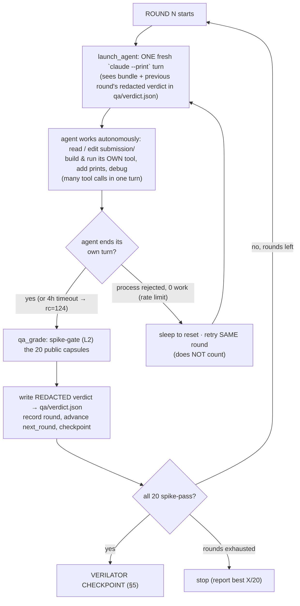
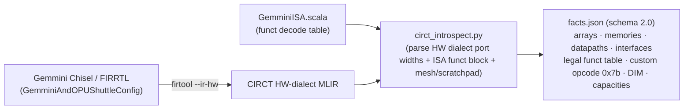
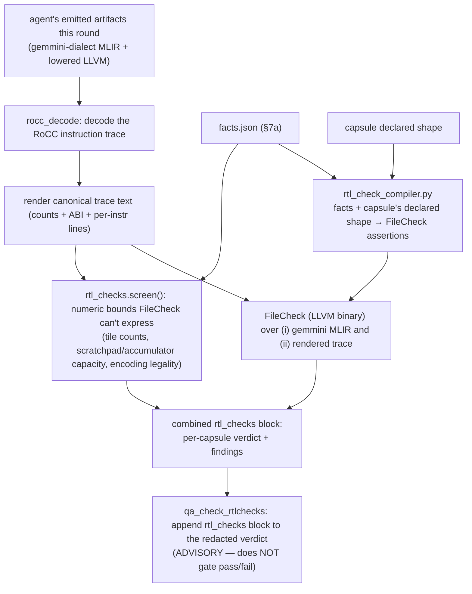

# Methodology — A/B/C agentic study: does RTL-grounded tooling help an agent author a hardware backend?

**One-line claim under test.** Holding the task, model, and grading fixed, we measure how much an agent's
ability to author a correct, complete Gemmini MLIR compiler backend improves as we add (B) Merlin's
authoring tools and (C) our new **CIRCT-compiled-from-RTL** feedback on top of those tools.

This document defines the experiment, the three arms, the shared infrastructure, what each arm is allowed
and denied, and — in detail — how the tooling works and interacts with the agent (especially the CIRCT
checks: how they are compiled from real hardware and fed back into the loop).

---

## 1. The task (identical for all three arms)

Each agent must author an **out-of-tree (OOT) MLIR compiler backend** for the Gemmini systolic-array
accelerator: an input dialect, a Gemmini *target* dialect, the lowering passes between them, and **4 CLI
entrypoints** that together turn a capsule's `capsule.interface.mlir` into a **command buffer** in Merlin's
frozen ABI.

```
capsule.interface.mlir ──[ agent's 4 entrypoints ]──▶ command_buffer.json + lowered.llvm.mlir
   (the problem)            parse                         (the two deliverables Merlin grades)
                            lower_interface_to_target
                            emit_command_buffer
                            lower_target_to_llvm
                                   │
   ════════════ operator-side verification (capsule_runner, agent never runs it) ════════════
        the two deliverables are graded by a ladder; each check below names WHERE it runs,
        WHAT it checks, and AGAINST WHAT (full per-check map in §C.3 / the table below):
   command_buffer.json ─▶ L0  numeric: reference(cb)  ==  independent golden tensor   (bit-exact int)
                       ─▶ L1  consistency: reference(cb) == simulate(cb)
   lowered.llvm.mlir   ─▶ trace: rocc_decode → instruction classes == capsule.expected (+ ordering)
   both                ─▶ L2  spike   : spike_out   == golden == reference == simulate  (ISA exec)
                       ─▶ L3  verilator: rtl_out     == golden == reference == simulate  (cycle-acc RTL)
                            └─ the PASS BAR is L2 (spike). L3 always RUNS and is recorded, but it is
                               ADVISORY: under bwrap the materializer caps a capsule's
                               required_oracle_tiers at L2, so a failing L3 does not fail the capsule.
```

Two distinct check *kinds* run at distinct *places*: **numerical** (output tensor values, bit-exact vs an
independent golden — L0/L2/L3) and **functional/structural** (the RoCC instruction stream is legal,
complete, correctly ordered — the trace gate), plus **cross-oracle consistency** (the four paths must agree,
L1–L3). The per-check "where / what / how / against-what" map is the table in §C.3.

The agent iterates against a **redacted QA verdict** until its capsules pass (details §4). The **frozen
submission is graded only through those 4 CLI entrypoints — never imported** — and must be
**integrity-clean** (no `import merlin`, no oracle calls; see §6).

**Corpus.** 25 capsules: **20 public** (the agent sees their interfaces and iterates to pass them) +
**5 hidden** (held out; graded only in the final audit, to test generalization). Classes span the full op
surface: `config`, `matmul`, `k-accumulation`, `movement (mvin/mvout)`, `acc_scale`, `relu`, `padding`,
`conv2d (im2col)`, `mlp`, `attention`.

---

## 2. The three arms — what differs is *only* the authoring aid

```
                          ┌───────────────────────────── identical ─────────────────────────────┐
  ARM            authoring aid the agent is given        task   model   grading   corpus   sandbox
  ─────────────  ──────────────────────────────────────  ─────  ──────  ────────  ───────  ───────
  A  baseline    (none) spec + headers + contract only      ✓      ✓        ✓         ✓        ✓
  B  merlin      A + Merlin authoring tools (xDSL)          ✓      ✓        ✓         ✓        ✓
  C  merlin+CIRCT B + CIRCT-compiled RTL checks (feedback)  ✓      ✓        ✓         ✓        ✓
```

The arms are **nested**: `C ⊃ B ⊃ A`. Because each adds exactly one thing, the deltas are attributable:

- **(B − A)** = the value of Merlin's authoring tooling.
- **(C − B)** = the value of grounding feedback in the *actual RTL* via CIRCT — the contribution we test.

Model/flags: `claude-opus-4-8`, `--effort high`, up to **12 rounds**, 8 rate-limit waits, 4 h/round cap.

---

## 3. Shared infrastructure & inputs (the level playing field)

Everything below is identical across arms — this is what makes it an A/B/C rather than three different
experiments.

| Shared resource | What it is | Where |
|---|---|---|
| **Public Gemmini facts** | `gemmini.h`, `gemmini_params.h` — ISA encoding, `DIM`, dtypes | bundle (all arms) |
| **Bench contract** | frozen ABI v0.1: schemas, grammar, command-buffer ABI, integrity policy + public capsule inputs | `bench_contract/` |
| **Toolchain** | LLVM/MLIR 23 to build an OOT package | `third_party/llvm-install/` |
| **The runtime/ladder that EXECUTES + GRADES** | Merlin's `capsule_runner` binds the agent's 4 entrypoints and runs the emitted command buffer through the oracle ladder | operator-side (not the agent's to edit) |
| **Oracle ladder** | L0 numeric golden · L1 ref==sim · L2 spike (functional) · L3 verilator (cycle-accurate RTL) | operator-side |

**Key architectural point — shared compiler/runtime, own dialect+passes.** All three arms author *their
own* dialect and lowering passes, but they all target the **same command-buffer ABI** that Merlin's shared
runtime executes and grades. The submitted artifact is self-contained (cannot call Merlin at runtime); it
only has to emit a command buffer Merlin understands.

```
  ┌──────────────────────────── SHARED (operator-side, all arms) ───────────────────────────┐
  │  bench_contract (ABI, schemas, capsule inputs)   LLVM/MLIR 23   gemmini.h/params.h        │
  │                                                                                            │
  │  capsule_runner  ──▶  L0 golden ─ L1 ref==sim ─ L2 spike ─ L3 verilator   (oracle ladder) │
  └────────────────────────────────────────────────────────────────────────────────────────┘
                    ▲ binds the 4 entrypoints                 ▲ grades the emitted command buffer
                    │                                          │
        ┌───────────┴───────────┐   ┌───────────────────┐   ┌┴────────────────────────┐
        │ A: dialect+passes      │   │ B: dialect+passes  │   │ C: dialect+passes        │
        │    (from scratch)      │   │  + Merlin authoring│   │  + Merlin authoring      │
        │                        │   │    tools           │   │  + CIRCT RTL checks      │
        └────────────────────────┘   └───────────────────┘   └─────────────────────────┘
                AUTHORED PER ARM (this is the only thing that varies)
```

---

## 4. The round loop (identical control flow for all arms)

A **round** is one autonomous agent session followed by one grade.



**What ends a round** — two events: (a) the agent *voluntarily ends its turn* (no explicit "submit":
whatever is in `submission/` at turn-end is graded) or hits the 4 h cap; then (b) the spike grade runs.
A round **counts** (advances `next_round`) whenever the agent did real work — *including a timeout*. It
**does not count** only when rate-limit-rejected with zero work (it retries the same index). Feedback
arrives **between** rounds: the agent gets one autonomous attempt, then sees pass/fail next round.

**Per-round gate = L2 spike only.** Running cycle-accurate verilator (L3) on 20 capsules every round across
3 parallel arms is infeasible (CPU storm), and spike already gives the functional pass/fail signal. L3 is
the bounded checkpoint instead (§5).

> **HOW A SCORE FROM THIS BENCH MAY BE QUOTED.** The round gate is L2; the CORPUS is not — 143 of the 183
> public capsules declare `required_oracle_tiers` including L3. Those are two different bars, and a run
> graded at the first one produces a headline indistinguishable from a run graded at the second. It has
> already happened: one submission travelled as **20/20** while its Verilator tier passed **1 of 20**,
> beside three siblings whose 20/20 was RTL-clean on all 20.
>
> So: **a bare fraction is not a result from this bench.** `capsule_grade` builds the quotable form once,
> as `score["headline"]` — the fraction plus the tier every capsule cleared plus the `rtl_backed` /
> `cheap_tier_only` split from `pass_evidence`. Quote `headline`; parse `public_passed`. Nothing may be
> described as **RTL-certified** unless a `full_suite_audit` L3 pass stands behind it and the report says
> which run that was.

### What feedback the agent receives (redacted verdict, all arms)
Per capsule: `status`, which `tier` failed, `failure_plane` (e.g. `command_buffer` vs `numeric_golden`),
`failure_category`, **`mismatch_count`**, `trace_violations`, and a human **`failure_detail`** hint (e.g.
*"conv2d must be lowered to a 2D im2col; a MATMUL operand likely has the wrong rank"*). **Golden values and
exact numbers are redacted** — it is a *why*, never the answer.

### Debug capability (all arms)
The agent has Bash/Read/Write/Edit and authors Python, so it **can** add `print()`s, build & run its own
`gemmini-opt`, dump its emitted command buffer / decoded trace / intermediate IR, and self-inspect its
*own* pipeline. It **cannot** run the oracle (spike/verilator/reference) or read goldens — so it can debug
*structure* freely but cannot self-verify *correctness vs golden*. That boundary is the intended limit.

---

## 5. The verilator checkpoint (cycle-accurate validation, 3 chances)

When an arm passes all 20 public capsules on spike, it is "ready"; the harness then validates on the real
RTL and gives the agent up to **3 verilator attempts** (a fix-round between each), all recorded.

```
  spike-converged (20/20 L2)
        │
        ▼
  ┌─ verilator attempt k (k = 1..3) ─────────────────────────────┐
  │  parallel L3 grade (max_workers) of all 20 on verilator RTL    │
  │  record n_passed/20 + per-capsule L3 status → verilator_checkpoints.json
  └───────────────────────────────────────────────────────────────┘
        │ all L3 pass? ── yes ──▶ done
        │ no, and k<3 ──▶ hand REDACTED L3 failures back → 1 fix round → attempt k+1
        │ k==3 ──────────▶ stop (record best)
```

Note: L3 runs strictly *after* L0/L1/L2 pass. A capsule failing earlier (e.g. conv at `command_buffer`)
never reaches verilator — so verilator access cannot fix pre-spike functional bugs; it certifies timing.

---

## 6. Allowed vs denied (the integrity model — identical grading guarantee)

| | baseline (A) | merlin (B) | merlin+CIRCT (C) |
|---|---|---|---|
| Public spec, `gemmini.h/params.h`, bench_contract, LLVM/MLIR | ✅ | ✅ | ✅ |
| Merlin **authoring** tools: `targetgen/synthesize/`, `targetgen/generate/`, `xdsl_dialects/`, `interface_emit.py` | ❌ | ✅ | ✅ |
| **CIRCT RTL-checks** feedback each round (§7) | ❌ | ❌ | ✅ |
| Merlin runtime `reference.py` / `simulator.py` / `reference_outputs` | ❌ denied (oracle = cheat) | ❌ | ❌ |
| `generate/runtime_adapter.py`, `xdsl_dialects/lowering/` | ❌ (callable oracle routes) | ❌ | ❌ |
| Hidden capsules + any goldens | ❌ | ❌ | ❌ |

**Enforcement:** denied paths are masked from the workspace; goldens are withheld; a **post-run transcript
audit** flags any out-of-bundle read or oracle-using code (defence-in-depth). The shipped package must pass
the integrity scan: graded only via its 4 CLI entrypoints, never imported.

---

## 7. The CIRCT tooling — how it works (arm C's contribution)

The CIRCT checks are **deterministic, RTL-grounded feedback** appended to arm C's redacted verdict every
round. They are produced in two phases: an **offline** extraction of hardware facts from the *real Gemmini
RTL* (run once, frozen), and a **per-round** screen of the agent's emitted artifacts against those facts.

### 7a. Offline: compile the RTL into machine-checkable facts (run once → `facts.json`)



`facts.json` is extracted **from the hardware itself** (CIRCT's HW dialect lowered by `firtool --ir-hw`
from the elaborated SoC, plus the ISA Chisel source) — *not* from documentation or hand-written rules.
That provenance is what makes the checks authoritative: they encode what the silicon actually accepts
(systolic array dims, scratchpad/accumulator capacities, the legal funct/opcode table, port widths).

### 7b. Per-round: screen the agent's artifacts against the facts



Concretely, `rtl_check_runner` per capsule: (1) renders the decoded RoCC trace to canonical text;
(2) compiles capsule-specific FileCheck assertions from the RTL facts (`rtl_check_compiler`); (3) runs the
**LLVM `FileCheck` binary** over the gemmini-dialect MLIR and the rendered trace; (4) additionally runs the
Python `rtl_checks.screen()` for numeric bounds FileCheck can't express. The result is a per-capsule
`{verdict, filecheck:{trace,dialect}, findings}` block.

### 7c. How it interacts with the agent
`qa_check_rtlchecks.run()` wraps the **unmodified** base QA gate, then appends the `rtl_checks` block +
a note to the verdict the agent reads next round. It is **advisory — it never gates pass/fail** (spike/
verilator still decide passing). What it changes is the *quality of feedback*: instead of only "capsule X
failed at plane Y," arm C also learns "your emitted trace violates a hardware-legal invariant Z" (illegal
funct/opcode, tile exceeding the systolic dims, scratchpad/accumulator over capacity, wrong ABI field) —
**grounded in the real RTL**, before the expensive oracle would ever catch it. A clean rtl_checks result
means the ISA structure is hardware-legal (not that numerics are correct).

> **Why this can help without cheating:** the facts come from public RTL/ISA (the same hardware the agent
> is targeting), the checks expose *structural/encoding* legality (not golden outputs), and they are
> advisory. It is the machine equivalent of a senior engineer saying "that instruction encoding isn't
> legal on this array" — guidance, not the answer.

### 7d. Related: the arc middle-tier (used in the perf study, same CIRCT lineage)
The same CIRCT toolchain underpins an **arcilator middle-tier** simulator: `firtool --ir-hw` → `arcilator`
JITs the isolated `@Gemmini` to a fast cycle-exact model (no SoC boot), bit-exact vs golden, ~10⁵× faster
than verilator. It is the RTL-faithful estimator used in the performance figures; it is *not* part of the
agentic loop (the loop's RTL grounding is the static checks above).

---

## 8. Merlin authoring tools (arm B & C) — what they are

The Merlin arms may use these **authoring aids** (to scaffold/plan, never to grade):

| Tool | Path | What it does for the agent |
|---|---|---|
| Plan synthesis | `targetgen/synthesize/` (`dialect_plan`, `target_contract`, …) | produce a *plan/spec* for a dialect, lowering, runtime adapter — scaffolding intent, not the answer |
| Scaffold generators | `targetgen/generate/` (`mlir_scaffold`, `xdsl`, …) **∖ `runtime_adapter.py`** | emit empty/structural dialect + pass + tablegen scaffolds to fill in |
| xDSL dialect patterns | `xdsl_dialects/` **∖ `lowering/`** | reference IRDL op/type/verifier patterns for prototyping input + target dialects |
| Interface grammar | `targetgen/contract/interface_emit.py` | serialize/parse the `merlin_iface` grammar (clean; no oracle) |

The excluded sub-paths (`runtime_adapter.py`, `xdsl_dialects/lowering/`) are denied because they route to
the reference oracle — allowing them would let the agent self-grade against the true answer.

---

## 9. What we measure (two first-class dimensions)

1. **Authoring effort** — cost ($), tokens, tool-calls, rounds-to-converge, cumulative spend, and the
   activity trajectory through the transcript. *Does the aid make authoring cheaper / faster?*
2. **Dialect completeness / correctness** — each frozen dialect re-graded on the **full 25 capsules**
   (20 public + 5 hidden) on the RTL oracle (L2 spike + L3 verilator) via `full_suite_audit`: per-capsule
   pass/fail, failure plane, L3 cycles, per-class coverage. *Does the aid yield a more complete dialect?*

Plus a **tool-usage breakdown** (`transcript_tooling_audit.py`): how each agent spent its actions
(reading / writing code / running / thinking; merlin-tool calls; and — for provenance — that the agent
never invoked the oracle). The same audit doubles as the **isolation check** (zero out-of-bundle reads).

---

## 10. Provenance & reproducibility

- Arms are keyed by `environment.yaml::bundle_id`
  (`raw_baseline_public_v0` / `merlin_assisted_public_v0` / `merlin_assisted_rtlchecks_public_v0`).
- Every round writes a durable checkpoint (`qa_loop_state.yaml`: `next_round`, per-round pass counts,
  cumulative active/wait time) so a run survives quota windows and resumes exactly where it stopped.
- `facts.json` records its inputs' SHAs (`hw_sha`, `fir_sha`, `isa_sha`) and generator version, so the
  CIRCT facts are reproducible from the exact RTL.
- Aggregation → `agentic_results.json`; figures → `gen_agentic_plots.py` + `gen_agentic_trajectory.py`;
  arm definitions → `ARMS.md`; this document → `METHODOLOGY.md`.

---
---

# Appendix — Detailed Reference (inputs, infra, tools, lowering & CIRCT internals)

> This appendix expands §§1–10 with the *exact* artifacts: real IR, the frozen ABI, the oracle code, the
> CIRCT facts + generated code, and the per-arm tool plumbing — with verbatim snippets. Everything here is
> copied from the live tree (paths given), not paraphrased. (Harness note: as of the `abc8`/`abc9`
> hardening the round loop runs under a **bwrap filesystem sandbox**, the verilator checkpoint is
> **non-terminal** — a fail/timeout feeds back and re-iterates rather than ending the run — and the agent
> reaches the slow oracles through an **async sim-job broker**; see §A.4 and §E.)

## A. Inputs and shared infrastructure — exactly what every arm gets

### A.1 The INPUT the agent must compile — `merlin_iface` MLIR (one per capsule)
Every capsule ships a tiny, fixed-grammar MLIR module in the `merlin_iface` dialect. This is the *only*
hardware-agnostic description of the workload; the agent's job is to lower it to the target. It is
**identical for all three arms.** Real example — `bench_contract/capsules/isa/A2_single_tile_matmul/capsule.interface.mlir`:

```mlir
// A2: single 16x16 i8 matmul -> i32 (CONFIG, MVIN, PRELOAD, COMPUTE_PRELOADED, MVOUT).
module attributes {merlin_iface.version = "0.1", merlin_iface.target = "gemmini", merlin_iface.abi_version = "0.1"} {
  %W   = merlin_iface.tensor {name = "W",  role = "weight"} : tensor<16x16xi8>
  %A0  = merlin_iface.tensor {name = "A0", role = "input"}  : tensor<16x16xi8>
  %W_res = merlin_iface.resident_pack %W {layout = "packed_rhs"} : (tensor<16x16xi8>) -> !merlin_iface.resident
  %acc0  = merlin_iface.matmul %A0, %W_res : (tensor<16x16xi8>, !merlin_iface.resident) -> !merlin_iface.acc<i32>
  %Y0    = merlin_iface.commit %acc0 {name = "Y0", epilogue = [], output_dtype = "i32"} : (!merlin_iface.acc<i32>) -> tensor<16x16xi32>
  merlin_iface.evict %W_res : (!merlin_iface.resident) -> ()
}
```

The grammar is small and fixed: `tensor` (named operands w/ roles), `resident_pack`/`evict` (operand
residency), `matmul`, `conv2d`, `movement`, and `commit` (writeback + epilogue like relu/scale). A conv
capsule (`B3_conv2d_im2col_i8`) uses `merlin_iface.conv2d` with `kh/kw/stride/padding/dilation/layout`
attributes instead of `matmul`.

Each capsule also has a `capsule.yaml` that the **grader** (not the agent) uses — the operation spec, input
shapes/dtypes, the numeric policy, and the **expected instruction classes** the decoded RoCC trace must
contain:

```yaml
operation: {op: matmul, attributes: {lhs: A0, weight: W, out: Y0, epilogue: [], output_dtype: i32}}
numeric_policy: {compare: exact_int, dtype: i32}
expected:
  instruction_classes: [FLUSH, CONFIG_EX, CONFIG_LD, MVIN, CONFIG_ST, PRELOAD, COMPUTE_PRELOADED, MVOUT]
```

### A.2 The OUTPUT contract — the frozen command-buffer ABI (`command_buffer.json`)
The agent's backend must emit a JSON command buffer that the shared runtime executes. The schema
(`bench_contract/schemas/command_buffer.schema.json`) is frozen and identical for all arms:
`required: [abi_version, target, commands]`; top-level props `{abi_version, target, backend, tensors,
commands, params, metrics_requested, resources}`; each command is `{opcode, operands, attributes}`. A real
emitted buffer for the matmul above (`generated_targets/.../g0_matmul/command_buffer.json`):

```json
{
  "abi_version": "0.1", "target": "gemmini",
  "tensors": {"W": {"shape": [16,16], "dtype": "i8", "role": "weight"},
              "A0": {"shape": [16,16], "dtype": "i8", "role": "input"}},
  "commands": [
    {"opcode": "RES_PACK",        "operands": {"src": "W", "dst": "W_res"}, "attributes": {"layout": "packed_rhs"}},
    {"opcode": "MATMUL_RESIDENT", "operands": {"lhs": "A0", "rhs": "W_res", "dst": "acc0"}},
    {"opcode": "COMMIT",          "operands": {"src": "acc0", "dst": "Y0"}, "attributes": {"epilogue": [], "output_dtype": "i32"}},
    {"opcode": "EVICT",           "operands": {"handle": "W_res"}}
  ]
}
```

The command-buffer opcodes (`RES_PACK`/`MATMUL_RESIDENT`/`COMMIT`/`EVICT`) are the agent's chosen
**abstract** ops; the *concrete* RoCC instructions come later, when the agent's LLVM lowering emits the
inline-asm `.insn` stream (§C).

### A.3 Shared substrate (identical, operator-side, not the agent's to edit)
| Resource | What | Path |
|---|---|---|
| Public ISA headers | `gemmini.h`, `gemmini_params.h` (opcode, funct names, `DIM`, dtypes) | bundle |
| Bench contract | frozen ABI v0.1: schemas, `merlin_iface` grammar, cmdbuf ABI, integrity policy, **capsule inputs + goldens** | `bench_contract/` |
| Toolchain (prebuilt) | LLVM/MLIR-23 (`clang`, `mlir-opt`, `mlir-translate`, libs+headers+CMake config), `cmake`/`ninja`/`g++`, `spike`, `verilator` (built SoC sim), `riscv64-unknown-elf-gcc` | `third_party/llvm-install/` + the chipyard conda env |
| Runtime + grader | `capsule_runner` binds the 4 entrypoints, executes the cmdbuf, runs the oracle ladder | operator-side |

The agent never builds LLVM — it builds **its own OOT backend** *against* the prebuilt LLVM. The toolchain
is the shared substrate; the only variable across arms is the Merlin/CIRCT authoring layer (§B).

### A.4 The four entrypoints the backend must expose (the binding contract)
The shared `capsule_runner` invokes the agent's compiled tool through four fixed CLI entrypoints (so any
backend, C++ or Python, is graded identically):
`parse` (verify the interface), `lower_interface_to_target` (merlin_iface → target dialect),
`emit_command_buffer` (→ `command_buffer.json`), `lower_target_to_llvm` (→ LLVM/RoCC MLIR, from which the
RoCC `.insn` stream is decoded). The submitted package declares them in `manifest.yaml`
(`tool_output: mlir_oot/build/bin/gemmini-opt` for C++, an executable Python script for the merlin arms).

## B. The three arms — exact tool inventory, how each interacts and works
Verbatim from the bundle manifests (`allowed`/`denied`). The contrast is *only* the authoring layer:

| Capability | A baseline | B merlin | C merlin+CIRCT |
|---|---|---|---|
| `merlin_iface` input, cmdbuf ABI, headers, toolchain, oracle ladder | ✓ | ✓ | ✓ |
| Merlin xDSL framework (`targetgen/{synthesize,generate}`, `xdsl_dialects`, `contract/interface_emit.py`) | ✗ denied | ✓ | ✓ |
| OOT starter kit (`targetgen/oot_starterkit/`: `parse_interface`, `CommandBufferBuilder`, `transforms`, `verify`) | ✗ | ✓ | ✓ |
| CIRCT RTL-facts generators (`targetgen/rtl/`: `gen_isa_module`, `gen_rtl_digest`, `gen_numeric_facts`) + `rtl_facts/facts.json` | ✗ | ✗ denied | ✓ |
| Oracle source (`runtime/reference.py`, `runtime/simulator.py`) + finished backends | ✗ denied | ✗ denied | ✗ denied |

- **Arm A (baseline)** authors a C++/TableGen OOT MLIR backend from scratch (`language: cpp`): it writes
  its own input + target dialects, conversion passes, and a `gemmini-opt` driver, and **compiles** them
  against the prebuilt LLVM (this is the only arm with a build step — §C.1). Its only references are the
  public headers and the contract. It is the control: "how you'd build an OOT MLIR backend normally."
- **Arm B (merlin)** authors in Python on the **xDSL framework** (`language: python`, no compile step). It
  *imports* the framework (typed `merlin_iface` dialect, scaffold generators) and calls the **starter kit**:
  `parse_interface()` to get a verified model, `transforms.im2col`/`tile_to_dim` for the generic math,
  `CommandBufferBuilder` for a schema-valid output, and `verify.validate()` as a compile-time-equivalent
  structural gate. The framework does the plumbing; the agent writes the target lowering + RoCC encoding.
- **Arm C (merlin+CIRCT)** = B **plus** the RTL-facts generators (§D): it runs `gen_isa_module` to get an
  RTL-derived encoder (legal-funct + config-before-use by construction), `gen_rtl_digest` for a one-page HW
  spec sheet (instead of crawling 55 RTL files), and `gen_numeric_facts` for datapath-width checks. It also
  receives a per-round advisory `rtl_checks` screen (FileCheck over its decoded trace + numeric bounds).

How they *interact*: A's tools are the generic LLVM/MLIR toolchain only. B's tools are **agent-callable
Python** it imports/invokes during authoring; the output is still a plain cmdbuf + LLVM the shared runtime
grades. C's CIRCT tools are **also agent-callable** but emit only RTL-derived *structural truth* (tables,
capacities, a digest) — never an answer; the moat is data, not a finished lowering.

## C. The lowering & compilation scheme (end-to-end)

The pipeline is the same shape for every arm; only *who writes the passes* and *what language* differ.

```
  merlin_iface.mlir  ──(1) parse/verify──▶  target dialect MLIR  ──(2) emit_command_buffer──▶  command_buffer.json
        (input)                                  (gemmini.*)                                        (ABI output)
            │                                                                                          │
            └──────────(3) lower_target_to_llvm──▶ LLVM/RoCC MLIR ──mlir-translate──▶ LLVM IR ─clang─▶ rv64 .o
                                                       (inline-asm .insn custom-3 stream)               │
                                                                                                        ▼
                                       (4) capsule_runner executes cmdbuf + links the ELF, runs the oracle ladder
```

### C.1 Stage-by-stage (matmul `A2` as the worked example)
1. **parse / `lower_interface_to_target`** — read the `merlin_iface` module (§A.1), bind tensors by role,
   and rewrite each interface op to a *target* dialect op. The C++ arm does this as an MLIR
   `ConversionPass` (`ConvertPass.cpp`); the merlin arms do it in Python (often via
   `parse_interface()` → a typed model). Result: `merlin_iface.matmul` → `gemmini.matmul_resident`
   (operands: lhs A0, resident rhs W_res; result: acc0 i32), `commit` → `gemmini.commit` (+ epilogue).
2. **`emit_command_buffer`** — serialize the target ops to the frozen ABI. Baseline hand-writes JSON;
   merlin arms call `CommandBufferBuilder` (§D.5). Output = the `command_buffer.json` in §A.2. This is the
   primary graded artifact (L0/L1 numerics run on it directly).
3. **`lower_target_to_llvm`** — lower each target op to the actual **RoCC custom-3 instruction sequence**,
   emitted as LLVM inline assembly. For one tile the canonical Gemmini WS sequence is
   `FLUSH → CONFIG_EX → CONFIG_LD → MVIN → CONFIG_ST → PRELOAD → COMPUTE_PRELOADED → MVOUT` (exactly the
   `expected.instruction_classes` the grader checks). Each instruction is a `.insn r 0x7b, 0x3, <funct>, …`
   custom-3 encoding. `mlir-translate` → LLVM IR; `clang`/`riscv64-gcc` → a bare-metal `rv64` object.
4. **execute + grade** — `capsule_runner` runs the command buffer through the runtime and the ELF through
   spike/verilator, decoding the RoCC stream back into the trace below.

### C.2 What the emitted RoCC stream decodes to (real trace, `A1_mvin_mvout`)
`rocc_decode` parses the inline-asm back into a classed instruction trace
(`instruction_trace.json`); this is what `trace_check` validates against `expected.instruction_classes`:

```
 idx class        funct      (movement capsule: load → store, NO compute)
  0  FENCE        –
  1  FLUSH        7
  2  CONFIG_LD    0          # load config (stride…)
  3  CONFIG_ST    0          # store config (relu/acc_scale/out_stride)
  4  MVIN         2          # DRAM → scratchpad
  5  MVOUT        3          # scratchpad → DRAM
  6  FENCE        –
 summary.class_histogram: {FENCE:2, FLUSH:1, CONFIG_LD:1, CONFIG_ST:1, MVIN:1, MVOUT:1}
```

This decode is *runner-owned* (parity-fair) — every arm's emitted `.insn` stream is decoded by the same
`rocc_decode`, so "did you emit a legal, correctly-ordered instruction stream" is judged identically.

### C.3 The oracle ladder that grades it (`capsule_runner.run_capsule`, verbatim tiers)
```
 L0  independent numeric golden   (capsule_golden vs reference(cb))   -- catches a wrong command buffer
 L1  reference(cb) == simulate(cb)                                    -- cb internal consistency (mandatory)
 trace  rocc_decode(lowered.llvm) + trace_check(expected)             -- legal + complete instruction stream
 L2  spike      oracle == golden == reference == simulate             -- functional, fast (~secs/capsule)
 L3  verilator  oracle == golden == reference == simulate             -- cycle-accurate RTL (~2.5 min/capsule)
 L4  VCS / L5 FireSim  (config-gated; honest-unavailable here)
```
**`not_run_is_not_pass`**: a mandatory tier that is unavailable/skipped makes the capsule `incomplete`,
never `pass` — enforced in `run_capsule`, not in any adapter (so a missing sim can never look like success).
**The pass bar is L2 (spike), not L3.** It is set by the run's MATERIALIZED corpus — `materialize.py`
caps `required_oracle_tiers` at `_DEFAULT_CEILING = "L2"` under bwrap — and the authoritative record of
what a score means is `<run>/grading_public/runs/<suite>/<capsule>/run_manifest.yaml`
(`required_oracle_tiers`), never the committed `capsule.yaml`. Verilator still runs on every capsule and
its verdict is recorded in `tiers.L3`, but it is ADVISORY and does not gate `n_passed`.

⚠️ This distinction is load-bearing, not pedantic: `merlincirct_gemarm4_codex3` scores `20/20` with
`tier_reached = {L0:20, L1:20, L2:20, L3:1}` — verilator disagreed with the golden on **19 of the 20
public capsules it passed**. Always report `tier_reached["L3"]` beside any `n_passed`.

**Per-check map — WHERE each check runs · WHAT it checks · HOW / AGAINST WHAT** (the explicit version of
the top-of-doc diagram; all operator-side in `capsule_runner.run_capsule`, the agent never runs any of it):

| Check | Where (on which artifact/stage) | What it checks | How / against what |
|-------|----------------------------------|----------------|--------------------|
| **L0** numeric golden | `command_buffer.json` → `reference(cb)` | **numerical** correctness of the cb | `reference(cb)` outputs **== independent golden tensor**, compared by `numeric_policy` = **`exact_int`** (bit-exact i32, `mismatch_count==0`). Golden = an independent int reference impl (`golden_source: merlin_tensor_int`), not the agent's. |
| **L1** consistency | `command_buffer.json` → `reference` & `simulate` | cb is **unambiguous** | `reference(cb)` **== `simulate(cb)`** (two independent interpreters, exact match) |
| **trace** gate | `lowered.llvm.mlir` → `rocc_decode` | **functional/structural**: legal, complete, ordered RoCC stream | decoded instruction **classes == `capsule.expected.instruction_classes`** (e.g. FLUSH/CONFIG_EX/CONFIG_LD/MVIN/PRELOAD/COMPUTE_PRELOADED/MVOUT) **+ config-before-use ordering** (`trace_check`) |
| **L2** spike | both deliverables → spike (ISA sim) | **numerical** on real ISA execution | `spike_out` **== golden == reference == simulate** (all four agree, exact int); fast (~secs) |
| **L3** verilator | both deliverables → verilator (cycle-accurate RTL) | **numerical** on the real hardware model — the **definition-of-done** | `rtl_out` **== golden == reference == simulate** (all four agree, exact int); ~2.5 min/capsule |
| L4/L5 | VCS / FireSim | (same, heavier oracles) | config-gated; VCS honest-unavailable here |

Reading order is also failure order: a capsule must clear L0 → L1 → trace before any sim runs, so a
pre-spike functional bug (e.g. conv emitted at `command_buffer`) **never reaches** spike/verilator. What is
**not** checked anywhere: **cycles/performance** (correctness-only) and the backend's internal source (only
its emitted `command_buffer.json` + `lowered.llvm.mlir` are graded).

## D. The CIRCT tooling — how the moat is built and used (arm C)

The premise: instead of trusting hand-written headers, **compile the actual RTL into machine-checkable
facts**, then generate the agent's encoder/spec/checks *from those facts*. The RTL is the source of truth.

### D.1 Offline pipeline: RTL → `facts.json` (run once, cached by input SHAs)
`merlin/targetgen/rtl/circt_introspect.py`:
1. **FIRRTL → CIRCT HW dialect**: `firtool --ir-hw <chipyard_soc.fir> > gemmini_soc.hw.mlir` (preserves
   port widths + instance counts).
2. **Accumulator capacity** — regex the `@AccumulatorMem` HW-dialect port signature: `io_write_bits_addr:iN`
   → depth `2^N`; `io_write_bits_data_*_0:iM` → lane count × width; byte-mask field count → row bytes;
   `@AccumulatorMem` instance count → banks.
3. **ISA decode table** — regex the `// funct values` block of `GemminiISA.scala` (`val NAME = N.U`),
   stopping at `CONFIG_EX` (after which numbers are rs1-subfields, not funct codes) → ordered legal funct
   set + names.
4. **Mesh + scratchpad** — reused grep facts (top-module hierarchy + `Scratchpad.scala`).
5. **Provenance + cache** — input SHAs (`hw_sha`, `fir_sha`, `isa_sha`) recorded; unchanged inputs ⇒
   previous `facts.json` returned unchanged.

Resulting `merlin/targets/gemmini/contracts/rtl_facts/facts.json` (abridged) — the moat as data:
```json
{ "facts": {
  "arrays":   [{"name":"mesh","tiles":256,"rows":16,"cols":16}],
  "memories": [{"name":"scratchpad","banks":4,"depth":4096,"row_elems":16,"elem_bits":8,"bytes":262144},
               {"name":"accumulator","banks":2,"depth":512,"lanes":16,"lane_bits":32,"bytes":65536}],
  "datapaths":[{"name":"input","dtype":"i8"},{"name":"accumulator","dtype":"i32"}],
  "interfaces":[{"name":"funct_decode_table","custom_opcode":123,"funct3":3,
                 "legal_funct":[0,1,…,25],
                 "names":{"0":"CONFIG_CMD","2":"LOAD_CMD","3":"STORE_CMD","4":"COMPUTE_AND_FLIP_CMD",
                          "6":"PRELOAD_CMD","7":"FLUSH_CMD","8":"LOOP_WS","15":"LOOP_CONV_WS",…}}]
}}
```
Extraction logic (verbatim, `circt_introspect.extract_funct_table`):
```python
val_re = re.compile(r"\bval\s+([A-Z0-9_]+)\s*=\s*(\d+)\.U\s*(?:$|//)")
for ln in lines[start+1:]:
    if "CONFIG_EX" in ln: break        # rs1-subfield block begins -> stop
    mm = val_re.search(ln)
    if mm: table.setdefault(int(mm.group(2)), mm.group(1))
```

### D.2 `gen_isa_module` → an RTL-derived encoder the agent builds on
`python -m merlin.targetgen.rtl.gen_isa_module --out submission/mlir_oot/gemmini_isa.py` emits a
self-contained module (verbatim, generated):
```python
CUSTOM_OPCODE = 0x7b   # RoCC custom-3
DIM = 16               # systolic array is 16x16
SCRATCHPAD_ROWS = 4096 ; ACCUMULATOR_ROWS = 512
FUNCT = {"CONFIG_CMD":0, "LOAD_CMD":2, "STORE_CMD":3, "COMPUTE_AND_FLIP_CMD":4,
         "PRELOAD_CMD":6, "FLUSH_CMD":7, "LOOP_WS":8, "LOOP_CONV_WS":15, …}   # 26 codes, RTL-extracted
LEGAL_FUNCT   = frozenset([0,…,25])
CONFIG_FUNCTS = frozenset([0,9,10,11,12,13,16,17,18,19,20,21,24,25])
COMPUTE_FUNCTS= frozenset([4,5])

@dataclass
class Instr:
    funct: int; rs1: int = 0; rs2: int = 0
    def __post_init__(self):
        if self.funct not in LEGAL_FUNCT:
            raise ValueError(f"illegal funct {self.funct}: not in RTL legal_funct table "
                             f"(would emit an UNKNOWN custom-3 the hardware rejects)")

@dataclass
class Program:
    instrs: list = field(default_factory=list)
    def emit(self, funct_name, rs1=0, rs2=0): self.instrs.append(Instr(FUNCT[funct_name], rs1, rs2)); return self
    def finalize(self):
        seen_config = set()
        for k, ins in enumerate(self.instrs):
            if ins.funct in CONFIG_FUNCTS: seen_config.add(ins.funct)
            if ins.funct in COMPUTE_FUNCTS and not (CONFIG_FUNCTS & seen_config):
                raise ValueError(f"use-before-config: COMPUTE at {k} before any CONFIG_*")
        return [(i.funct, i.rs1, i.rs2) for i in self.instrs]
```
The point: building on `emit()`/`Program` makes the **two most common structural bugs impossible by
construction** — an illegal funct raises at emit time (the "UNKNOWN instruction" failure plane), and
`finalize()` raises on config-before-use. The agent still writes the op *algorithm* (tiling, im2col,
accumulation) — the moat removes the encoding foot-guns, not the compiler work.

### D.3 `gen_rtl_digest` → one-page HW spec sheet (read instead of crawling RTL)
`python -m merlin.targetgen.rtl.gen_rtl_digest --out RTL_DIGEST.md` renders `facts.json` to a markdown
sheet: module map, mesh `16×16` ("tile every operand to DIM=16"), scratchpad/accumulator capacities, the
full 26-row legal-funct table, and the legal-sequencing rules (config-before-use; decode-clean; movement vs
matmul vs conv⇒im2col). It replaces reading ~55 RTL Scala files.

### D.4 `gen_numeric_facts` → datapath-width sanity checker
Emits `check_numeric_shapes(cb)` (from `facts.json` widths: input i8, accumulator i32) that flags
shape/width bugs (e.g. an accumulator declared narrower than i32) *without* computing any golden — narrows
the numeric blind spot so fewer slow sims are needed.

### D.5 Per-round CIRCT screen + the generic transforms (shared kit)
- The advisory `rtl_checks` screen decodes the agent's trace and runs FileCheck-style structural checks +
  numeric bounds from the facts; on a structural reject it can **skip the slow sim** (catch the bug in ~ms).
- `oot_starterkit/transforms.py` (arms B & C) — generic, target-agnostic math the agent *calls*:
```python
def im2col(ifm_nhwc, weight_khwc, stride=(1,1), padding=(0,0,0,0), dilation=(1,1)) -> Im2colPlan:
    n,h,w,cin = ifm_nhwc;  kh,kw,wcin,cout = weight_khwc
    out_h = (h+pt+pb-(dh*(kh-1)+1))//sh + 1;  out_w = (w+pl+pr-(dw*(kw-1)+1))//sw + 1
    k = kh*kw*cin
    return Im2colPlan(im2col_shape=(out_h*out_w, k), weight_2d_shape=(k, cout),
                      out_shape=(n,out_h,out_w,cout), recipe={...})           # conv -> 2D matmul SHAPES
def tile_to_dim(m, n, k, dim) -> list[Tile]:                                  # standard systolic tiling
    return [Tile(mo,no,ko,…) for mo in range(0,m,dim) for no in range(0,n,dim) for ko in range(0,k,dim)]
```
These reduce conv→matmul and tile to `DIM`; the agent still maps each resulting tile to *its* target's
load/preload/compute/store. They are legitimate shared tooling (generic + agent-callable), not a Gemmini
answer.

## E. How the agent works and interacts with the tooling (the round loop, in detail)

1. **Launch (per round).** The driver stages the workspace and runs one autonomous `claude --print` session
   inside the **bwrap sandbox** (only granted files + the toolchain visible; goldens/oracle/other arms
   masked). The agent reads `TASK.md` (which embeds the arm's `STARTER_PROMPT.md` — verified present), plus
   the previous round's **redacted verdict**.
2. **Author.** The agent edits `submission/` — writing its dialect+passes (C++ for A; Python+framework for
   B/C) and, for C, generating `gemmini_isa.py`/`RTL_DIGEST.md` first. Tools are called as ordinary
   subprocess/imports inside the sandbox.
3. **Self-check on demand (the async oracle broker).** The agent runs `agent_selfcheck.py` (spike, fast) and
   `simjob.py submit/poll` for verilator. These are *shims*: the request goes over `<ws>/.qa_channel/` to a
   **driver-side broker that runs the real graded check OUTSIDE the sandbox** (where the oracle lives) and
   returns a **redacted** verdict (pass/fail + mismatch_count + failing plane + the agent's own
   trace/artifacts; never golden values). This is how the agent gets cycle-accurate feedback without the
   oracle ever entering its box and without a slow sim blocking its turn. (Constrained runner: only the
   named sims on the agent's own artifacts — never arbitrary shell.)
4. **Declare done.** When spike + trace are clean, the agent drops `submission/READY_FOR_BARRIER`.
5. **Grade + L3 cert (non-terminal).** The driver grades the submission on the full ladder; the verilator
   L3 cert runs per-capsule (measured ~2.5 min each). **A fail/timeout is not terminal** — the redacted L3
   verdict is fed back, a false READY is cleared, and the loop re-iterates (up to `max_rounds`). The only
   success exit is all-capsules-L3-pass; the only other exit is `max_rounds` (recorded honestly, never a
   barrier timeout).
6. **Integrity (all arms, every round).** A transcript audit + a non-exempt integrity scan on the submitted
   package reject any read of a prior backend / golden / oracle source; `verify_no_cheat.py` statically
   re-confirms the shipped tooling is answer-free and the kit is byte-identical across arms.

Net interaction model: **the agent authors a self-contained backend; the shared runtime executes and grades
it; the only per-arm difference is the authoring tooling it may call** — and every tool is either generic
plumbing or RTL-derived structural truth, never the answer.

## F. Validity & fairness — is a CIRCT win attributable to the tooling, or an unfair advantage?

The central threat to validity is: *if* the CIRCT arm converges and the others don't, is that the tooling
working, or did CIRCT get an unfair leg up? We address each vector explicitly.

### F.1 Same task, model, grading, sandbox, budget — the only variable is the authoring layer
All three arms are launched with identical parameters (`claude-opus-4-8`, `--effort high`, same
`--max-rounds`, the same 20 public capsules, the same oracle ladder, the same bwrap sandbox + async broker +
non-terminal barrier). The arms are **nested (C ⊃ B ⊃ A)**, so each adds exactly one thing and the deltas
are attributable: (B−A) = Merlin framework value, (C−B) = the CIRCT RTL-grounding value. A converging arm
that used *fewer* rounds did so with *less* budget, not more.

### F.2 The convergence bar is spike (L2); the RTL tier is recorded but advisory
"Converged" = all 20 public capsules pass **L2 (spike)**. Cycle-accurate verilator (L3) runs on every
capsule and is recorded, but the bwrap tier ceiling leaves it out of `required_oracle_tiers`, so it does
not gate convergence — see §D. The CIRCT arm's
sim-skip gate is the obvious place an "unfair advantage" could hide, so it is constrained to **skip-on-
reject only, never skip-as-pass**: it may only *skip* a sim when the structural screen *rejects* the trace
(a capsule that would fail the sim anyway) — it can never mark a capsule `pass` without the sim running.
This is verifiable per run from `circt_gate_log.jsonl` + the per-capsule `tier_cycles`. (In the abc9 run the
CIRCT arm's 20/20 had **0 sim-skips and real cycle counts on every capsule** — every L3 pass was a genuine
verilator run, identical bar to the other arms.) `not_run_is_not_pass` (enforced in `run_capsule`) means a
mandatory tier that is unavailable/skipped yields `incomplete`, never `pass`, for *any* arm.

### F.3 The moat is RTL-derived structural truth, not the answer
The CIRCT-only inputs (`facts.json`, the generated encoder/digest/numeric-checker) contain mesh dims, the
legal funct table, capacities, datapath widths — **what the hardware accepts**, extracted from the
elaborated RTL with recorded input SHAs. They contain **no** per-capsule command buffers, golden outputs,
oracle, or hidden-capsule references. This is enforced statically by `verify_no_cheat.py` (no answer-
content; moat is CIRCT-arm-only and denied to A/B; starter kit byte-identical across arms) and dynamically
by the per-run transcript audit (reading a prior backend / golden / oracle source is disqualifying). So the
mechanism of a CIRCT win is *legitimate*: the RTL-derived encoder makes illegal-funct and use-before-config
**impossible by construction**, so the agent is structurally correct from round 1 → no structural rejects →
a clean first cycle-accurate pass. That is the hypothesis, not a leak.

### F.4 Self-check parity and final cycle-accurate audit
Every arm self-checks on the same redacted broker (spike fast-path + verilator via the async sim-job
service) — the cycle-accurate check is the bar they all work against during authoring, not an afterthought.
At the end, `full_suite_audit.py` re-runs **L3 verilator** (and opportunistically L4 VCS) on every *frozen*
submission — including arms that finished < 20/20 and the **5 hidden capsules** — so the final report is a
cycle-accurate audit of exactly what each arm produced, never the agent's self-reported status.

### F.5 Known caveats (stated plainly)
- **N=1 per arm.** A single clean sample per arm. The win can be *mechanistically explained* and is *fair*,
  but run-to-run variance of a frontier model on a hard task is not ruled out. The `--repeats N` harness
  exists to turn "a clean win" into "a measured effect (mean ± std)"; until run, no magnitude is claimed.
- **VCS is a different SoC config.** The built VCS sim is `RadianceGemminiOnlyConfig`, distinct from
  verilator's `GemminiAndOPUShuttleConfig`; `vcs_available()` only checks the binary exists, not that it
  runs on our ELF. So **verilator is the primary cycle-accurate oracle**; VCS is an opportunistic bonus
  cross-check, never the sole sign-off.
- **Environmental cost noise.** Wall-clock is dominated by the shared 5-hour API quota (multi-hour rate-
  limit sleeps), so cost/time comparisons should use *active compute*, not elapsed wall. Token/cost figures
  are computed from the per-round stream-json `result` events (the authoritative cumulative usage), not by
  summing per-message deltas (which double-counts).
- **Isolation falls hardest on the C++ baseline.** Only arm A has a compile step, so it alone pays the
  build/toolchain tax under bwrap (and one early run lost a round to a `libidn` provisioning bug, since
  fixed). This is a real, *fair* cost of the from-scratch C++ approach — but it means baseline's higher
  cost is partly "build tax," which the analysis separates from "rounds of model work."

## G. The capsule corpus — exactly what is shown, what is tested, and what is withheld

This appendix is the concrete, file-level answer to "what does the agent actually get, and what are the
20+5 tests?" Everything below is verbatim from `bench_contract/` as shipped to the abc11 runs.

### G.0 The hardware bring-up info set + the worked C kernel (what teaches the *output* side)
Beyond the abstract `merlin_iface` input (G.1), every arm is granted a **hardware bring-up info set** at
`contracts/hwbringup_gemmini_v0` (mounted as `gemmini/`), intended to teach how to *drive the real ISA*:
`rtl/` (the Gemmini Chisel RTL), `isa_include/` (`gemmini.h`, `gemmini_params.h` — opcodes, DIM, dtypes),
a README, and `example_kernel/matmul_ws.c` — **one hand-written Gemmini C kernel** (single-tile
weight-stationary matmul) showing the canonical RoCC sequence
`gemmini_flush → config_ex → config_ld → mvin → preload → compute_preloaded → mvout → fence`. This is the
*output-side* worked example (the `.interface.mlir` examples in G.1 teach the *input* grammar; this teaches
the instruction stream the backend must emit).

A representative worked kernel from the info set — `example_kernel/mvin_mvout.c`, the **movement** primitive
(load → store, *no compute*), verbatim core (slide-ready illustration of how a real Gemmini kernel drives the
ISA via the `gemmini.h` intrinsics):
```c
gemmini_flush(0);                          // reset accelerator state
gemmini_config_ld(DIM * sizeof(elem_t));   // configure DRAM→scratchpad load stride
gemmini_config_st(DIM * sizeof(elem_t));   // configure scratchpad→DRAM store stride

static elem_t In [N][DIM][DIM] row_align(1);
static elem_t Out[N][DIM][DIM] row_align(1);

for (size_t n = 0; n < N; ++n) {
  gemmini_mvin (In [n], n*DIM);            // DRAM  → scratchpad  (mvin)
  gemmini_mvout(Out[n], n*DIM);            // scratchpad → DRAM   (mvout) — NO matmul
}
gemmini_fence();                           // wait for all queued ops to retire
```
(The README-designated "hello world" is `matmul_ws.c` — same intrinsic style, adding
`config_ex(WEIGHT_STATIONARY) → mvin(weight) → mvin(input) → preload → compute_preloaded → mvout` for the
matmul datapath. The backend's job is to emit exactly this class of RoCC stream from the abstract
`merlin_iface` input.)

> **⚠️ abc11 caveat (known harness bug).** In the abc11 runs the `example_kernel/*.c` files were stored as
> **symlinks into `/scratch2/.../chipyard/.../bareMetalC/`**, which bwrap **masks** — so in-sandbox they were
> **broken symlinks and unreadable** (transcripts show every `cat example_kernel/*.c` → "No such file or
> directory"). Net: **all arms ran WITHOUT the worked C kernel**, deriving the RoCC sequence from
> `gemmini.h` + RTL alone. This is *fair* (identical for all four arms) but made the task harder than
> designed and plausibly contributed to the `A1_mvin_mvout` holdout. Two secondary notes: (a) the directory
> actually contained four kernels (`matmul_ws`, `mvin_mvout`, `conv`, `padded`) vs the README's "one" —
> moot, since none were readable; (b) **fix for future runs:** commit real file copies instead of
> `/scratch2` symlinks, and pin the set to the intended `matmul_ws.c` only.

### G.1 The worked-example kernels the agent is GIVEN (teach the input grammar)
`bench_contract/examples/` ships **three worked input kernels** so the agent can learn the
`merlin_iface` grammar before touching a graded capsule. The agent gets the **inputs** (`.interface.mlir`),
but the example's **expected command buffer is masked** (see G.5) — it would be giving away an answer, even
for the example. The three:

- `g0_matmul.interface.mlir` — plain 16×16 i8 matmul → i32 (no epilogue).
- `g1_relu.interface.mlir`   — same, with `epilogue = ["relu"]`.
- `g2_acc_scale.interface.mlir` — same, with `epilogue = ["acc_scale"], output_dtype = "i8", acc_scale = 0.0625`.

`g0_matmul.interface.mlir` verbatim (this is exactly what the agent reads):
```mlir
module attributes {merlin_iface.version = "0.1", merlin_iface.target = "gemmini", merlin_iface.abi_version = "0.1"} {
  %W   = merlin_iface.tensor {name = "W",  role = "weight"} : tensor<16x16xi8>
  %A0  = merlin_iface.tensor {name = "A0", role = "input"}  : tensor<16x16xi8>
  %W_res = merlin_iface.resident_pack %W {layout = "packed_rhs"} : (tensor<16x16xi8>) -> !merlin_iface.resident
  %acc0  = merlin_iface.matmul %A0, %W_res : (tensor<16x16xi8>, !merlin_iface.resident) -> !merlin_iface.acc<i32>
  %Y0    = merlin_iface.commit %acc0 {name = "Y0", epilogue = [], output_dtype = "i32"} : (!merlin_iface.acc<i32>) -> tensor<16x16xi32>
  merlin_iface.evict %W_res : (!merlin_iface.resident) -> ()
}
```
The g0 *expected output* (`expected_command_buffer_g0.json`) is **withheld**; for the record it would be a
4-command buffer — `RES_PACK(W→W_res)`, `MATMUL_RESIDENT(A0,W_res→acc0)`, `COMMIT(acc0→Y0, output_dtype=i32)`,
`EVICT(W_res)` — i.e. the abstract op-buffer the agent's backend must learn to emit, NOT the RoCC encoding.

### G.2 What a GRADED capsule reveals — its full "signature" (the agent sees all of this)
Each graded capsule directory contains a **spec** (`capsule.yaml`), the **input** (`capsule.interface.mlir`),
a coverage hint (`expected_instruction_coverage.yaml`), a `README.md` — and, *masked from the agent*, the
numeric answer (`golden.yaml`). The agent is therefore **told what the test should do** (op, shapes, dtypes,
the *expected instruction classes*), and only the numeric output values are hidden. Example —
`A2_single_tile_matmul/capsule.yaml` verbatim:
```yaml
name: A2_single_tile_matmul
kind: isa
source_role: uplifted_from_bareMetalC
source_reference: bareMetalC/matmul_ws.c
label: public
interface_mlir: capsule.interface.mlir
inputs:
- {name: W,  role: weight, shape: [16, 16], dtype: i8}
- {name: A0, role: input,  shape: [16, 16], dtype: i8}
operation:
  op: matmul
  attributes: {lhs: A0, weight: W, out: Y0, epilogue: [], output_dtype: i32}
numeric_policy: {compare: exact_int, dtype: i32}     # how we grade: bit-exact i32
expected:                                            # the SIGNATURE we reveal
  instruction_classes: [FLUSH, CONFIG_EX, CONFIG_LD, MVIN, CONFIG_ST, PRELOAD, COMPUTE_PRELOADED, MVOUT]
  modes: {i8: false, relu: false, acc_scale: false}
required_oracle_tiers: [L0, L1, L2, L3]              # must pass golden→ref==sim→spike→verilator
vcs: optional
firesim: optional
```
So "what we test for and show them" = **(a)** the input MLIR, **(b)** the operation + tensor signatures,
**(c)** the numeric comparison policy (`exact_int` i32 here), and **(d)** the expected RoCC instruction
classes + required oracle tiers. We grade by (i) running the agent's emitted command buffer through the
oracle ladder and comparing the **simulated output tensor** to `golden.yaml` (masked), and (ii) decoding the
RoCC trace and checking the instruction classes/coverage against `expected`.

### G.3 The 20 PUBLIC capsules (shown; the agent iterates to pass them)
| # | Capsule | Category | Op | Probes |
|---|---------|----------|----|--------|
| 1 | `A0_config_smoke` | isa | matmul | config-before-use ordering |
| 2 | `A1_mvin_mvout` | isa | **movement** | pure load→store, NO compute |
| 3 | `A2_single_tile_matmul` | isa | matmul | one 16×16 i8 tile → i32 |
| 4 | `A3_k_accumulation` | isa | matmul | K-dim accumulate across tiles |
| 5 | `A4_acc_scale_i8` | isa | matmul | accumulator scale → i8 out |
| 6 | `A5_relu_epilogue` | isa | matmul | relu epilogue |
| 7 | `A6_resident_reuse` | isa | resident_reuse | keep stationary operand resident |
| 8 | `A7_edge_padding` | isa | matmul | non-tile-aligned edges/padding |
| 9 | `B0_quantized_linear_i8` | layers | matmul | quantized linear layer |
| 10 | `B1_linear_relu_i8` | layers | matmul | linear + relu |
| 11 | `B2_linear_acc_scale_relu_i8` | layers | matmul | linear + acc-scale + relu |
| 12 | `B3_conv2d_im2col_i8` | layers | **conv2d** | 4D conv → 2D im2col → matmul |
| 13 | `B4_conv2d_relu_i8` | layers | **conv2d** | conv2d + relu |
| 14 | `C0_mlp_linear1` | model_slices | matmul | MLP first linear |
| 15 | `C1_mlp_activation_linear2` | model_slices | matmul | activation + second linear |
| 16 | `C2_attention_q_projection` | model_slices | matmul | attention Q-proj |
| 17 | `C3_attention_k_projection` | model_slices | matmul | attention K-proj |
| 18 | `C4_attention_v_projection` | model_slices | matmul | attention V-proj |
| 19 | `C5_attention_qk_matmul` | model_slices | matmul | QKᵀ scores |
| 20 | `C6_attention_pv_matmul` | model_slices | matmul | scores·V |

Three families: **A = ISA primitives** (config, movement, matmul variants), **B = layers** (quantized
linear, conv2d via im2col), **C = model slices** (MLP + attention projections/matmuls).

### G.4 The 5 HIDDEN capsules (held out; never shown to any arm; graded only in the final audit)
Same directory structure as the public ones (interface + spec + golden), but they live under
`bench_contract/capsules/hidden/`, which the bundle **denies** and bwrap **tmpfs-masks**, so no arm ever
sees their interfaces or goldens. They test generalization across the same op families:

| Hidden | Probes (op family) |
|--------|--------------------|
| `H0_matmul_hidden` | matmul |
| `H1_acc_scale_hidden` | accumulator-scale matmul |
| `H2_k_accum_hidden` | K-accumulation |
| `H3_movement_hidden` | movement (mvin/mvout) |
| `H4_conv_hidden` | conv2d |
A `CANARY_HIDDEN.txt` sentinel in that dir lets the audit detect if a submission ever read the hidden set.

### G.5 Shown-vs-withheld, at the file level (the masking is exact, not vibes)
Per public capsule dir, the agent **sees** `capsule.interface.mlir`, `capsule.yaml`,
`expected_instruction_coverage.yaml`, `README.md`; the agent **never sees** `golden.yaml`. The driver's
`answer_files()` enumerates the masked set and bwrap tmpfs-overlays each to empty:
- **20 ×** `…/{isa,layers,model_slices}/*/golden.yaml` (the per-capsule numeric answers), **plus**
- **1 ×** `examples/expected_command_buffer_g0.json` (the worked-example answer),
= **21 masked answer files** (matches the `golden_mask_selftest: n_answer_files_masked: 21` recorded in each
run's `environment.yaml`). The 5 hidden capsules are masked wholesale at the directory level (bundle-denied).
Net: the agent gets every *specification* (inputs, op, dtypes, expected instruction classes, comparison
policy) but **zero golden output tensors and zero hidden capsules** — it can know exactly *what* to build and
*how it will be judged*, but must produce the correct *values* itself.
