# Coarse model graph structures — why a flat graph is not enough

A **coarse, big-blocks-only** structural map of each VLA/VLM we support, to motivate one point: these models
are **multi-rate** — a slow part runs *once per replan* and a fast part runs *×K in a loop*, carrying state
across iterations. A flat `torch.export` unrolls/erases that loop, so the loop count **K**, the loop-carried
state (KV / action latent), and the once-vs-×K split disappear. The diagrams below keep exactly those three
things and nothing else (no per-layer detail).

**Discipline:** every block, loop, and count is read from the **real source** under `/path/to/*`
(model repo + the `model2MLIR/workloads/<m>/loader.py` entry + the numerically-verified `*_whileloop_wrapper.py`).
**No guesses** — where a value is not in the source it says *"not in source"*. Control-rate provenance is marked
**ⓢ** = from the model's own source/config, **ⓡ** = dse_guidance registry design-target (literature value, *not*
in the model source).

Legend (all diagrams): 🟦 **once per replan** (prefill / "System 2", slow) · 🟥 **repeated ×K** (decode/denoise
/ "System 1", fast) · 🟩 **loop-carried state** · ⬜ inputs/outputs · dashed arrow = read-only invariant
condition reused every step.

---

## The one graph that encompasses them all (parametric multi-rate template)

Yes — every multi-rate model below is the **same skeleton**. A slow **conditioning** stage runs **once per
replan** and produces a **condition context C**; a fast **kernel** runs **×K** over a **carried state S**,
reading C read-only each step; a **readout** turns the final state into an action chunk. The "two shapes" are
just two ways of filling four slots — *what C is*, *what S is*, *what the kernel is*, *how it updates S*.

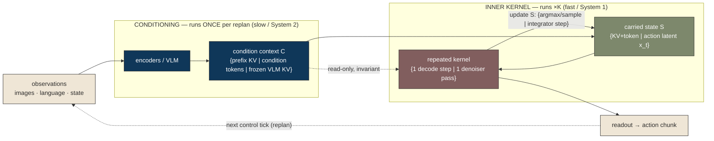

```
        ┌─────────── outer: once per control tick (replan) ───────────┐
        ▼                                                              │
 observations ─▶ [ CONDITIONING (once, slow) ] ─▶ condition C ─────────┤ (invariant)
                                                                       │
  carried state S₀ ─▶ ╔══════════════════════════════╗                │
                      ║  repeated kernel   (×K)        ║◀── C (read-only)
                      ║  {decode step | denoiser pass} ║
                      ╚══════════════┬═══════════════╝
                       S_{t+1} ──────┘   {KV+token | action latent x_t}
                                     ▼
                               readout ─▶ action chunk
```

**The four slots — and the only two ways they get filled:**

| slot | ① autoregressive | ② flow-matching / diffusion |
|---|---|---|
| condition context **C** | prefix KV (same LLM stack) | condition tokens / frozen VLM KV (separate) |
| carried state **S** | KV cache (**grows** +1/step) + current token | **fixed-shape** action latent x_t |
| repeated **kernel** | one LLM decode step | one denoiser pass (DiT / action expert) |
| **update** rule | argmax / sample → next token | Euler / DPM integrator step |
| **K** = | # action tokens | # denoise steps |

**Why this single graph IS the argument:** a flat `torch.export` keeps only the **CONDITIONING** box (it's a
plain DAG) and **deletes the entire INNER-KERNEL box** — the ×K loop, the carried state S, and the C-reuse edge.
Everything that makes these models multi-rate lives in exactly the box flat capture throws away.

### Filling the slots for every model (no guesses)

| model | shape | conditioning C (once) | C invariant? | carried state S | kernel | update | K |
|---|---|---|---|---|---|---|---|
| smolVLA | ② | SmolVLM2 → prefix KV | yes | action latent 50×32 | action expert | Euler | 10 |
| π0.5 | ② | SigLIP+Gemma-2B → prefix KV | yes | action latent 50×32 | Gemma-300M expert | Euler | 10 |
| RDT | ② | T5-XXL + SigLIP+DINOv2 → cond tokens | yes | noisy action 64×128 (+m_prev) | DiT ×28 | DPM-solver | 5 |
| RDT2 | ② | frozen Qwen2.5-VL-7B KV | yes | action latent 24×20 | DiT ×14 | Euler | 5 |
| GR00T N1.7 | ② | Cosmos-2B VLM → VL embeds | yes | action latent 40×dim | action enc + DiT ×16 | flow Euler | 4 |
| xr0 | ② | Qwen3-VL-4B KV | yes | latent 30×32 (+t) | DiT ×16 | rectified-flow Euler | 5 |
| OpenVLA | ① | DINOv2+SigLIP + Llama-2-7B prefill | grows | KV cache + token | 1 Llama decode step | argmax | 7 |
| MolmoAct | ① | SigLIP2 + Qwen2 LLM prefill | grows | KV cache + token | 1 LLM decode step (48L) | argmax | 8 |
| tiny_llama | ① | Llama prefill | grows | KV cache + token | 1 decode step | argmax | 7 |
| BitVLA | (real = single pass; no inner loop — readout straight off conditioning) | SigLIP + ternary BitNet LLM | — | — | — | — | 1 |

> BitVLA is the one exception: its real `predict_action` is the **conditioning stage with the readout attached
> directly — no inner loop** (the ×K=7 loop exists only in the capture wrapper). In template terms it is the
> degenerate **K=1** case.

---

## The three shapes

### Shape ① — Autoregressive VLA (prefill once → ×K token decode, KV grows)
*openvla · molmoact · bitvla(real = single pass; see note) · (tiny_llama = the plain-LLM minimal case)*

```
 image + instruction
        │
        ▼
 ┌──────────────────────────────┐
 │ vision encode + project       │  ← runs ONCE
 │ + LLM PREFILL of the prompt   │     (fills KV[0:P])
 └──────────────┬───────────────┘
                │  KV cache (P tokens)
                ▼
        ╔═══════════════════════════════╗   carry: KV cache (+1 row/step), cur_tok
        ║  one LLM decode step           ║◀─┐  ── repeats ×K action tokens ──
        ║  norm→QKV→attn(KV)→MLP→argmax  ║  │
        ╚═══════════════┬═══════════════╝──┘
                        ▼
                 K action tokens → action
```

### Shape ② — Flow-matching / diffusion VLA (System-2 VLM once → ×K System-1 denoise; condition KV invariant)
*smolvla · pi05 · rdt · rdt2 · groot_n1d7 · xr0*  — this is the GR00T-style **dual-system** shape.

```
 images + language + state
        │
        ▼
 ┌──────────────────────────────┐
 │  VLM / condition encoders     │  ← System 2: runs ONCE per replan
 │  (vision + language + state)  │
 └──────────────┬───────────────┘
                │  condition tokens / prefix KV  (INVARIANT — reused every step)
                ▼
        ╔═══════════════════════════════╗   carry: noisy action latent x_t
   x_t ─║  action denoiser (DiT/expert)  ║◀─┐  ── repeats ×K denoise steps ──
        ║  self-attn + cross-attn(cond)  ║  │   (cross-attn KV does NOT change)
        ╚═══════════════┬═══════════════╝──┘
                        ▼
                 action chunk (H actions)
```

### Contrast — a "flat" model (what flat export was designed for)
A typical one-shot model (image classifier, a single VLM forward, an encoder) is a **single DAG, no loop, no
carried state** — flat export is exactly right for it. That is the baseline the VLAs above break:

```
 input → [ stack of layers ] → output          (one pass; nothing repeats, nothing carried)
```

---

## Per-model coarse maps

> Counts are coarse and cited. Where the captured config is reduced (small smoke configs), the **deployment**
> count is given from the model's real config (config-exact composition) and cited; otherwise marked *not in source*.

### smolVLA — flow-matching VLA (Shape ②)
Source: `vla-arena/external/lerobot/.../smolvla/{modeling_smolvla,smolvlm_with_expert,configuration_smolvla}.py`;
`model2MLIR/workloads/smolvla/loader.py`; wrapper `smolvla_whileloop_wrapper.py`.

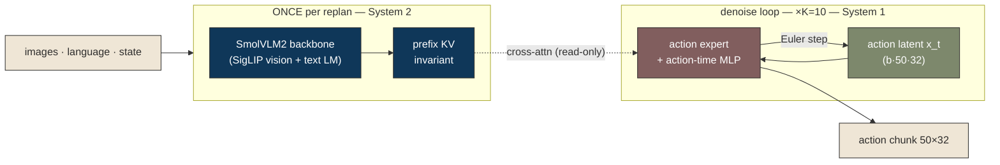
**K=10** Euler denoise (`num_steps=10`, configuration_smolvla.py / wrapper). **Carried:** action latent `x_t`
(b·50·32). **Once:** VLM prefix KV (reused ×K, invariant). **Horizon H=50** (`chunk_size`). **Control rate:**
not in source · 30 Hz ⓡ.

### π0.5 (pi05) — flow-matching VLA (Shape ②)
Source: `openpi/src/openpi/models/{pi0,gemma,pi0_config}.py`, `pi0_pytorch.py`; loader; `pi05_whileloop_wrapper.py`.

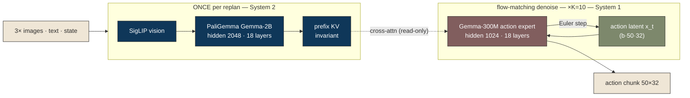
**K=10** denoise (pi0_config / wrapper). **Carried:** `x_t` (b·50·32). **Once:** Gemma-2B prefix KV, expert reads
it read-only every step (use_cache=False) — invariant. **H=50, action dim 32.** **Control rate:** not in source ·
50 Hz ⓡ.

### RDT — diffusion DiT VLA (Shape ②)
Source: `RoboticsDiffusionTransformer/models/{rdt/model.py,rdt/blocks.py,rdt_runner.py}`, `configs/base.yaml`; loader; `rdt_whileloop_wrapper.py`.

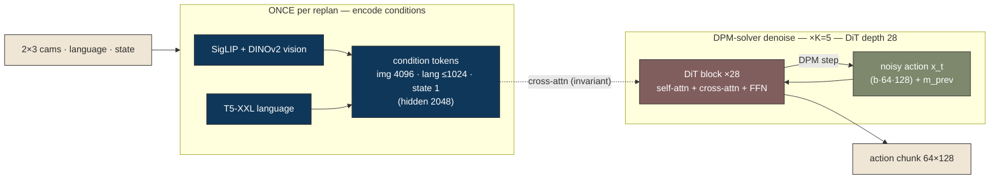
**K=5** denoise steps (`num_inference_timesteps`, base.yaml / wrapper), DPM-solver multistep. **Carried:** noisy
action (b·64·128) + DPM `m_prev`. **Once:** vision/lang/state condition tokens (cross-attn KV invariant ×K).
**Horizon 64**, state dim 128. **Control rate: 25 Hz ⓢ** (`ctrl_freqs`, loader) — note registry lists 30 Hz ⓡ.

### RDT2 — DiT flow-matching on a frozen VLM KV cache (Shape ②)
Source: `RDT2/models/rdt/{model,blocks}.py`, `configs/rdt/post_train.yaml`; loader; `rdt2_whileloop_wrapper.py`;
per-layer GEMM params confirmed in `real_config.py`.

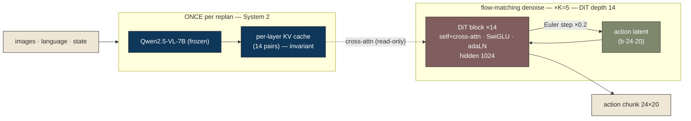
**K=5** Euler (`num_inference_timesteps`, post_train.yaml / wrapper). **Carried:** action latent (b·24·20).
**Once:** frozen Qwen2.5-VL KV (invariant). DiT depth 14, hidden 1024, SwiGLU 2816 (config-exact). **Horizon 24.**
**Control rate: 30 Hz ⓢ** (`fps`, post_train.yaml). Action-space output (no vocab).

### GR00T N1.7 (groot_n1d7) — dual-system VLA (Shape ②, the canonical System-1/System-2)
Source: `Isaac-GR00T/.../gr00t_n1d7.py`, README; loader; `groot_n1d7_whileloop_wrapper.py`. (Source names the parts
"backbone" + "action head", not literally System 1/2.)

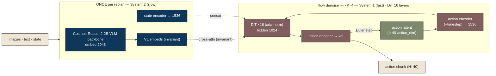
**K=4** denoise (`num_inference_timesteps`, gr00t_n1d7.py / wrapper). **Carried:** action latent (b·40·dim).
**Once:** VL embeds + state features (hoisted, invariant). DiT 16 layers, hidden 1024, cross-attn dim 2048.
**Action horizon 40** future steps. **Control rate:** not in source · 30 Hz ⓡ (dual-rate by design: VLM once vs DiT ×K).

### xr0 — rectified-flow DiT VLA (Shape ②)
Source: `Xiaomi-Robotics-0/xr0/mibot/models/VLA/XR0.py`; loader; `xr0_whileloop_wrapper.py`.

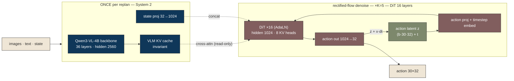
**K=5** rectified-flow Euler (`num_steps=5`, XR0.py / wrapper). **Carried:** latent z (b·30·32) + timestep.
**Once:** Qwen3-VL-4B KV (read-only invariant). DiT 16 layers. **Control rate / horizon: not in source** (registry:
None). Has a measured FireSim anchor (146.2 G cycles, fp32).

### OpenVLA — autoregressive VLA (Shape ①)
Source: `BitVLA/openvla-oft/prismatic/.../modeling_prismatic.py`, `prismatic/vla/constants.py`;
`model2MLIR/workloads/openvla/loader.py`; `openvla_whileloop_decode_wrapper.py`.

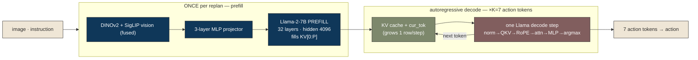
**K=7** action tokens (`constants.py` / wrapper). **Carried:** KV cache (+1 row/step) + current token. **Once:**
vision encode + projector + prompt prefill into KV. Llama-2-7B: 32 layers, hidden 4096, vocab 32064 (config-exact).
**Control rate:** not in source · 5 Hz ⓡ. (Action-chunk constants 7/8/14 per benchmark.)

### MolmoAct — autoregressive VLA (Shape ①)
Source: `molmoact/.../{configuration_molmoact,modeling_molmoact}.py`; loader; `molmoact_whileloop_wrapper.py`.

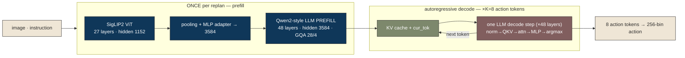
**K=8** action tokens (wrapper). **Carried:** static KV + current token. **Once:** vision + adapter + prompt
prefill. LLM: 48 layers, hidden 3584, GQA (28 q / 4 kv heads), head_dim 128, vocab 152064 (config-exact).
**Control rate:** not in source · 5 Hz ⓡ.

### BitVLA — ternary-weight (W1.58) VLA  ⚠️ real inference is a single pass
Source: `BitVLA/transformers/.../models/llava/{configuration_bitnet,modeling_bitnet}.py`; loader; `bitvla_whileloop_wrapper.py`.

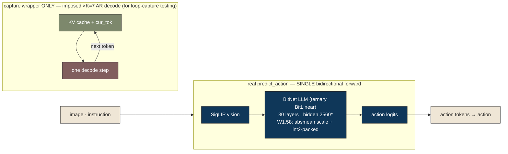
⚠️ **Honest note:** BitVLA's real `predict_action` is a **single bi-directional forward pass — no autoregressive
loop.** The K=7 decode loop exists only in the *capture wrapper* (built to exercise the `while_loop→scf.for`
path), not in the model. The distinctive real feature is the **low-bit weight datapath**: ternary `{-1,0,+1}`
BitLinear weights with an absmean scale, int2-packed (`modeling_bitnet.py`). `*` deployment size (30 layers /
2560) is the BitNet config-class default — **the real trained checkpoint config is not sourceable** in the repo
(captures use a reduced random config); so deployment magnitude is omitted elsewhere rather than guessed.

### tiny_llama — plain autoregressive LLM (minimal Shape ①, the "near-flat" contrast)
Source: HF `transformers` Llama; `model2MLIR/workloads/tiny_llama/loader.py`; `tiny_llama_whileloop_wrapper.py`.

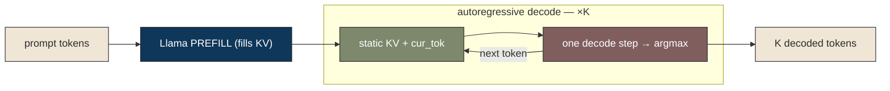
No vision, no action expert — just prefill + ×K decode with a (static) KV cache. Shows the *minimum* loop a flat
export already erases; the VLAs above add vision/expert/denoise structure on top.

---

## Summary table

| Model | Shape | Once-per-replan (slow) | Repeated ×K (fast) | Loop kind | K | Loop-carried state | Condition reuse | Horizon | Control rate |
|---|---|---|---|---|---|---|---|---|---|
| smolVLA | ② flow-match | SmolVLM2 VLM + prefix KV | action expert + MLP | Euler denoise | 10 | action latent (50×32) | prefix KV invariant | 50 | not in src · 30Hz ⓡ |
| π0.5 | ② flow-match | SigLIP + Gemma-2B + KV | Gemma-300M expert | Euler denoise | 10 | action latent (50×32) | prefix KV invariant | 50 | not in src · 50Hz ⓡ |
| RDT | ② diffusion | T5-XXL + SigLIP+DINOv2 → cond | DiT ×28 | DPM-solver | 5 | noisy action (64×128)+m_prev | cond KV invariant | 64 | 25Hz ⓢ |
| RDT2 | ② flow-match | frozen Qwen2.5-VL-7B KV | DiT ×14 (SwiGLU) | Euler | 5 | action latent (24×20) | VLM KV invariant | 24 | 30Hz ⓢ |
| GR00T N1.7 | ② dual-system | Cosmos-2B VLM + state enc | action enc + DiT ×16 | flow denoise | 4 | action latent (40×dim) | VL embeds invariant | 40 | not in src · 30Hz ⓡ |
| xr0 | ② rect-flow | Qwen3-VL-4B KV + state proj | DiT ×16 | rectified flow | 5 | latent (30×32)+t | VLM KV invariant | not in src | **not in source** |
| OpenVLA | ① autoregressive | DINOv2+SigLIP + Llama-2-7B prefill | 1 Llama decode step | AR token decode | 7 | KV cache (+1/step)+tok | KV grows | 7 tok | not in src · 5Hz ⓡ |
| MolmoAct | ① autoregressive | SigLIP2 + adapter + Qwen2 LLM prefill | 1 LLM decode step (48L) | AR token decode | 8 | static KV + tok | KV grows | 8 tok | not in src · 5Hz ⓡ |
| BitVLA | (real = 1 pass) | SigLIP + BitNet LLM (ternary) | — (wrapper imposes ×7) | — / AR in wrapper | 7* | (wrapper) KV + tok | — | not in src | not in source |
| tiny_llama | ① autoregressive | Llama prefill | 1 decode step | AR token decode | 7 | static KV + tok | KV grows | — | n/a |

ⓢ = from model source/config · ⓡ = dse_guidance registry design-target (not in model source) · `*` = capture-wrapper construct, not the real model.

---

## The point for the slide
Eight of these ten models are **multi-rate**: a slow conditioning stage runs **once per replan** and a fast
stage runs **×K in a loop**, carrying a KV cache or an action latent across iterations. Two distinct loop shapes
(autoregressive token decode; flow-matching/diffusion denoise) — and the GR00T-style **System-2-once /
System-1-×K** split is the recurring structure. A flat graph capture unrolls the loop and throws all of that
away (K, the carried state, the once-vs-×K split). **That is why flat capture is not enough.**

_Coarse maps generated from real source under `/path/to/*` (model repos + `model2MLIR/workloads/<m>/loader.py` + verified `*_whileloop_wrapper.py`); no guesses — unsourced values are marked “not in source.”_
