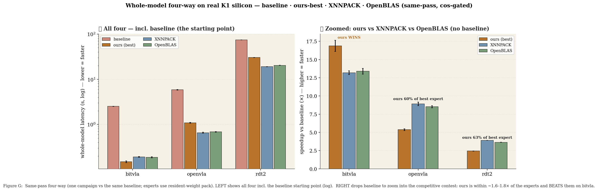
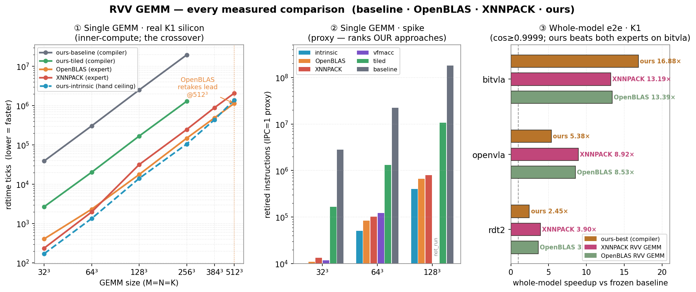
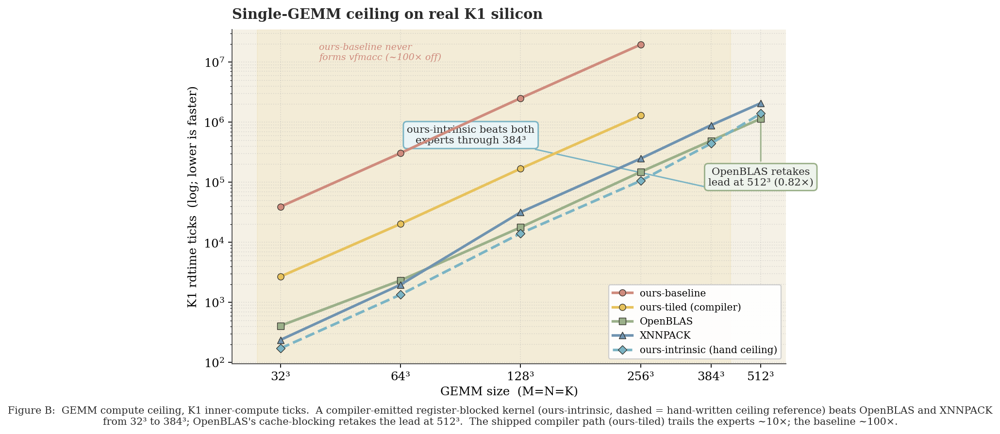
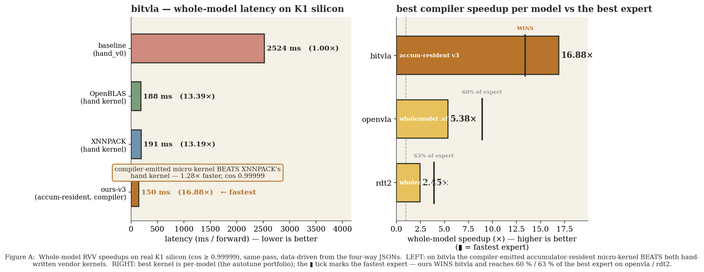
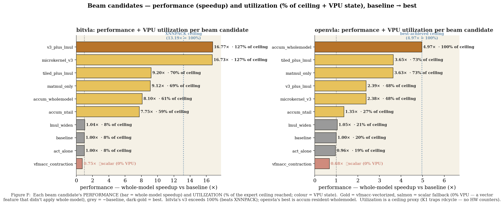
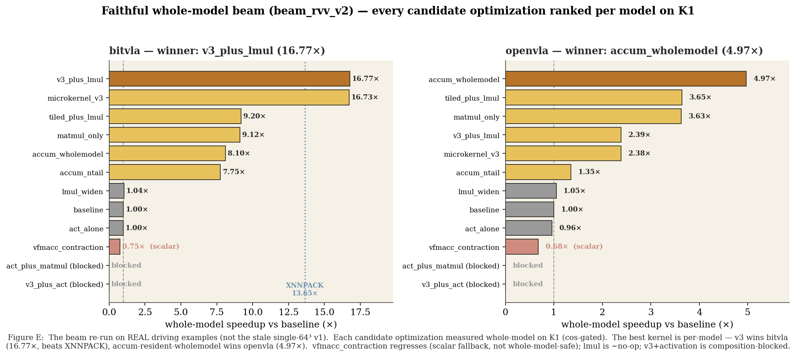
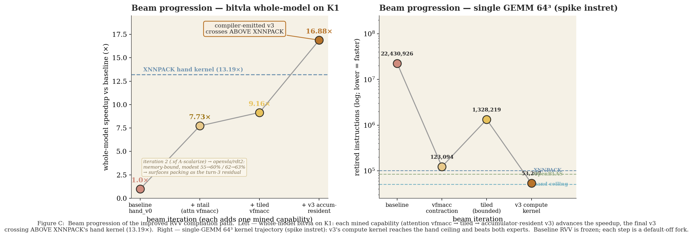
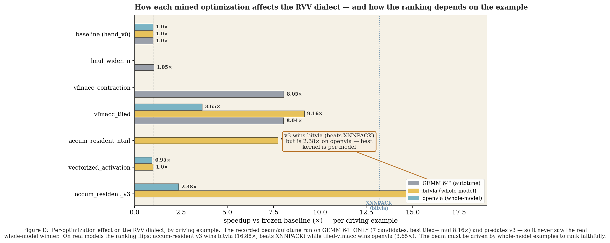
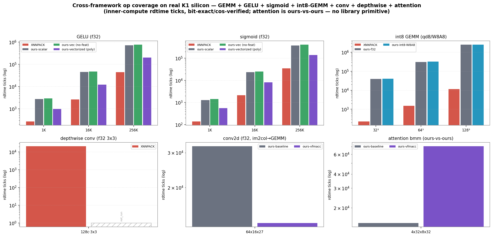

# RVV compilation — full results

Faithful four-way comparison on the **SpacemiT K1** (+ spike): **frozen baseline RVV** · **our improved RVV
path** (per beam iteration) · **OpenBLAS** · **XNNPACK**. All numbers measured and correctness-gated
(bit-exact on spike / cos ≥ 0.99999 on the board). Baseline is frozen; every improvement is a default-off
fork. Hand kernels are ceiling references only. Figures are PNGs in this directory.

---

## Headline — whole-model FOUR-WAY on K1 (same-pass, fair, cos-gated)

| model | baseline | best ours (beam-picked) | XNNPACK | OpenBLAS | ours vs best expert |
|---|---|---|---|---|---|
| **bitvla** | 2.524 s | **v3 — 0.150 s (16.88×)** | 0.191 s (13.19×) | 0.189 s (13.39×) | **ours WINS +1.26×** |
| **openvla** | 5.855 s | wholemodel-vf — 1.089 s (5.38×) | **0.657 s (8.92×)** | 0.686 s (8.53×) | ours **60%** |
| **rdt2** | 74.04 s | wholemodel-vf — 30.27 s (2.45×) | **18.97 s (3.90×)** | 20.32 s (3.64×) | ours **63%** |

**Honest verdict:** ours is **competitive with both hand-tuned vendor libraries** — it **beats both XNNPACK
and OpenBLAS on bitvla** (compiler-emitted v3, +1.26–1.28×) and reaches **55–66%** of the fastest expert on
openvla/rdt2 (geomean ≈ 76%). The two experts are neck-and-neck (within ~5%). Our kernels are shape-brittle
(v3: 16.88× bitvla → 2.38× openvla; tiled/v3 regress rdt2 3×) — so the **per-model beam is essential**.
Same-pass (one campaign vs the same baseline), N=5/3, experts with resident-weight pack.

---

## 1 · Every measured comparison

## 2 · Whole-model end-to-end

## 3 · The beam — performance, utilization, and how the search progresses

## 4 · Beyond GEMM (individual non-full-model ops)

---

## Beam candidate ranking (bitvla / openvla, beam_rvv_v2)

| candidate (optimization) | bitvla × | openvla × | VPU / note |
|---|---|---|---|
| v3 (accum-resident microkernel) | **16.7** | 2.39 | vfmacc.vf · wins bitvla, beats both experts |
| accum_wholemodel | 8.10 | **4.97** | vfmacc · openvla/rdt2 best ours |
| tiled (fused_vfmacc) | 9.12 | 3.63 | vfmacc |
| accum_ntail | 7.75 | 1.35 | vfmacc (attention-safe) |
| lmul_widen | 1.04 | 1.05 | ~no-op |
| vectorized_activation | 1.00 | 0.96 | vectorized, correct, neutral |
| vfmacc_contraction | **0.75** | **0.68** | scalar fallback — not whole-model-safe |
| v3+activation, act+matmul | blocked | blocked | CompositionError (2 full-replace) |

---

## Limits (scope boundaries)
- **No cycle-accurate confirmation** — K1 is wall/rdtime (`cycle_accurate=false`; rdcycle traps, no HW
  counters). Spike is an IPC=1 proxy. FireSim/VCS is queue-gated. "Utilization" is a ceiling proxy.
- **Scope** — fp32 matmul-dominated VLA inference, 3 models, one board. No int8 e2e / conv-heavy models;
  beam grid (33 MR/NR/KC points) not whole-model-evaluated.
- **Beyond GEMM** — activation neutral whole-model + ~3.6–4.6× behind XNNPACK isolated; int8/dwconv/attention
  not competitive. Separate efforts.

Sources: `cross_framework_matrix{,_k1}.{md,jsonl}`, `../rvv_bench/k1_4way_*.json` + `k1_h2h_*.json`,
`../../mined_knowledge/rvv/{headtohead_rvv_v1,beam_rvv_v2}_*/`. Full writeup: `../../docs/rvv_kernel_mining_results.md`.
Regenerate figures: `.venv/bin/python scripts/plot_paper_style.py` & `scripts/plot_rvv_comparisons.py`.
