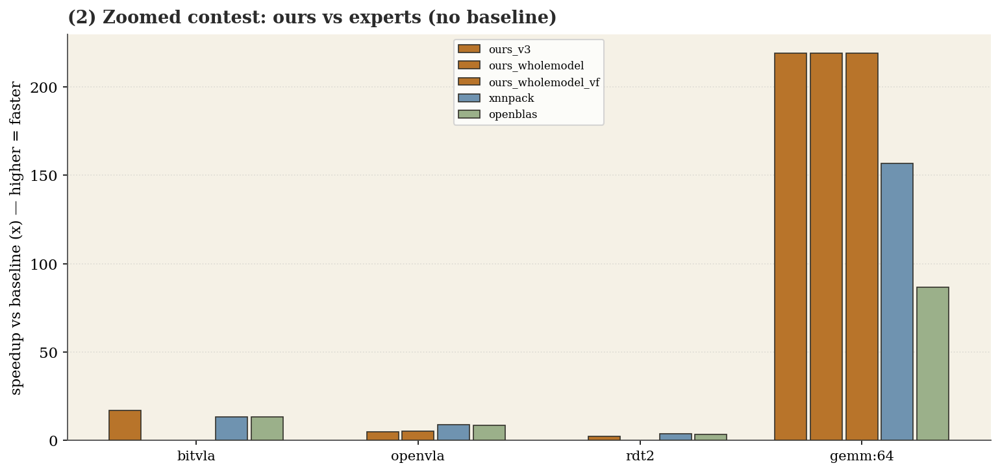
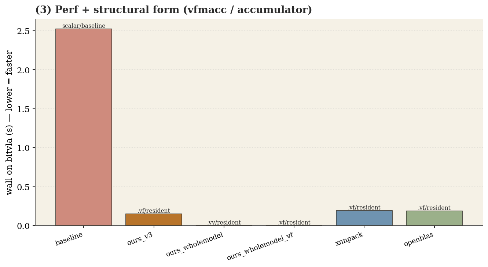
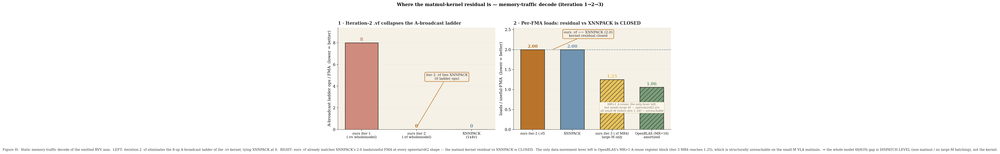

# RVV compilation — full results

Faithful four-way comparison on the **SpacemiT K1** (+ spike): **frozen baseline RVV** · **our improved RVV
path** (per beam iteration) · **OpenBLAS** · **XNNPACK**. All numbers measured and correctness-gated
(bit-exact on spike / cos ≥ 0.99999 on the board). Baseline is frozen; every improvement is a default-off
fork. Hand kernels are ceiling references only. Figures are PNGs in this directory.

---

## Headline — whole-model FOUR-WAY on K1 (same-pass, fair, cos-gated)

| model | baseline | best ours (beam-picked) | XNNPACK | OpenBLAS | ours vs best expert |
|---|---|---|---|---|---|
| **bitvla** | 2.524 s | **v3 — 0.150 s (16.88×)** | 0.191 s (13.19×) | 0.189 s (13.39×) | **ours WINS +1.26×** |
| **openvla** | 5.855 s | wholemodel-vf — 1.089 s (5.38×) | **0.657 s (8.92×)** | 0.686 s (8.53×) | ours **60%** |
| **rdt2** | 74.04 s | wholemodel-vf — 30.27 s (2.45×) | **18.97 s (3.90×)** | 20.32 s (3.64×) | ours **63%** |

**Honest verdict:** ours is **competitive with both hand-tuned vendor libraries** — it **beats both XNNPACK
and OpenBLAS on bitvla** (compiler-emitted v3, +1.26–1.28×) and reaches **60% (openvla) / 63% (rdt2)** of the
fastest expert (geomean ≈ 76%). The two experts are **neck-and-neck (within ~5%; OpenBLAS actually edges
XNNPACK on bitvla, 13.39× vs 13.19×)** — there is no single "expert" to beat, which is why we plot both.
Our kernels are shape-brittle (v3: 16.88× bitvla → 2.38× openvla; tiled/v3 regress rdt2 3×) — so the
**per-model beam is essential**. Same-pass (one campaign vs the same baseline), N=5/3, experts with
resident-weight pack.

---

## Structural parity — the residual gap is **not** compute (merlin-compare CCA)

The `merlin-compare` tool decodes each kernel's Common Compute Abstraction from the **emitted asm** (no
regex, no source). It shows our compiler-emitted kernels have **already abstracted the compute facets the
experts use** — the residual 60–63% gap is *not* a missing vectorization idiom:

| config | contraction | acc-resident | NR=vsetvlmax | sew/lmul | vfmacc (.vf/.vv) |
|---|---|---|---|---|---|
| baseline | *(scalar — no vector matmul)* | — | — | — | — |
| **ours_v3** | fused_fma | ✓ | — | 32 / m4 | **vf=4, vv=0** |
| **ours_wholemodel_vf** | fused_fma | ✓ | — | 32 / m4 | **vf=4, vv=0** |
| XNNPACK | fused_fma | ✓ | ✓ | 32 / m4 | vf=1, vv=0 |
| OpenBLAS | fused_fma | ✓ | — | 32 / **m2** | vf=60, vv=0 |

Ours matches XNNPACK on **contraction form, accumulator-residency, lane width (SEW=32) and LMUL=m4**, and
emits the **same `vfmacc.vf` broadcast form** (iteration-2 `.vf` fix — it eliminated the `vfmacc.vv`
A-broadcast ladder). So the abstraction *worked*.

**Reproducible, tool-generated views.** The figures below are emitted by `merlin-compare` directly from a
spec (`configs × workloads × target × metric`) into a versioned `compare_<ts>/` artifact — not hand-drawn.
Re-running the spec regenerates them identically; adding a model/candidate is one spec line. This is the
methodological, repeatable comparison layer (the hand-styled figures elsewhere in this doc are the
presentation layer over the same measured data). Source: `mined_knowledge/rvv/compare_20260619_182411/`
(`compare.md` + `fig{1,2,3}`).

### Iteration 3 — the memory-traffic decode **refutes the packing hypothesis** (and pins the real blocker)

I had assumed the residual was data movement (the experts stream pre-packed panels, ours streams the
model layout). **Iteration 3 measured it and that is wrong vs XNNPACK.** A new memory-traffic decode facet
(`kernels/decode/memory.py`, structural mnemonic classification of every K-loop load — no regex) shows:

- **vs XNNPACK the per-FMA memory residual is already CLOSED.** At *every* openvla/rdt2 matmul shape the
  iteration-2 `.vf` kernel decodes **identically** to XNNPACK: MR=1, **2.0 loads / useful-FMA**, unit-stride
  only, **0 broadcast-ladder ops**. (The iteration-1 `.vv` kernel carried an **8-op** A-broadcast ladder per
  FMA — that was the gap, and `.vf` removed it.) The hypothesised "strided model-layout stream" **does not
  exist** (`vec_strided_loads = 0` everywhere). Ours matches XNNPACK on compute **and** memory.
- **The one lever left is OpenBLAS's MR>1 A-reuse** (MR=16 register block → ~1.06 amortized loads/FMA). The
  iteration-3 feature `accumulator_resident_wholemodel_vf_mr4` (default-off) reproduces it: **loads/FMA
  2.0 → 1.25**, decode-confirmed, spike bit-exact on large-M.
- **But it is structurally unreachable on these models.** openvla/rdt2 have **no large-M matmul** (leading dim
  = token count: openvla M∈{16,17,20}, rdt2 M∈{1,28}); MR>1 needs M≥MR with a clean tile, so it trips the
  LLVM-23 mask PipelineError or scalar-falls-back and *regresses* them. The A-reuse they leave on the table
  is a **structural property of the small token dim, not a kernel defect** — closable only by a
  **dispatch-level large-M batching pass** (group the 11 separate M=20 projections / per-head attention into
  one GEMM). That is the precise, bounded blocker.

**⇒ Conclusion:** since the matmul kernel already matches XNNPACK on both compute and memory, the whole-model
**60/63% gap is dispatch-level overhead (everything around the matmuls), not the matmul kernel.** Full
analysis: `packing_residual.md` (+ `packing_residual_decode.json`).

---

## 1 · Every measured comparison

## 2 · Whole-model end-to-end

## 3 · The beam — performance, utilization, and how the search progresses

> **Beam coverage (honest):** the per-model beam was run on **bitvla + openvla** (the two driving examples).
> **rdt2 was not beam-searched** — it uses the `accumulator_resident_wholemodel(_vf)` kernel directly (the
> openvla winner), which is why rdt2 is absent from the beam panels. Broadening the beam to rdt2 + the 33-point
> MR/NR/KC grid is future scope (see Limits).

## 4 · Beyond GEMM (individual non-full-model ops)

---

## Beam candidate ranking (bitvla / openvla, beam_rvv_v2)

| candidate (optimization) | bitvla × | openvla × | VPU / note |
|---|---|---|---|
| v3 (accum-resident microkernel) | **16.7** | 2.39 | vfmacc.vf · wins bitvla, beats both experts |
| accum_wholemodel | 8.10 | **4.97** | vfmacc · openvla/rdt2 best ours |
| tiled (fused_vfmacc) | 9.12 | 3.63 | vfmacc |
| accum_ntail | 7.75 | 1.35 | vfmacc (attention-safe) |
| lmul_widen | 1.04 | 1.05 | ~no-op |
| vectorized_activation | 1.00 | 0.96 | vectorized, correct, neutral |
| vfmacc_contraction | **0.75** | **0.68** | scalar fallback — not whole-model-safe |
| v3+activation, act+matmul | blocked | blocked | CompositionError (2 full-replace) |

---

## Limits (scope boundaries)
- **No cycle-accurate confirmation** — K1 is wall/rdtime (`cycle_accurate=false`; rdcycle traps, no HW
  counters). Spike is an IPC=1 proxy. FireSim/VCS is queue-gated. "Utilization" is a ceiling proxy.
- **Scope** — fp32 matmul-dominated VLA inference, 3 models, one board. No int8 e2e / conv-heavy models;
  beam grid (33 MR/NR/KC points) not whole-model-evaluated.
- **Beyond GEMM** — activation neutral whole-model + ~3.6–4.6× behind XNNPACK isolated; int8/dwconv/attention
  not competitive. Separate efforts.

Sources: `cross_framework_matrix{,_k1}.{md,jsonl}`, `../rvv_bench/k1_4way_*.json` + `k1_h2h_*.json`,
`../../mined_knowledge/rvv/{headtohead_rvv_v1,beam_rvv_v2}_*/`. Full writeup: `../../docs/rvv_kernel_mining_results.md`.
Regenerate figures: `.venv/bin/python scripts/plot_paper_style.py` & `scripts/plot_rvv_comparisons.py`.
